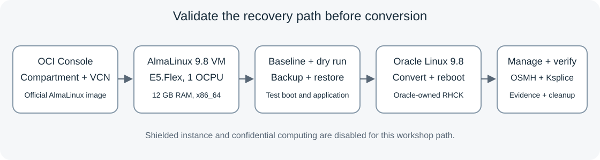

# Migrate AlmaLinux to Oracle Linux on OCI

## Introduction

Convert an AlmaLinux 9.8 OCI virtual machine to Oracle Linux 9.8 while retaining its test application and configuration. You create a compartment, VCN, and disposable AlmaLinux instance through the OCI Console, capture its baseline, assess readiness, test backup restoration, perform the conversion, and validate the result after reboot. You then practice package maintenance, register the converted instance with OS Management Hub, schedule updates through the OCI Console, and apply available Oracle Ksplice live patches.

The workshop starts in your OCI tenancy. Lab 1 creates the compartment, network, and AlmaLinux VM from the official partner image. Select and verify an AlmaLinux 9.8 x86_64 build before continuing.

Estimated Workshop Time: 5 hours 45 minutes, plus OCI backup and restore operations

### Objectives

- Create the workshop compartment, VCN, and AlmaLinux 9.8 x86_64 instance using the OCI Console.
- Capture application, package, network, and security evidence.
- Verify a pinned migration script and run its dry run.
- Create a recovery point and boot a restored copy before conversion.
- Convert the same lab instance to Oracle Linux 9.8 with RHCK.
- Apply package updates, register with OS Management Hub, and schedule security updates.
- Apply available Ksplice kernel live updates through OS Management Hub.
- Verify the migrated system and clean up disposable resources.

### Prerequisites

- An OCI tenancy with access to an official AlmaLinux 9.8 x86_64 partner image build or an administrator-provided compatible 9.8 image.
- Permissions to create a compartment, VCN resources, lab instances, and boot-volume backups and restored volumes.
- Quota for VM.Standard.E5.Flex with 1 OCPU and 12 GB memory. A recovery rehearsal temporarily needs another VM with those resources.
- A workstation public IPv4 address for the lab SSH and HTTP ingress rules.
- Outbound HTTPS access to raw.githubusercontent.com, yum.oracle.com, and www.ksplice.com; AlmaLinux repositories must also be reachable during preparation.
- An eligible OCI tenancy for OS Management Hub; Free Tier instances cannot use the service.
- Administrator access to configure IAM and add regional OS Management Hub vendor software sources, or an administrator who completes those setup steps.
- Oracle Cloud Agent 1.40.0 or later on the converted instance and HTTPS access to the regional OS Management Hub service.
- A browser, an SSH client, and a local folder for downloaded evidence.

## Instance Configuration

| Setting | Workshop value |
| --- | --- |
| Shape | VM.Standard.E5.Flex |
| OCPUs | 1 |
| Memory | 12 GB |
| Network bandwidth | 1 Gbps as reported for the selected shape configuration |
| Source | AlmaLinux 9.8, x86_64 |
| Target | Oracle Linux 9.8, RHCK |
| Shielded instance | Disabled |
| Confidential computing | Disabled |
| Boot volume | Image's default size or larger, with sufficient free space in / and /boot |

The shape's Security column lists available capabilities. Check the instance's actual launch settings. OCI documents shielded instances and confidential computing as mutually exclusive. Its E5.Flex confidential VM matrix lists Oracle Linux 9 with UEK8; the AlmaLinux-to-RHCK path used here is outside that configuration. See [Shielded instances](https://docs.oracle.com/en-us/iaas/Content/Compute/References/shielded-instances.htm) and [Confidential computing](https://docs.oracle.com/en-us/iaas/Content/Compute/References/confidential_compute.htm).

## Workshop Flow

The eight labs progress from OCI setup and migration to DNF maintenance, OS Management Hub, Ksplice, and final validation. Lab 6 registers the existing converted VM; it does not create another Compute instance. See [OS Management Hub prerequisites](https://docs.oracle.com/en-us/iaas/osmh/doc/getstarted.htm).

## Workshop Conventions

- Resource names begin with `alma-to-ol`.
- Replace `<ssh-user>`, `<public-ip>`, and `<private-key-path>` with the image username, new instance address, and downloaded or existing key path.
- The migration preserves the existing SSH account. Changing the distribution does not create an `opc` account automatically.
- Run Linux commands on the disposable lab VM unless the step says to use your local terminal or OCI Console.
- Copy buttons contain executable commands. Expected output appears separately.
- The test application uses `MIGRATION_WORKLOAD_OK` as a health marker.
- Only delete resources recorded as workshop-owned in your resource ledger.

## Support and Success Criteria

The migration scripts are community maintained and are not officially supported by Oracle. A dry run prints planned operations and writes evidence; it does not perform the conversion or prove that the next boot will succeed. Run this workshop on a disposable VM before using the process for an application migration.

Success requires Oracle Linux 9.8 identity immediately after conversion, an Oracle-owned RHCK after reboot, reachable repositories, a healthy RPM database, and an unchanged application response and checksum. Later DNF maintenance can advance the Oracle Linux 9 minor release; record that result rather than treating it as a migration failure.

## Learn More

- [Migration announcement](https://blogs.oracle.com/scoter/announcing-oracle-linux-migration-mirror-automation-scripts)
- [Migration repository and support notice](https://github.com/oracle/migrate-to-ol)
- [AlmaLinux migration support](https://github.com/oracle/migrate-to-ol/blob/main/README-migrate-to-oracle-linux.md)

## Acknowledgements

- **Author** - Perside Foster, Principal Solution Engineer, Oracle
- **Last Updated By/Date** - Perside Foster with Codex assistance, October 2026
