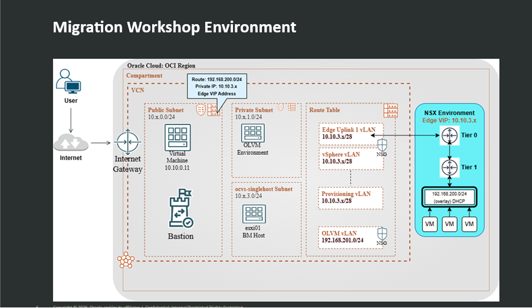
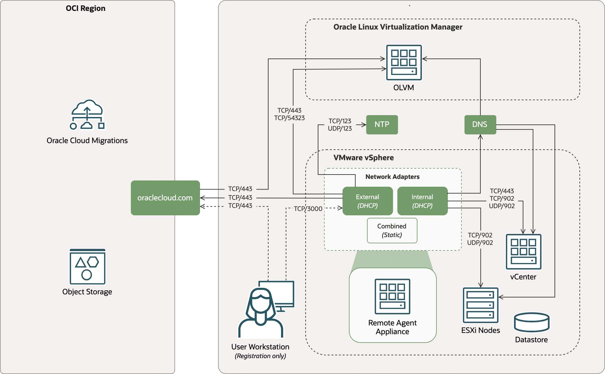

# Review the OCM Demo Architecture

## Introduction

This lab introduces the demo architecture before you create resources. The key point is that the VMware source environment is built in OCVS, the migration target is OLVM, and OCM coordinates discovery, replication, planning, and migration.

Estimated Lab Time: 15 minutes

### Objectives

In this lab, you will:

* Identify the source, target, and migration components
* Review the OCVS single-host SDDC model
* Review the OCVS NSX-T overlay and OCI VCN underlay networking
* Review OCM remote agent and OLVM connectivity requirements
* Identify the values you must collect during the build

### Prerequisites (Optional)

This lab assumes you have access to the workshop materials and a basic understanding of OCI and VMware concepts.

## Task 1: Review the Demo Goal

The demo shows how a VMware workload can be migrated to OLVM by using OCM.

1. Identify the VMware source environment.

    The source environment is a single-host OCVS SDDC deployed in OCI.

2. Identify the target environment.

    The target environment is OLVM running in OCI.

3. Identify the migration control plane.

    OCM is used to discover the VMware source VM, create a migration project, configure the target, replicate the workload data, and complete the migration.

4. Identify the source VM.

    The source deck builds a VM named `OL9u7-test` on the OCVS `workload-1` NSX segment.

## Task 2: Review the OCVS Architecture

OCVS creates a VMware SDDC in OCI. The single-host SDDC is sufficient for this demo, but it is not a production high-availability pattern.

1. Review the OCI side of the architecture.

    OCI provides the compartment, VCN, route tables, security lists or network security groups, subnets, VLANs, NAT gateway, and the jump host used to administer the demo.

2. Review the VMware side of the architecture.

    OCVS provides vCenter, ESXi, NSX Manager, NSX Edge, vSAN, and the NSX workload segment where the source VM runs.

3. Review the management access path.

    The build deck recommends a Windows jump host for the initial build. OCI Bastion can be used later if the team wants a time-bound, zero-trust access model.

## Task 3: Review OCVS Networking

OCVS uses VMware NSX-T for overlay networking and OCI networking for the underlay.

1. Review the NSX-T overlay.

    NSX-T creates logical segments for workloads. In this build, the source VM is placed on the `workload-1` segment, using the `192.168.200.0/24` workload CIDR.

2. Review the gateway model.

    Tier-0 handles north-south traffic between the VMware environment and the OCI network. Tier-1 handles east-west traffic for internal SDDC workloads.

3. Review the OCI VLAN functions.

    The OCVS workflow creates VLANs for functions such as NSX Edge uplinks, NSX Edge VTEP, NSX VTEP, vMotion, vSAN, vSphere, replication, and provisioning.

4. Confirm that the NSX workload CIDR does not overlap with the VCN, OCVS management CIDR, or OLVM target networks.

## Task 4: Review OCM Migration Connectivity

OCM uses a remote agent appliance in the VMware environment to connect the source vCenter, ESXi hosts, OCI services, Object Storage, and the OLVM target.

1. Review the path from the remote agent appliance to OCI.

    The remote agent appliance needs outbound HTTPS access to Oracle Cloud endpoints and Object Storage.

2. Review the path from the remote agent appliance to VMware.

    The appliance needs HTTPS access to vCenter and VDDK connectivity to vCenter and ESXi hosts.

3. Review the path from OCM to OLVM.

    OCM must be able to discover OLVM assets and use the OLVM API for migration and replication operations.

4. Confirm these required services are available to the remote agent appliance:

    DNS, DHCP or a static IP configuration, NTP, HTTPS to OCI, HTTPS to vCenter, VDDK connectivity to vCenter and ESXi hosts, and HTTPS plus replication connectivity to OLVM.

5. Treat these connectivity checks as a gate before creating the migration project.

## Task 5: Capture Required Build Values

Create a small build worksheet before you start. You will need these values later in the OCM setup.

1. Record the tenancy and region.

2. Record the workshop compartment name.

    The source deck uses `olvm-migrations`.

3. Record the VCN name and CIDR plan.

    The source deck uses `ocm-demo` and reserves a dedicated OCVS cluster CIDR.

4. Record the OCVS SDDC name, cluster name, vCenter URL, NSX Manager URL, and SDDC credentials.

5. Record the jump host public IP address and current password location.

6. Record the source VM name, source network, source IP address, and guest credentials.

7. Record the OLVM engine URL, cluster, VnicProfile, template, storage domain, and administrator credential location.

## Learn More

* [Oracle Cloud VMware Solution Documentation](https://docs.oracle.com/en-us/iaas/Content/VMware/home.htm)
* [Oracle Cloud Migrations Documentation](https://docs.oracle.com/en-us/iaas/Content/cloud-migration/home.htm)

## Acknowledgements

* **Author** - Mark Atkinson, Master Principal Sales Consultant, Open Cloud Technologies
* **Workshop Draft** - Perside Foster, May 2026
* **Source Material** - OCM-DEMO-BUILD presentation, Confluence VMware-to-OLVM planning PDF, and Oracle Cloud Migrations LA PDF
