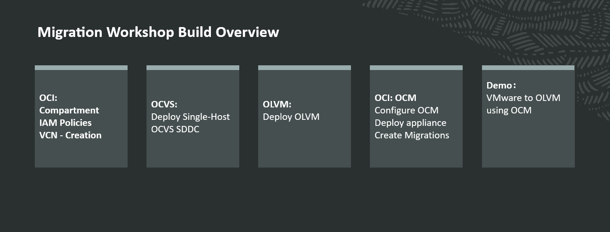

# Introduction

## About this Workshop

In this workshop, you will build and validate a migration scenario in Oracle Cloud Infrastructure (OCI). You will begin by preparing the required OCI foundation resources, including networking and access prerequisites. You will then use Oracle Cloud VMware Solution (OCVS) as the VMware source environment, Oracle Linux Virtualization Manager (OLVM) as the target platform, and Oracle Cloud Migrations (OCM) to perform the migration workflow.

The workshop is designed to show a clear migration path from a VMware virtual machine running in OCVS to OLVM in OCI. Along the way, you will review the architecture, prepare the OCI environment, deploy and prepare the source platform, review the target platform, configure Oracle Cloud Migrations, run the migration, and verify that the migrated virtual machine is running successfully in OLVM.

The following diagram provides a high-level view of the workshop build sequence. You will begin by preparing OCI foundation resources such as the compartment, IAM policies, and VCN. You will then deploy a single-host OCVS SDDC, prepare the OLVM target environment, configure Oracle Cloud Migrations (OCM), and perform the migration demo from VMware to OLVM.

At a high level, the workshop begins by preparing OCI resources and deploying the OCVS source environment. You will then prepare the OLVM target environment, configure Oracle Cloud Migrations, create or identify the VMware source virtual machine, and migrate the workload to OLVM in OCI.

### Workshop Components Overview

The workshop uses three main components:

1. **Oracle Cloud VMware Solution (OCVS)**  
   OCVS provides the VMware source environment. In this workshop, the source workload is hosted in a single-host Software-Defined Data Center (SDDC).

2. **Oracle Linux Virtualization Manager (OLVM)**  
   OLVM is the target virtualization platform in OCI where the migrated workload will run after the migration is complete.

3. **Oracle Cloud Migrations (OCM)**  
   OCM is used to connect to the source and target environments and perform the migration workflow.

The diagram also highlights the networking model used by the source environment. OCI provides the underlying cloud network, including the compartment, VCN, subnets, route tables, and VLANs. Within the OCVS environment, NSX-T provides the virtual networking layer, including Tier-0, Tier-1, and the workload overlay network used by the virtual machines.

Estimated Workshop Time: 4 hours

### Objectives

In this workshop you will:
- Review the migration architecture from OCVS to OLVM in OCI
- Prepare OCI prerequisites for the migration environment
- Deploy the VMware source environment in OCVS
- Prepare the VMware source workload in OCVS
- Prepare the OLVM target environment in OCI
- Prepare Oracle Cloud Migrations for the migration workflow
- Migrate a VMware workload from OCVS to OLVM
- Validate the migrated virtual machine in OLVM

### Prerequisites (Optional)

This lab assumes you have:
* An Oracle Cloud account with access to OCI resources required for OCVS, OLVM, and Oracle Cloud Migrations
* The required permissions to view or manage networking, compute, storage, and migration resources
* Basic familiarity with OCI, VMware vSphere, and Oracle Linux Virtualization Manager

## Learn More

* [Oracle Cloud VMware Solution Documentation](https://docs.oracle.com/en-us/iaas/Content/VMware/home.htm)
* [Oracle Linux Virtualization Manager Documentation](https://docs.oracle.com/en/virtualization/oracle-linux-virtualization-manager/)
* [Oracle Cloud Migrations Documentation](https://docs.oracle.com/en-us/iaas/Content/cloud-migrations/home.htm)

## Acknowledgements
* **Author** - <Name, Title, Group>
* **Contributors** - <Name, Group>
* **Last Updated By/Date** - <Name, Month Year>