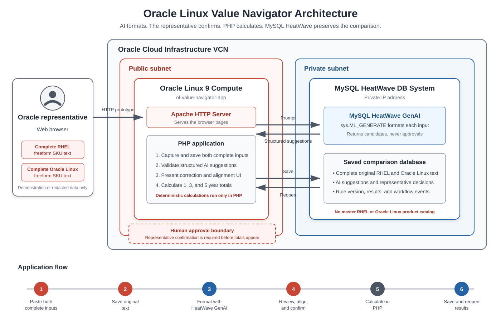

# Introduction

## About this Workshop

Oracle Linux Value Navigator is an AI-assisted PHP web application backed by MySQL HeatWave. It helps an Oracle representative format and compare RHEL and Oracle Linux subscription information. The representative supplies both sides of the comparison, reviews the formatted lines, and receives annual, three-year, and five-year subscription-cost results.

In this workshop, you build and deploy the complete Version 1 prototype on Oracle Cloud Infrastructure. You begin with the validated Oracle Linux LAMP environment, create the saved-comparison database, deploy the PHP workflow, add AI-assisted formatting and deterministic calculations, and finish with executable verification and a tested demonstration.

The workshop uses demonstration SKUs, quantities, and prices. Do not enter real customer information. The completed prototype produces a subscription-cost comparison for learning and demonstration. It is not a customer quote, a licensing determination, or a complete TCO analysis.

This workshop is also the development guide for the project. Each lab builds a working part of the software or infrastructure, explains why it exists, and provides steps to verify the result.

Because the documentation grows with the application, the workshop becomes a clean and accessible source of truth. Another developer can follow the labs, reproduce the environment, understand the decisions, and verify the completed application.

### About Product/Technology

Oracle Linux Value Navigator brings together Oracle Cloud Infrastructure, Oracle Linux, Apache HTTP Server, PHP, and MySQL HeatWave GenAI to create one web application.

* **Oracle Cloud Infrastructure** provides the networking, compute, and managed database services used to run the application.
* **Oracle Linux** provides the operating system for the application server.
* **Apache HTTP Server** receives browser requests and serves the application pages.
* **PHP** controls the application workflow, validates representative decisions, and performs the annual, three-year, and five-year calculations.
* **MySQL HeatWave DB System** stores the original inputs, formatted lines, representative decisions, calculation results, workflow history, and minimal deletion audits.
* **MySQL HeatWave GenAI** uses `sys.ML_GENERATE` to convert freeform RHEL and Oracle Linux subscription text into structured suggestions for representative review.

AI assists with formatting the input. It does not approve SKUs, prices, alignments, or final results. The Oracle representative reviews and confirms the data before PHP calculates the comparison.

### System Architecture

The application uses an Oracle Linux compute instance for Apache and PHP. A private MySQL HeatWave DB System stores the saved-comparison data and provides MySQL HeatWave GenAI formatting. The representative remains responsible for reviewing and confirming both sides before PHP calculates the results.

Estimated Workshop Time: 6 hours 45 minutes

### Application Flow

The completed application follows this flow:

1. The representative creates a comparison.
2. The representative pastes the complete RHEL SKU text into the RHEL freeform input.
3. MySQL HeatWave GenAI extracts and formats possible RHEL SKUs, descriptions, quantities, and prices through `sys.ML_GENERATE`.
4. The representative pastes the complete Oracle Linux SKU text into the Oracle Linux freeform input.
5. MySQL HeatWave GenAI extracts and formats possible Oracle Linux SKUs, descriptions, quantities, and prices through `sys.ML_GENERATE`.
6. The representative reviews, corrects, aligns, and confirms both sides.
7. PHP calculates annual, three-year, and five-year totals.
8. The MySQL HeatWave DB System stores the inputs, formatted lines, representative decisions, rule version, and calculated results.
9. The representative can reopen, revise, duplicate, export, or delete the comparison.

The repository includes the complete application source, an idempotent database schema, a staged deployment script, and executable PHP and installation tests. Labs 2 through 5 enable the application in stages so that each learner checkpoint corresponds to a working browser experience.

The database in the MySQL HeatWave DB System preserves each comparison like a saved Excel workbook. The application does not maintain a master RHEL or Oracle Linux product catalog. A saved SKU, description, or price is part of one representative-confirmed comparison and is not treated as authoritative product data.

### Objectives

In this workshop, you will:

* Create an Oracle Linux LAMP environment in OCI.
* Create a MySQL HeatWave DB System and configure it for MySQL HeatWave GenAI.
* Create a database schema in the MySQL HeatWave DB System for saving and reopening comparisons.
* Build PHP pages that capture RHEL and Oracle Linux freeform input.
* Use AI to format both sides into reviewable subscription lines.
* Review, correct, align, and confirm the formatted lines.
* Calculate annual, three-year, and five-year subscription costs.
* Save representative decisions and calculation-rule versions.
* Use built-in Help to guide the complete workflow.
* Reopen, revise, duplicate, export, and securely delete saved comparisons.
* Test and demonstrate the finished prototype.

### Prerequisites

This workshop assumes you have:

* Access to an OCI tenancy with permission to create a compute instance and configure its network.
* An SSH client and an SSH key pair.
* Basic experience with Linux, Apache, MySQL HeatWave, and PHP.
* No customer data is required. The workshop provides demonstration data.

### Workshop Build Sequence

* **Lab 1** creates the validated Oracle Linux, Apache, PHP, MySQL client, and MySQL HeatWave environment.
* **Lab 2** downloads the workshop source and creates the workbook-style database schema and least-privilege application account.
* **Lab 3** deploys the PHP foundation and verifies creation, storage, listing, and reopening of the two original inputs.
* **Lab 4** enables MySQL HeatWave GenAI formatting, strict response validation, representative editing, alignment, decisions, and manual fallback.
* **Lab 5** enables exact money calculations, saved result snapshots, built-in Help, revision, duplication, CSV workbook export, and confirmed deletion.
* **Lab 6** runs automated checks and verifies the complete browser workflow and fail-closed behavior.

*This is the fold. The remaining sections are collapsed by default.*

## Learn More

* [Oracle Linux documentation](https://docs.oracle.com/en/operating-systems/oracle-linux/)
* [Oracle Cloud Infrastructure documentation](https://docs.oracle.com/en-us/iaas/Content/home.htm)
* [Oracle LiveLabs authoring documentation](https://livelabs.oracle.com/how-to)

## Acknowledgements

* **Author** - Perside Foster, Mark Atkinson, Shawn Kelley
* **Contributors** - Nick Mader
* **Last Updated By/Date** - Perside Foster, September 2026
