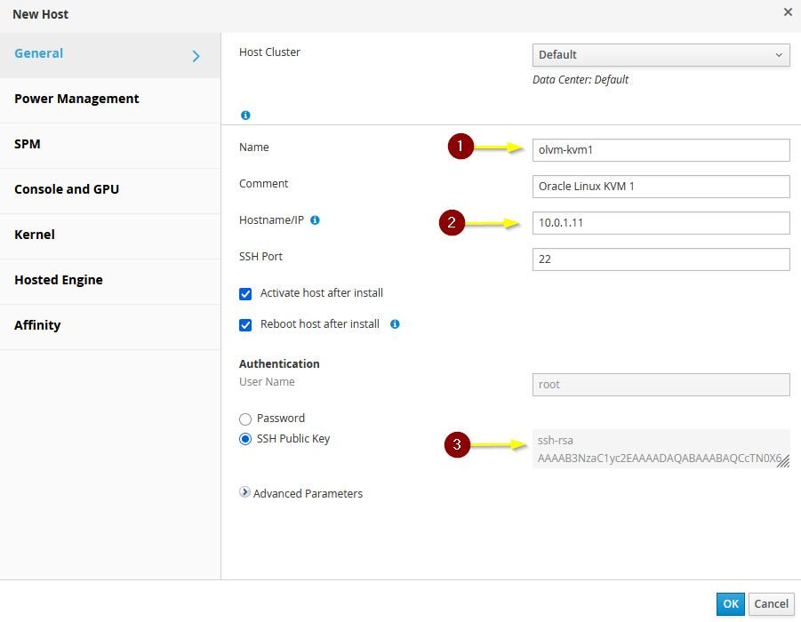
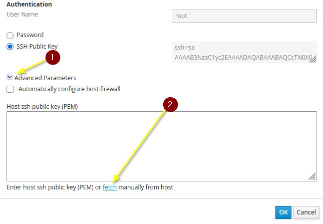
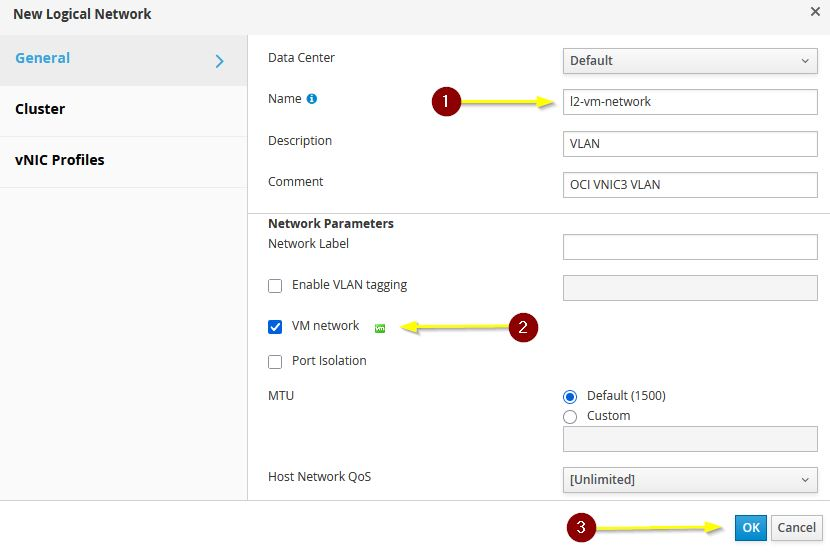
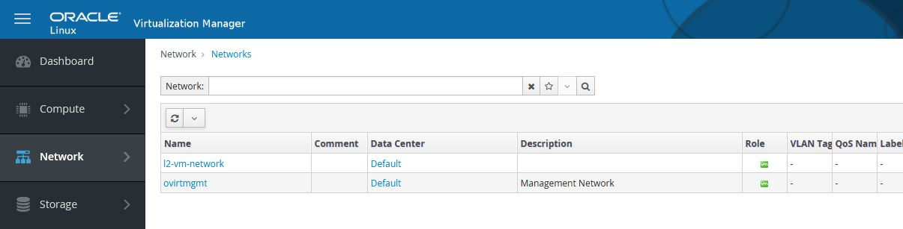
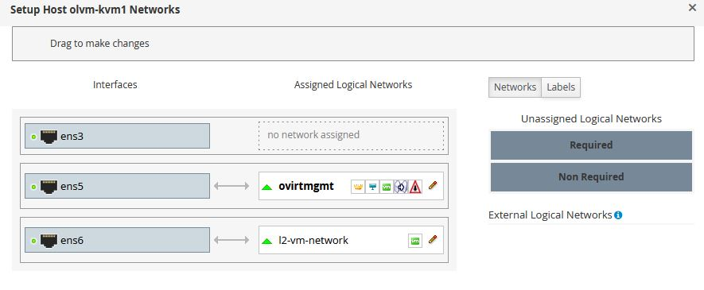

# Add Hosts and Networks

## Introduction

This lab walks you through preparing the KVM hosts for Oracle Linux Virtualization Manager (OLVM), adding the hosts to the OLVM Administration Portal, creating the logical network used for guest virtual machines, assigning that network to the host interfaces, and attaching shared storage domains.

Estimated Lab Time: 35 minutes

### About Host Integration in OLVM

After the OLVM Manager is installed, each KVM host must be prepared with the required packages and then added to the OLVM Administration Portal. In this workshop, the logical VM network is mapped to the VLAN-facing interface on each KVM host, and OCI block volumes are presented to OLVM as Fibre Channel data domains. :contentReference[oaicite:0]{index=0}

### Objectives

In this lab, you will:
* Install the required OLVM packages on the KVM hosts
* Add `olvm-kvm1` and `olvm-kvm2` to the OLVM Manager
* Create the logical VM network
* Assign the logical network to the KVM host interfaces
* Add the shared storage domains to OLVM

### Prerequisites

This lab assumes you have:
* An Oracle Cloud account
* Completed the previous labs
* A working OLVM Manager installation
* SSH access to `olvm-kvm1` and `olvm-kvm2`

## Task 1: Install Required Packages on the KVM Hosts

1. Open a terminal session to `olvm-kvm1` using SSH. :contentReference[oaicite:1]{index=1}

    ```
    <copy>ssh opc@<olvm-kvm1-public-ip> -i <path-to-private-key></copy>
    ```

2. Install the Oracle Linux Virtualization Manager release package:

    ```
    <copy>sudo dnf install -y oracle-ovirt-release-45-el8</copy>
    ```

3. Install the required UEK kernel modules:

    ```
    <copy>sudo dnf install -y kernel-uek-modules-extra</copy>
    ```

4. Clear the DNF cache:

    ```
    <copy>sudo dnf clean all</copy>
    ```

5. Reboot the host:

    ```
    <copy>sudo reboot</copy>
    ```

6. Repeat these steps on `olvm-kvm2`.

> **Note:** Complete these package installation steps on both KVM hosts before attempting to add them in the OLVM Administration Portal. :contentReference[oaicite:2]{index=2}

## Task 2: Add the KVM Hosts to OLVM

1. Open a browser and log in to the OLVM Administration Portal.

    ```
    <copy>https://<fqdn-of-the-manager-host>/ovirt-engine</copy>
    ```

2. In the side navigation menu, click **Compute**, then click **Hosts**. :contentReference[oaicite:3]{index=3}

3. Click **New**.

4. In the **New Host** dialog box, keep the **Default** data center and cluster selected.

5. Enter the details for the first host:

    | Field | Value |
    | --- | --- |
    | Name | `olvm-kvm1` |
    | Hostname | `10.0.1.11` |

6. Under **Authentication**, copy the SSH public key displayed by OLVM. :contentReference[oaicite:4]{index=4}

7. Switch to the terminal session for `olvm-kvm1`.

8. Become the `root` user and edit the authorized keys file:

    ```
    <copy>sudo -i</copy>
    ```

    ```
    <copy>vi /root/.ssh/authorized_keys</copy>
    ```

9. Paste the OLVM engine SSH public key into `/root/.ssh/authorized_keys`, then save the file.

10. Return to the OLVM portal.

11. Under **Advanced Parameters**, click **fetch manually** to populate the host SSH public key field.

    

    

12. Clear the **Automatically configure host firewall** checkbox.

13. Click **OK**.

14. When the power management dialog appears, click **OK** again. OCI instances do not support power management configuration in this workflow. :contentReference[oaicite:5]{index=5}

15. Repeat the same process to add `olvm-kvm2`, using `10.0.1.12` as the hostname.

16. Wait for both hosts to reach the **Up** status.

> **Important:** Do not continue until both hosts show a status of **Up**. The source guide warns against making spontaneous host network changes after the hosts are added to a cluster. :contentReference[oaicite:6]{index=6}

## Task 3: Create the Logical Network

1. In the side navigation menu, click **Network**, then click **Networks**. :contentReference[oaicite:7]{index=7}

2. Click **New**.

3. In the **New Logical Network** dialog box, enter the following value:

    | Field | Value |
    | --- | --- |
    | Name | `l2-vm-network` |

4. Confirm that the **Default** data center is selected.

5. Leave the **VM Network** checkbox selected.

6. Click **OK**.

    

    

## Task 4: Assign the Logical Network to the Host Interfaces

1. In the side navigation menu, click **Compute**, then click **Hosts**. :contentReference[oaicite:8]{index=8}

2. Click the name `olvm-kvm1`.

3. Click the **Network Interfaces** tab.

4. Click **Setup Host Networks**.

5. In the **Setup Host Networks** dialog box, drag **l2-vm-network** from **Unassigned Logical Networks** to the box next to interface `ens6`.

    

6. Click **OK** to save the change.

7. Repeat the same process for `olvm-kvm2`.

> **Note:** In this workshop, the VLAN-facing interface is expected to be `ens6`. Confirm the interface mapping before applying the logical network. :contentReference[oaicite:9]{index=9}

## Task 5: Add the Shared Storage Domains

1. In the side navigation menu, click **Storage**, then click **Domains**. :contentReference[oaicite:10]{index=10}

2. Click **New Domain**.

3. Create the first storage domain using these values:

    | Field | Value |
    | --- | --- |
    | Name | `1-storagedomain` |
    | Data Center | `Default` |
    | Domain Function | `Data` |
    | Storage Type | `Fibre Channel` |
    | Host to Use | `olvm-kvm1` |

4. Wait for the known targets and unused LUNs to appear.

5. Click **Add** next to the first available LUN ID.

6. Click **OK**.

7. Monitor the task progress until the **Cross Data Center Status** shows **Active**.

8. Repeat the process to create the second storage domain with these values:

    | Field | Value |
    | --- | --- |
    | Name | `2-storagedomain` |
    | Data Center | `Default` |
    | Domain Function | `Data` |
    | Storage Type | `Fibre Channel` |
    | Host to Use | `olvm-kvm2` |

9. Wait until the second storage domain also shows **Active**.

> **Note:** In this workshop, the OCI block volumes attached to the KVM hosts appear in OLVM as Fibre Channel LUNs. :contentReference[oaicite:11]{index=11}

You may now **proceed to the next lab**.

## Learn More

* [Adding Hosts in Oracle Linux Virtualization Manager](https://docs.oracle.com/en/virtualization/oracle-linux-virtualization-manager/)
* [Storage Domains in Oracle Linux Virtualization Manager](https://docs.oracle.com/en/virtualization/oracle-linux-virtualization-manager/)

## Acknowledgements
* **Author** - Shawn Kelley
* **Contributors** - Optional
* **Last Updated By/Date** - Perside Foster, April 2026