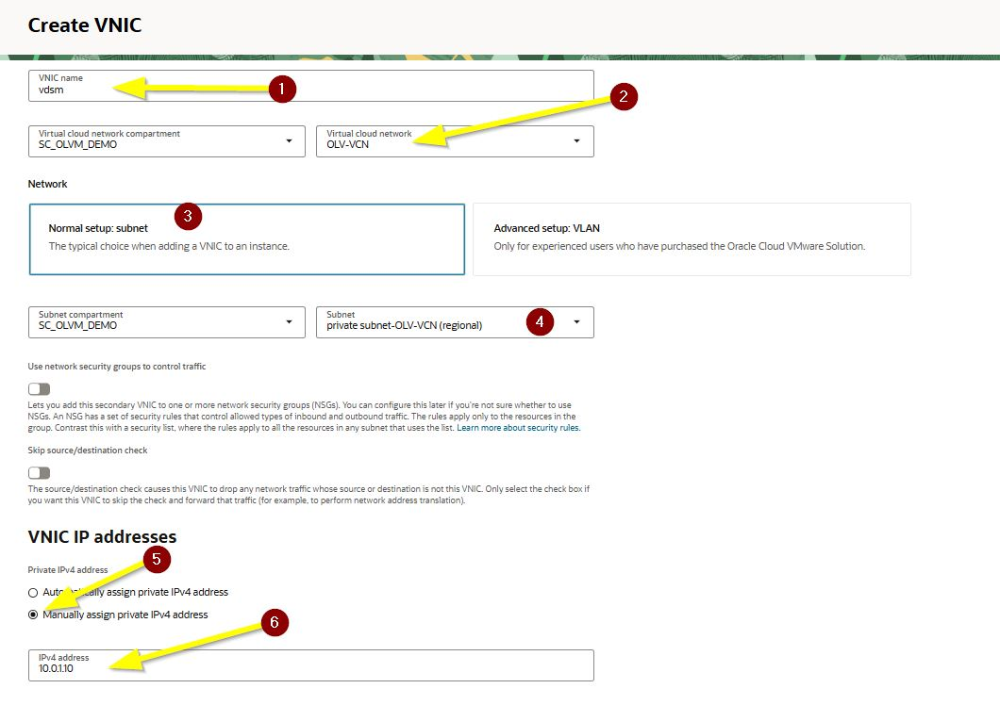
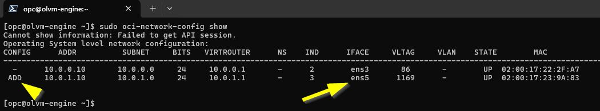
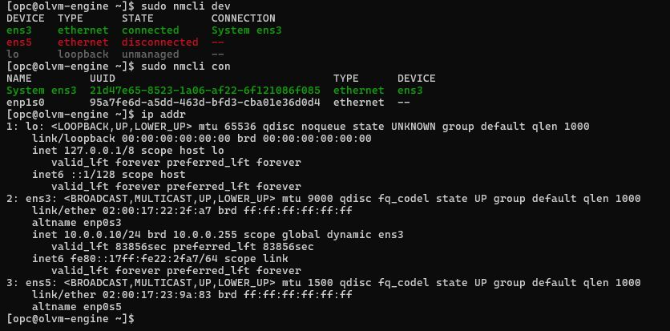
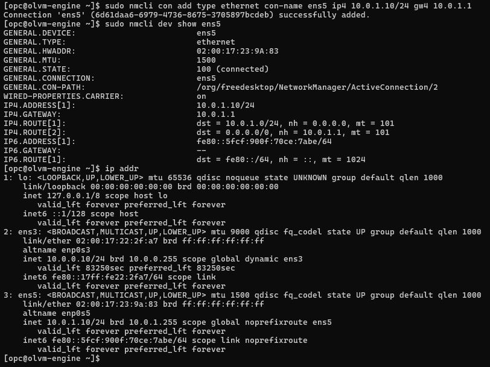
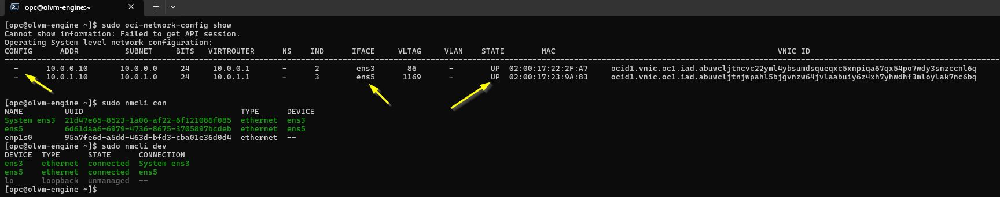
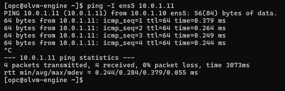
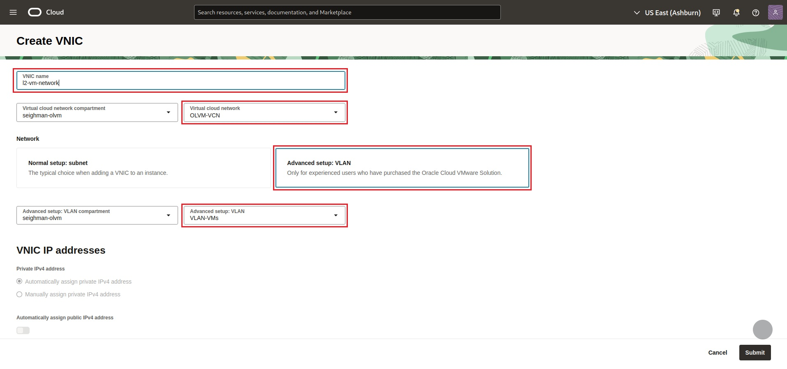
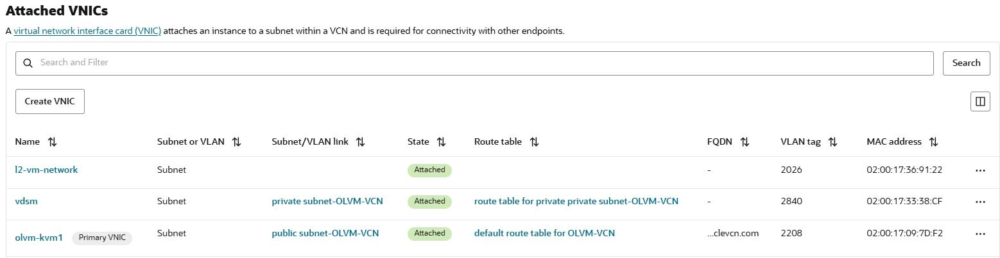
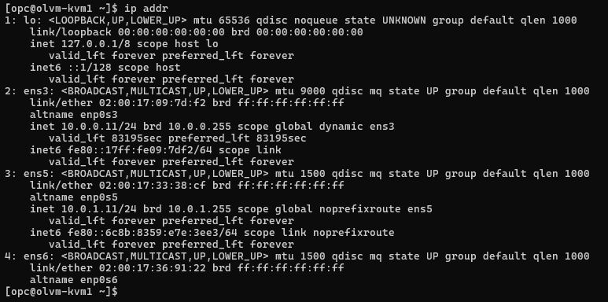

# Configure VNICs and VLAN

## Introduction

This lab walks you through adding the secondary VNIC to the OLVM engine and both KVM hosts, configuring the private host network in Oracle Linux, and then adding the VLAN VNIC to the KVM hosts for guest virtual machine networking.

Estimated Lab Time: 35 minutes

### About Host Networking

In this workshop, the primary VNIC on each instance is attached to the public subnet, the secondary VNIC is attached to the private subnet for host communication, and a third VLAN VNIC is attached only to the KVM hosts for guest virtual machine traffic. This sequence matters because the source content notes an OCI-related issue when the VLAN VNIC is added too early. :contentReference[oaicite:0]{index=0}

### Objectives

In this lab, you will:
* Add a secondary VNIC to the OLVM engine and both KVM hosts
* Configure the private subnet IP address on each host
* Validate host communication over the private network
* Add the VLAN VNIC to the KVM hosts
* Verify interface mapping before continuing

### Prerequisites

This lab assumes you have:
* An Oracle Cloud account
* Completed the previous labs
* Three running instances named `olvm-engine`, `olvm-kvm1`, and `olvm-kvm2`
* Access to the private SSH key used to connect to the instances

## Task 1: Add a Secondary VNIC to Each Instance

1. In the OCI Console, open **Compute** and then click **Instances**. :contentReference[oaicite:1]{index=1}

2. Click **olvm-engine**, then click **Networking**.

3. Click **Create VNIC**.

4. Enter the following values for the engine:

    | Field | Value |
    | --- | --- |
    | Name | `VDSM` |
    | Virtual Cloud Network | `OLVM-VCN` |
    | Network Setup | `Subnet` |
    | Subnet | `Private Subnet-OLVM-VCN` |
    | Manually Assign Private IPv4 Address | Enabled |
    | Private IPv4 Address | `10.0.1.10` |

5. Click **Submit**.

6. Repeat these steps for the KVM hosts using the following IP addresses:

    | Instance | VNIC Name | Private IPv4 Address |
    | --- | --- | --- |
    | `olvm-kvm1` | `VDSM` | `10.0.1.11` |
    | `olvm-kvm2` | `VDSM` | `10.0.1.12` |

    

> **Note:** Do not add the VLAN VNIC yet. The source content explicitly warns that adding the VLAN NIC too early can cause problems with `oci-network-config`. :contentReference[oaicite:2]{index=2}

## Task 2: Connect to Each Host and Inspect the New Interface

1. Capture the public IP address for each instance from the OCI Console. :contentReference[oaicite:3]{index=3}

2. Open a terminal session and connect to `olvm-engine` using SSH.

    ```
    <copy>ssh opc@<public-ip-address> -i <path-to-private-key></copy>
    ```

3. Run the following command to confirm that the second VNIC was added and is ready to be configured:

    ```
    <copy>sudo oci-network-config show</copy>
    ```

    

4. Run the following commands to inspect the device and connection names:

    ```
    <copy>sudo nmcli dev</copy>
    ```

    ```
    <copy>sudo nmcli con</copy>
    ```

    ```
    <copy>ip addr</copy>
    ```

    

5. Repeat this inspection on `olvm-kvm1` and `olvm-kvm2`.

> **Note:** In this workshop, the second VNIC is expected to appear as `ens5`. Confirm this before assigning the private subnet address. :contentReference[oaicite:4]{index=4}

## Task 3: Configure the Private Network on Each Host

1. On `olvm-engine`, create the network connection for `ens5` with the private subnet address:

    ```
    <copy>sudo nmcli con add type ethernet con-name ens5 ip4 10.0.1.10/24 gw4 10.0.1.1</copy>
    ```

2. On `olvm-kvm1`, create the network connection for `ens5`:

    ```
    <copy>sudo nmcli con add type ethernet con-name ens5 ip4 10.0.1.11/24 gw4 10.0.1.1</copy>
    ```

3. On `olvm-kvm2`, create the network connection for `ens5`:

    ```
    <copy>sudo nmcli con add type ethernet con-name ens5 ip4 10.0.1.12/24 gw4 10.0.1.1</copy>
    ```

4. On all three hosts, bind the connection to the expected interface name:

    ```
    <copy>sudo nmcli con mod ens5 connection.interface-name ens5</copy>
    ```

5. Confirm the updated configuration on each host:

    ```
    <copy>sudo oci-network-config show</copy>
    ```

    

    

## Task 4: Validate Private Network Connectivity

1. From each host, test connectivity over the private interface using the `ping` command. :contentReference[oaicite:5]{index=5}

2. Run the following commands as needed to validate communication across the `10.0.1.0/24` network:

    On `olvm-engine`:

    ```
    <copy>ping -I ens5 10.0.1.11</copy>
    ```

    ```
    <copy>ping -I ens5 10.0.1.12</copy>
    ```

    On `olvm-kvm1`:

    ```
    <copy>ping -I ens5 10.0.1.10</copy>
    ```

    ```
    <copy>ping -I ens5 10.0.1.12</copy>
    ```

    On `olvm-kvm2`:

    ```
    <copy>ping -I ens5 10.0.1.10</copy>
    ```

    ```
    <copy>ping -I ens5 10.0.1.11</copy>
    ```

3. You can also validate connectivity using SSH between hosts if needed.

    

> **Important:** If the ping tests fail, check the private subnet security list and confirm that traffic within the `10.0.1.0/24` network is allowed. The source guide warns not to continue until this network is working correctly. :contentReference[oaicite:6]{index=6}

## Task 5: Add the VLAN VNIC to the KVM Hosts

1. In the OCI Console, return to **Compute** > **Instances**. :contentReference[oaicite:7]{index=7}

2. Click **olvm-kvm1**, then click **Networking**.

3. Click **Create VNIC**.

4. Enter the following values:

    | Field | Value |
    | --- | --- |
    | Name | `l2-vm-network` |
    | Virtual Cloud Network | `OLVM-VCN` |
    | Network Setup | `Advanced Setup: VLAN` |
    | VLAN | `VLAN-VMs` |

5. Click **Submit**.

6. Repeat the same steps for `olvm-kvm2`.

    

7. Verify that both KVM hosts now show the expected VNIC configuration.

    

## Task 6: Verify the VLAN Interface Mapping

1. Return to the SSH sessions for `olvm-kvm1` and `olvm-kvm2`. :contentReference[oaicite:8]{index=8}

2. Run the following command on each KVM host:

    ```
    <copy>ip addr</copy>
    ```

3. Confirm that the new VLAN interface appears as `ens6`.

    

4. Confirm that private network communication over `ens5` still works after the VLAN VNIC has been added.

    ```
    <copy>ping -I ens5 10.0.1.10</copy>
    ```

    ```
    <copy>ping -I ens5 10.0.1.11</copy>
    ```

    ```
    <copy>ping -I ens5 10.0.1.12</copy>
    ```

5. Do not continue until both KVM hosts can still reach the private network correctly.

> **Important:** The source content notes that if adding the VLAN VNIC changes the mapping and causes the VLAN interface to attach incorrectly, you should restart networking or reboot the instance before moving on. A more detailed fix is provided later in the troubleshooting content. :contentReference[oaicite:9]{index=9}

You may now **proceed to the next lab**.

## Learn More

* [OCI Secondary VNICs](https://docs.oracle.com/en-us/iaas/Content/Network/Tasks/managingVNICs.htm)
* [Oracle Linux NetworkManager Documentation](https://docs.oracle.com/en/operating-systems/oracle-linux/)

## Acknowledgements
* **Author** - Shawn Kelley
* **Contributors** - Optional
* **Last Updated By/Date** - Perside Foster, April 2026