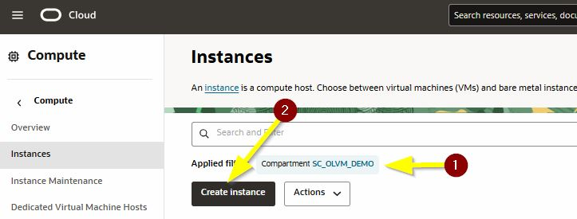
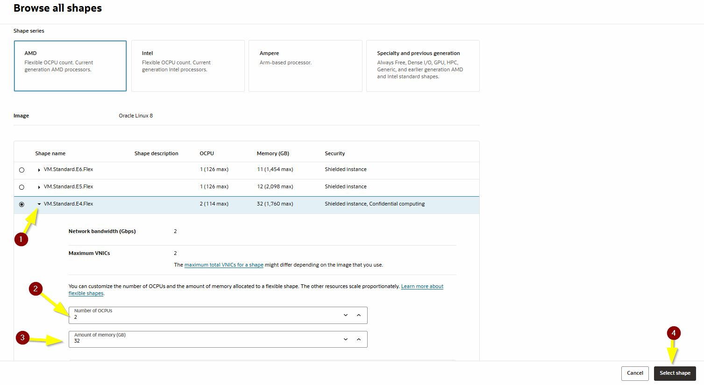
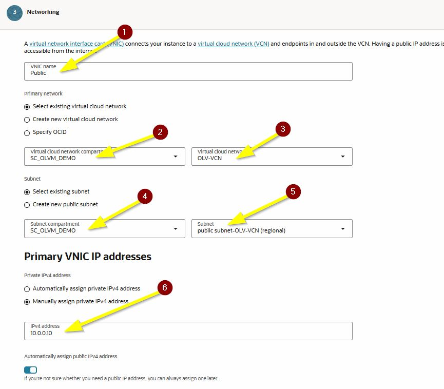
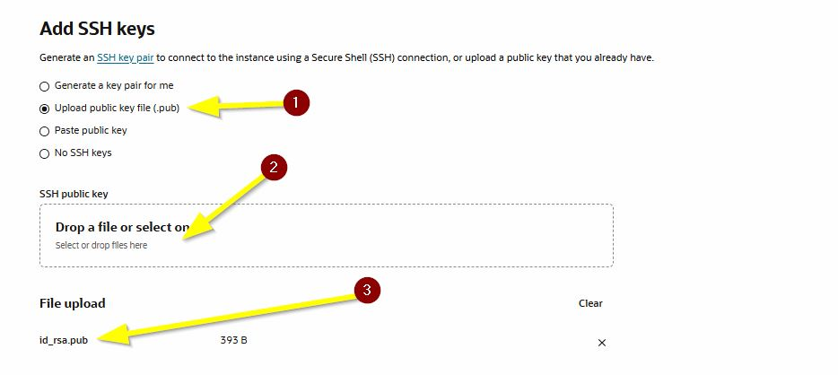
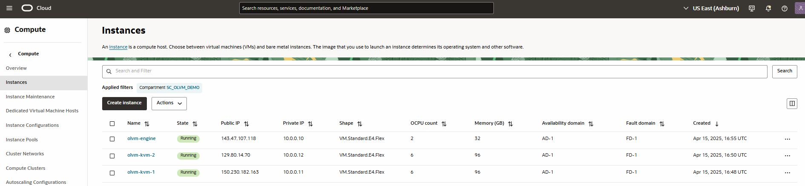

# Deploy OLVM Engine and KVM Hosts

## Introduction

This lab walks you through deploying the Oracle Linux Virtualization Manager (OLVM) engine and two Oracle Linux KVM hosts on Oracle Cloud Infrastructure (OCI). You will create the compute instances, assign the required shapes and IP addresses, and verify that the environment is ready for network and storage configuration.

Estimated Lab Time: 30 minutes

### About OLVM on OCI

This lab uses three Oracle Linux 8 compute instances: one OLVM engine and two KVM hosts. The engine provides the management plane for the virtualization environment, while the KVM hosts provide the compute resources used to run virtual machines. In this workshop, the instances are deployed into the OCI networking foundation created in the previous lab. :contentReference[oaicite:0]{index=0}

### Objectives

In this lab, you will:
* Create the `olvm-engine` instance
* Create the `olvm-kvm1` instance
* Create the `olvm-kvm2` instance
* Assign the correct primary private IP addresses
* Verify the instance inventory before continuing

### Prerequisites

This lab assumes you have:
* An Oracle Cloud account
* Completed the previous lab
* A working OCI VCN with the required public and private subnets
* An SSH key pair available for instance access

## Task 1: Create the OLVM Engine Instance

1. Open the **Navigation Menu**, click **Compute**, and then click **Instances**. :contentReference[oaicite:1]{index=1}

2. Confirm that your compartment is set to `<lastname-olvm>`. :contentReference[oaicite:2]{index=2}

3. Click **Create Instance**.

    

4. Enter the basic instance details:

    | Field | Value |
    | --- | --- |
    | Name | `olvm-engine` |
    | Create in Compartment | `<lastname-olvm>` |
    | Availability Domain | `AD 1` |
    | Image | `Oracle Linux 8` |

5. Click **Change Shape** and set the instance shape values:

    | Field | Value |
    | --- | --- |
    | Shape | `VM.Standard.E4.Flex` |
    | Number of OCPUs | `2` |
    | Memory (GB) | `32` |

6. Click **Select Shape**.

    

7. Click **Next** for **Security**.

8. Click **Next** for **Networking**.

9. Enter the networking values:

    | Field | Value |
    | --- | --- |
    | VNIC Name | `Public` |
    | Virtual Cloud Network | `OLVM-VCN` |
    | Subnet | `Public Subnet-OLVM-VCN` |
    | Manually Assign Private IPv4 Address | Enabled |
    | Private IPv4 Address | `10.0.0.10` |
    | Automatically Assign Public IPv4 Address | Enabled |

10. In the SSH key section, select **Generate a key pair for me**.

11. Download and save both the private and public keys to your local system.

    > **Important:** Save the keys in a location you can access later. You will use them to connect to the engine and host instances. :contentReference[oaicite:3]{index=3}

12. Click **Next** for **Storage**.

13. Click **Next** for **Review and Create**.

14. Click **Create**.

## Task 2: Create the First KVM Host Instance

1. On the **Instances** page, click **Create Instance**. :contentReference[oaicite:4]{index=4}

2. Enter the basic instance details:

    | Field | Value |
    | --- | --- |
    | Name | `olvm-kvm1` |
    | Create in Compartment | `<lastname-olvm>` |
    | Availability Domain | `AD 1` |
    | Image | `Oracle Linux 8` |

3. Click **Change Shape** and set the instance shape values:

    | Field | Value |
    | --- | --- |
    | Shape | `VM.Standard.E4.Flex` |
    | Number of OCPUs | `6` |
    | Memory (GB) | `96` |

4. Click **Select Shape**.

5. Click **Next** for **Security**.

6. Click **Next** for **Networking**.

7. Enter the networking values:

    | Field | Value |
    | --- | --- |
    | VNIC Name | `Public` |
    | Virtual Cloud Network | `OLVM-VCN` |
    | Subnet | `Public Subnet-OLVM-VCN` |
    | Manually Assign Private IPv4 Address | Enabled |
    | Private IPv4 Address | `10.0.0.11` |
    | Automatically Assign Public IPv4 Address | Enabled |

8. In the SSH key section, select **Upload public key files (.pub)**.

9. Upload the public key file that you downloaded when creating `olvm-engine`. :contentReference[oaicite:5]{index=5}

    

    

10. Click **Next** for **Storage**.

11. Click **Next** for **Review and Create**.

12. Click **Create**.

## Task 3: Create the Second KVM Host Instance

1. Repeat the previous task to create the second KVM host. :contentReference[oaicite:6]{index=6}

2. Use the following values:

    | Field | Value |
    | --- | --- |
    | Name | `olvm-kvm2` |
    | Create in Compartment | `<lastname-olvm>` |
    | Availability Domain | `AD 1` |
    | Image | `Oracle Linux 8` |
    | Shape | `VM.Standard.E4.Flex` |
    | Number of OCPUs | `6` |
    | Memory (GB) | `96` |
    | Virtual Cloud Network | `OLVM-VCN` |
    | Subnet | `Public Subnet-OLVM-VCN` |
    | Private IPv4 Address | `10.0.0.12` |

3. Upload the same public SSH key used for `olvm-kvm1`.

4. Complete the instance creation.

    > **Important:** Use `10.0.0.12` for the primary private IP address of `olvm-kvm2`. The source content included an incorrect `10.0.1.12` reference and then corrected it. For this lab, use `10.0.0.12` only. :contentReference[oaicite:7]{index=7}

## Task 4: Verify the Instance Inventory

1. Return to the **Instances** page in OCI. :contentReference[oaicite:8]{index=8}

2. Verify that all three instances have been created in the same Availability Domain:

    * `olvm-engine`
    * `olvm-kvm1`
    * `olvm-kvm2`

3. Verify that the instances use these primary private IP addresses:

    | Instance Name | Primary Private IP | OCPUs | Memory (GB) |
    | --- | --- | --- | --- |
    | `olvm-engine` | `10.0.0.10` | `2` | `32` |
    | `olvm-kvm1` | `10.0.0.11` | `6` | `96` |
    | `olvm-kvm2` | `10.0.0.12` | `6` | `96` |

4. Confirm that each instance also has a public IP address assigned on its primary VNIC.

    

You may now **proceed to the next lab**.

## Learn More

* [Creating Compute Instances](https://docs.oracle.com/en-us/iaas/Content/Compute/Tasks/launchinginstance.htm)
* [Compute Shapes Documentation](https://docs.oracle.com/en-us/iaas/Content/Compute/References/computeshapes.htm)

## Acknowledgements
* **Author** - Shawn Kelley
* **Contributors** - Optional
* **Last Updated By/Date** - Perside Foster, April 2026