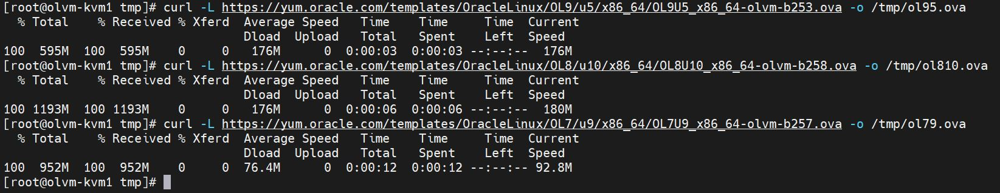
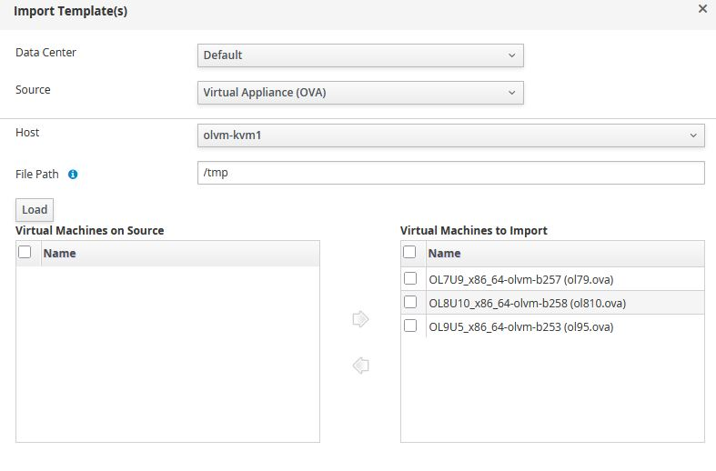
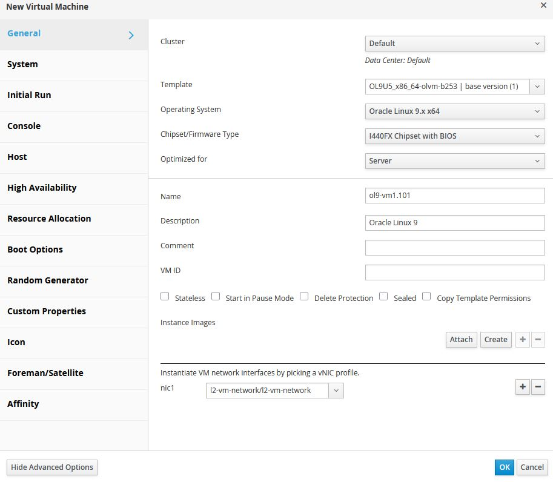
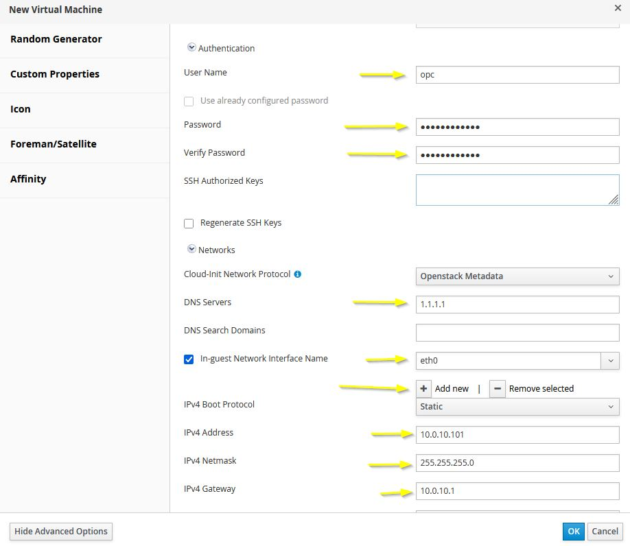
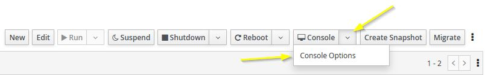
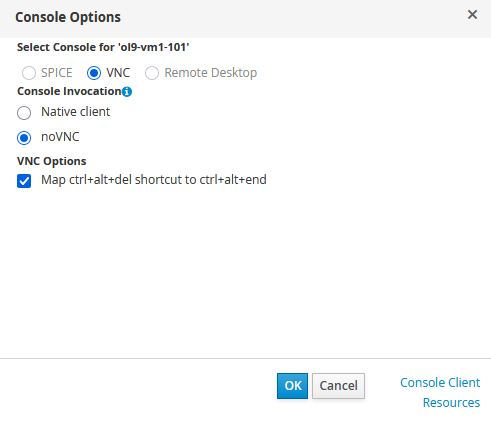
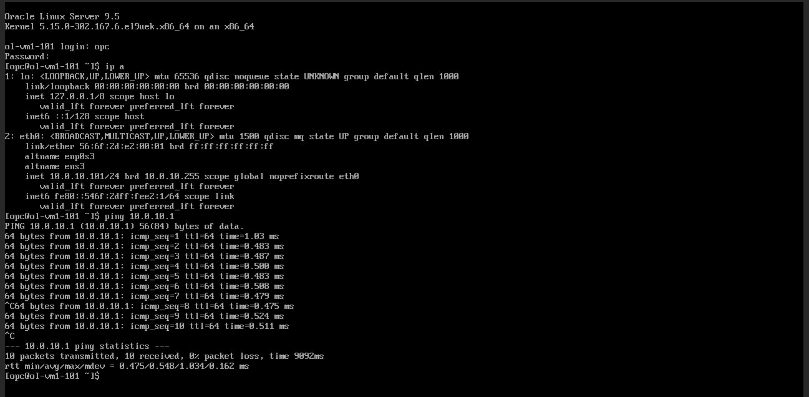
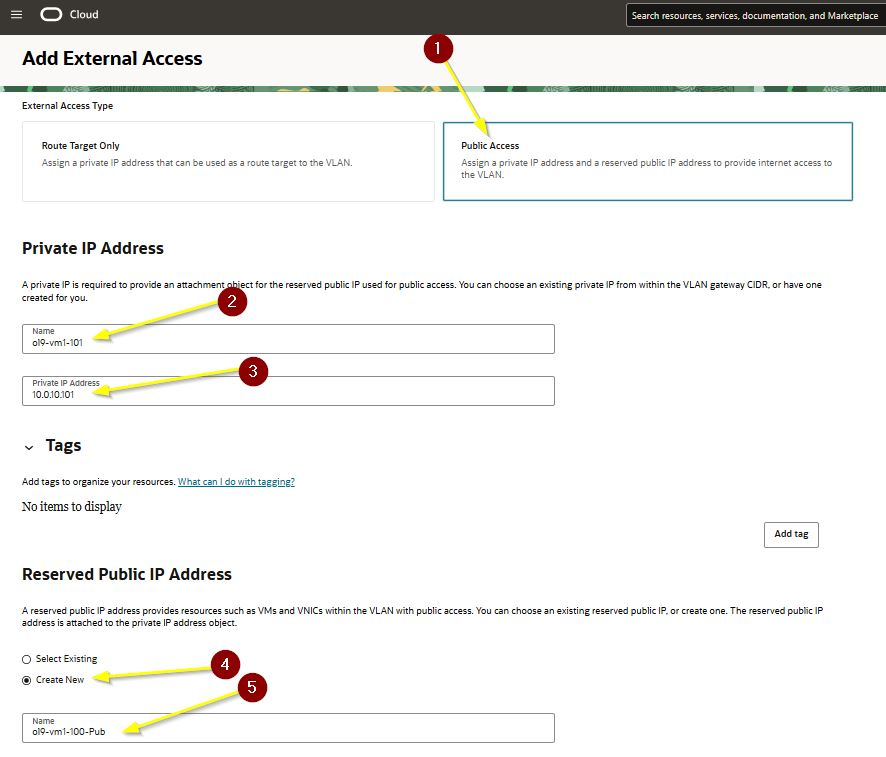
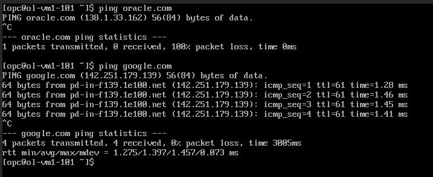
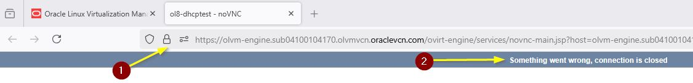

# Import Templates and Create VMs

## Introduction

This lab walks you through importing Oracle Linux OVA templates into Oracle Linux Virtualization Manager (OLVM), creating a virtual machine from a template, validating console access, enabling external access for the guest network, and reviewing optional DHCP and troubleshooting steps for demo environments.

Estimated Lab Time: 40 minutes

### About VM Provisioning in OLVM

In this workshop, Oracle Linux OVA templates are downloaded to a KVM host and then imported into OLVM for use as virtual machine templates. Guest virtual machines are connected to the VLAN-backed logical network, where they can be configured with static addressing and, if needed, optional public external access through OCI. :contentReference[oaicite:0]{index=0}

### Objectives

In this lab, you will:
* Download Oracle Linux OVA templates to a KVM host
* Import OVA templates into OLVM
* Create a virtual machine from a template
* Configure guest networking and authentication
* Validate noVNC console access
* Add public external access for a guest virtual machine
* Test guest network connectivity
* Review optional DHCP and troubleshooting procedures

### Prerequisites

This lab assumes you have:
* An Oracle Cloud account
* Completed the previous labs
* A working OLVM Manager environment with KVM hosts in the **Up** state
* Shared storage domains available in OLVM
* Access to `olvm-kvm1` using SSH

## Task 1: Download Oracle Linux OVA Templates

1. Open a terminal and connect to `olvm-kvm1` using SSH. :contentReference[oaicite:1]{index=1}

    ```
    <copy>ssh opc@<olvm-kvm1-public-ip> -i <path-to-private-key></copy>
    ```

2. Change to the `/tmp` directory.

    ```
    <copy>cd /tmp</copy>
    ```

3. Download the Oracle Linux 9 OVA template.

    ```
    <copy>curl -L https://yum.oracle.com/templates/OracleLinux/OL9/u5/x86_64/OL9U5_x86_64-olvm-b253.ova -o /tmp/ol9u5.ova</copy>
    ```

4. Download the Oracle Linux 8 OVA template.

    ```
    <copy>curl -L https://yum.oracle.com/templates/OracleLinux/OL8/u10/x86_64/OL8U10_x86_64-olvm-b258.ova -o /tmp/ol8u10.ova</copy>
    ```

5. Download the Oracle Linux 7 OVA template.

    ```
    <copy>curl -L https://yum.oracle.com/templates/OracleLinux/OL7/u9/x86_64/OL7U9_x86_64-olvm-b257.ova -o /tmp/ol7u9.ova</copy>
    ```

    

> **Note:** The source content references Oracle Linux templates from Oracle public sources and uses `/tmp` on `olvm-kvm1` as the import location. :contentReference[oaicite:2]{index=2}

## Task 2: Import the OVA Templates into OLVM

1. In the OLVM Administration Portal, click **Compute**, then click **Templates**. :contentReference[oaicite:3]{index=3}

2. Click **Import**.

3. Keep the default selections for **Data Center**, **Source**, and **Host**.

4. In the **File Path** field, enter `/tmp`.

5. Click **Load**.

6. In the **Virtual Machines on Source** pane, select the OVA templates and move them to the **Virtual Machines to Import** pane.

7. Click **Next**.

8. Review the template details, then click **OK**.

9. Wait until the imported templates show a status of **OK**.

    

## Task 3: Create a Virtual Machine from a Template

1. In the OLVM Administration Portal, click **Compute**, then click **Virtual Machines**. :contentReference[oaicite:4]{index=4}

2. Click **New**.

3. Enter the following values for the new virtual machine:

    | Field | Value |
    | --- | --- |
    | Template | `OL9U5x8664-olvm-b253` |
    | Operating System | `Oracle Linux 9.x x64` |
    | Name | `ol9-vm1-101` |
    | nic1 | `l2-vm-network` |

    

4. Click **Show Advanced Options**.

5. Click **Initial Run**.

6. Click **Authentication** and enter the following values:

    | Field | Value |
    | --- | --- |
    | User Name | `opc` |
    | Password | `<your-password>` |
    | Verify Password | `<your-password>` |

7. Click **Networks**.

8. Enter the DNS server value:

    | Field | Value |
    | --- | --- |
    | DNS Servers | `1.1.1.1` |

9. Select the checkbox for **In-guest Network Interface Name**.

10. Click **Add** and enter the static network settings:

    | Field | Value |
    | --- | --- |
    | In-guest Network Interface Name | `eth0` |
    | IPv4 Boot Protocol | `Static` |
    | IPv4 Address | `10.0.10.101` |
    | IPv4 Netmask | `255.255.255.0` |
    | IPv4 Gateway | `10.0.10.1` |

11. Click **OK**.

12. Wait for the VM status to change from **Importing** to **Down**.

    

> **Note:** The source content uses static guest IP addressing because the VLAN-backed VM network does not provide DHCP by default. :contentReference[oaicite:5]{index=5}

## Task 4: Start the VM and Validate Console Access

1. Select the virtual machine and click **Run**. :contentReference[oaicite:6]{index=6}

2. Click the arrow next to **Console**, then select **Console Options**.

    

3. Under **Console Invocation**, select **noVNC**, then click **OK**.

    

4. Click **Console** to open a new browser window for the VM.

5. Log in using the user name and password defined during VM creation.

6. Check the guest network configuration.

    ```
    <copy>ip addr</copy>
    ```

7. Verify that the guest interface is using the configured `10.0.10.101` address.

8. Ping the gateway.

    ```
    <copy>ping 10.0.10.1</copy>
    ```

    

9. Test a public hostname such as `oracle.com` or `google.com`.

> **Note:** At this point, DNS resolution or public connectivity may fail because the VLAN network is isolated until external access is configured in OCI. :contentReference[oaicite:7]{index=7}

## Task 5: Add External Access for the Virtual Machine

1. Open the OCI Console and navigate to **Networking** > **Virtual Cloud Networks**. :contentReference[oaicite:8]{index=8}

2. Click the name of the VCN.

3. In the **Resources** menu, click **VLANs**.

4. Click the VLAN name.

5. On the **VLAN Details** page, click **Add External Access**.

6. Under **External Access Type**, select **Public Access**.

7. Enter the guest details:

    | Field | Value |
    | --- | --- |
    | Name | `ol9-vm1-101` |
    | Private IP Address | `10.0.10.101` |
    | Reserved Public IP Address | `Create New` |

8. Click **Add External Access**.

    

    

9. Verify that the VLAN now displays a public IP mapping for the VM.

## Task 6: Test Guest Internet Connectivity

1. Return to the VM console window. :contentReference[oaicite:9]{index=9}

2. Test DNS and internet access from the guest.

    ```
    <copy>ping oracle.com</copy>
    ```

    ```
    <copy>ping google.com</copy>
    ```

    

3. Confirm that the guest can now resolve names and reach internet destinations.

4. Optionally, update the guest package level.

    ```
    <copy>sudo dnf upgrade -y</copy>
    ```

## Task 7: Optionally Add a DHCP Server to the VM Network

1. Create another virtual machine using the same template workflow, but use the following values for the DHCP server guest:

    | Field | Value |
    | --- | --- |
    | Name | `ol9-dhcpserver` |
    | IP Address | `10.0.10.2` |
    | User Name | `opc` |

2. In **Initial Run**, go to **Networks** and configure the guest as needed.

3. Under **Custom Script**, paste the following script:

    ```
    <copy>runcmd:
      - |
        dnf install -y dhcp-server

        echo 'option domain-name-servers 10.0.10.1;
        default-lease-time 43200;
        max-lease-time 86400;
        authoritative;
        log-facility local7;
        subnet 10.0.10.0 netmask 255.255.255.0 {
          range 10.0.10.200 10.0.10.250;
          option domain-name-servers 10.0.10.1;
          option routers 10.0.10.1;
          option broadcast-address 10.0.10.255;
        }' >> /etc/dhcp/dhcpd.conf

        systemctl enable --now dhcpd.service</copy>
    ```

4. Complete the VM creation and start the guest.

> **Note:** This DHCP configuration is optional and is intended for demo use on the `l2-vm-network`. :contentReference[oaicite:10]{index=10}

## Task 8: Troubleshoot noVNC and VLAN Interface Issues

1. If the noVNC console shows **Something went wrong, connection is closed**, first confirm that the OLVM CA certificate was imported correctly into your browser. :contentReference[oaicite:11]{index=11}

    

2. Confirm that your current client IP address is still allowed in the OCI security list. The source content notes that your public IP may change if your ISP uses DHCP. :contentReference[oaicite:12]{index=12}

3. If needed, update or add an ingress rule for your current IP address and confirm that TCP port `6100` is allowed.

    

4. If the KVM host VLAN VNIC was mapped incorrectly, connect to the affected KVM host and inspect the interface configuration:

    ```
    <copy>sudo nmcli dev show</copy>
    ```

    ```
    <copy>sudo nmcli con show</copy>
    ```

5. If needed, correct the device or connection mapping and restart NetworkManager:

    ```
    <copy>sudo nmcli device set [ifname]</copy>
    ```

    ```
    <copy>sudo nmcli connect [ifname]</copy>
    ```

    ```
    <copy>sudo systemctl restart NetworkManager</copy>
    ```

6. Recheck the interface configuration:

    ```
    <copy>ip addr show</copy>
    ```

    ```
    <copy>sudo nmcli dev show</copy>
    ```

    ```
    <copy>sudo nmcli con show</copy>
    ```

7. If needed, inspect the host interface configuration files:

    ```
    <copy>cat /etc/sysconfig/network-script/ifcfg-ens5</copy>
    ```

    ```
    <copy>cat /etc/sysconfig/network-script/ifcfg-ens6</copy>
    ```

8. Confirm that the interface names and device names match as expected, then restart NetworkManager again if required.

> **Important:** Do not proceed with OLVM operations until the private `ens5` network is functioning correctly and the VLAN interface mapping is stable on both KVM hosts. :contentReference[oaicite:13]{index=13}

## Learn More

* [Oracle Linux Templates](https://yum.oracle.com/oracle-linux-templates.html)
* [Oracle Linux Virtualization Manager Documentation](https://docs.oracle.com/en/virtualization/oracle-linux-virtualization-manager/)

## Acknowledgements
* **Author** - Shawn Kelley
* **Contributors** - Optional
* **Last Updated By/Date** - Perside Foster, April 2026