# Install Storage and Engine

## Introduction

This lab walks you through creating the shared block volumes used for OLVM storage domains, attaching them to the KVM hosts, installing Oracle Linux Virtualization Manager on the engine host, and logging in to the OLVM Manager web interface.

Estimated Lab Time: 40 minutes

### About OLVM Storage and Engine Installation

In this workshop, OCI block volumes are used as shared storage for OLVM data domains, and the OLVM engine is installed as a standalone manager on the `olvm-engine` host. The source content uses Oracle Linux Virtualization Manager 4.5 packages from Oracle repositories and does not use a self-hosted engine deployment. :contentReference[oaicite:0]{index=0}

### Objectives

In this lab, you will:
* Create two shared block volumes for OLVM storage domains
* Attach the block volumes to both KVM hosts
* Install the OLVM engine packages on `olvm-engine`
* Run `engine-setup`
* Record the OLVM Manager access details
* Log in to the OLVM Manager web interface
* Import the OLVM CA certificate into your browser

### Prerequisites

This lab assumes you have:
* An Oracle Cloud account
* Completed the previous labs
* Running instances for `olvm-engine`, `olvm-kvm1`, and `olvm-kvm2`
* SSH access to the engine and KVM hosts

## Task 1: Create Block Volumes for Shared Storage

1. In the OCI Console, open the **Navigation Menu**, click **Storage**, and then click **Block Volumes**. :contentReference[oaicite:1]{index=1}

2. Click **Create Block Volume**.

3. Create the first block volume with these values:

    | Field | Value |
    | --- | --- |
    | Name | `1-storagedomain` |
    | Compartment | `<lastname-olvm>` |
    | Volume Size | `1024 GB` |

4. Accept the remaining defaults and click **Create Block Volume**.

    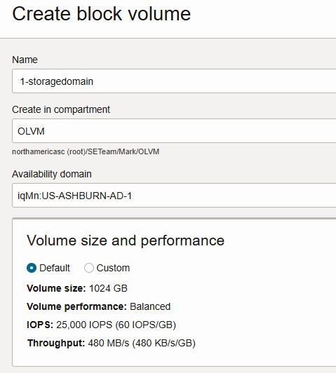

5. Repeat the process to create a second block volume with these values:

    | Field | Value |
    | --- | --- |
    | Name | `2-storagedomain` |
    | Compartment | `<lastname-olvm>` |
    | Volume Size | `1024 GB` |

6. Verify that both block volumes have been created.

    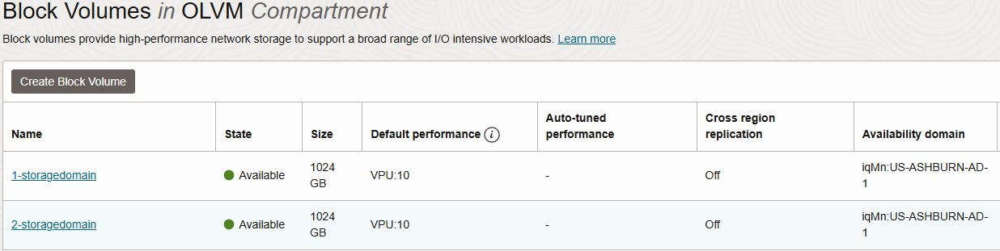

> **Note:** The source content recommends short storage domain names such as `1-storagedomain` and `2-storagedomain` because long names can be truncated in the OLVM interface when moving disks. :contentReference[oaicite:2]{index=2}

## Task 2: Attach the Block Volumes to the KVM Hosts

1. In OCI, open **Compute** and then click **Instances**. :contentReference[oaicite:3]{index=3}

2. Click **olvm-kvm1**.

3. Click **Storage** and then click **Attach Block Volume**.

4. Attach the `1-storagedomain` volume using these values:

    | Field | Value |
    | --- | --- |
    | Volume | `1-storagedomain` |
    | Access | `Read/Write Shareable` |

5. When the warning appears, confirm that you understand the risks of data corruption, then continue.

6. Click **Attach**.

7. Repeat the same process to attach `2-storagedomain` to `olvm-kvm1`.

8. Repeat the full process on `olvm-kvm2` so that both `1-storagedomain` and `2-storagedomain` are attached to both KVM hosts.

    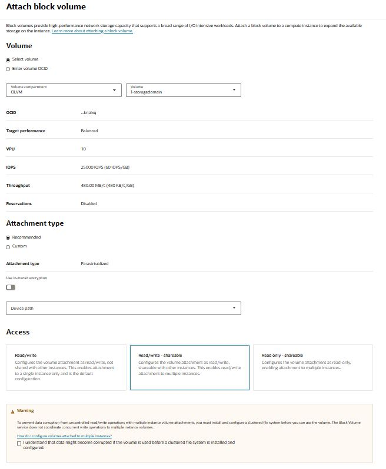

> **Important:** Do not set a device path manually. Accept the defaults during block volume attachment. :contentReference[oaicite:4]{index=4}

## Task 3: Install OLVM Packages on the Engine Host

1. Open a terminal and connect to `olvm-engine` using SSH.

    ```
    <copy>ssh opc@<olvm-engine-public-ip> -i <path-to-private-key></copy>
    ```

2. Install the Oracle Linux Virtualization Manager release package:

    ```
    <copy>sudo dnf install -y oracle-ovirt-release-45-el8</copy>
    ```

    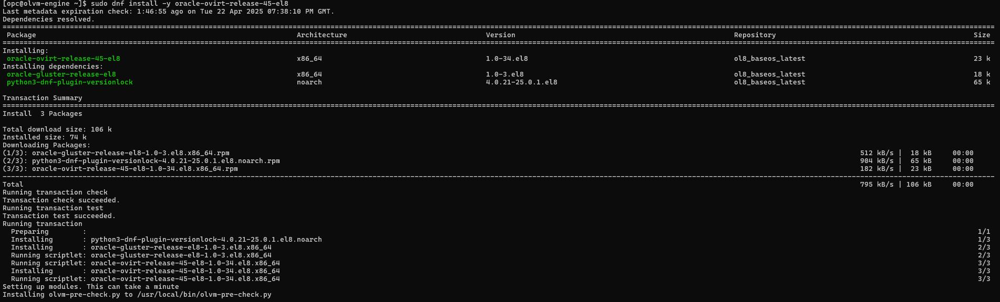

3. Install the required UEK kernel modules:

    ```
    <copy>sudo dnf install -y kernel-uek-modules-extra</copy>
    ```

4. Clear the DNF cache:

    ```
    <copy>sudo dnf clean all</copy>
    ```

5. Reboot the engine host:

    ```
    <copy>sudo reboot</copy>
    ```

6. Reconnect to the engine host after the reboot completes.

## Task 4: Run the OLVM Engine Installation

1. Install the OLVM engine package:

    ```
    <copy>sudo dnf install -y ovirt-engine</copy>
    ```

2. Start the engine setup and accept the defaults:

    ```
    <copy>sudo engine-setup --accept-defaults</copy>
    ```

3. When prompted, enter a password for the `admin@ovirt` account.

    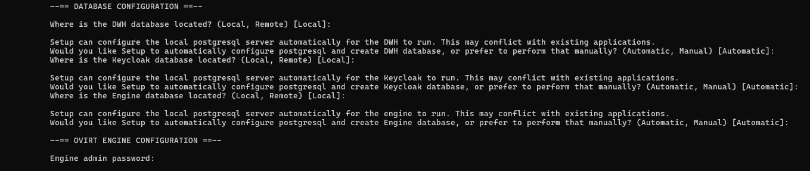

4. Wait for the installation to complete.

5. At the end of the installation, review and save the summary output.

    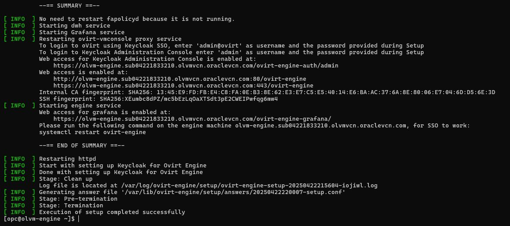

6. Record the access details shown in the summary output. You will need them to log in to the OLVM Manager UI.

7. The setup log is also available on the engine host at:

    ```
    <copy>/var/log/ovirt-engine/setup/ovirt-engine-setup-xxx.log</copy>
    ```

> **Important:** Save the summary output or take a screenshot of it before moving on. The source content explicitly calls this out. :contentReference[oaicite:5]{index=5}

## Task 5: Prepare Local Name Resolution for the Engine

1. On the `olvm-engine` host, get the fully qualified hostname:

    ```
    <copy>hostname -f</copy>
    ```

2. On your local workstation, update your local hosts file to map the engine public IP address to the fully qualified hostname returned by the previous command. :contentReference[oaicite:6]{index=6}

3. Add an entry similar to the following example:

    ```
    <copy>143.47.107.118   olvm-engine.sub04151620080.olvvcn.oraclevcn.com</copy>
    ```

4. Save the file.

> **Note:** On Linux, update `/etc/hosts`. On Windows, update `C:\Windows\System32\drivers\etc\hosts`. :contentReference[oaicite:7]{index=7}

## Task 6: Log In to the OLVM Manager Web Interface

1. Open a browser and go to the OLVM Manager URL:

    ```
    <copy>https://<fqdn-of-the-manager-host>/ovirt-engine</copy>
    ```

2. If you see a browser security warning, proceed to the site.

    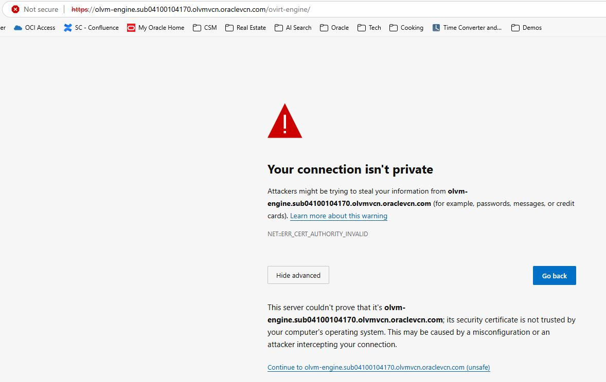

3. On the landing page, under **Downloads**, click **Engine CA Certificate** to download the certificate file.

    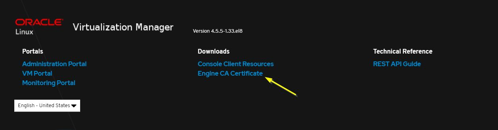

4. Import the certificate into your browser.

    For most desktop browsers:
    - Open **Settings**
    - Search for `cert`
    - Open the certificate manager
    - Import the downloaded certificate
    - Trust the certificate for website identification

5. If you are using macOS:
    - Open **Keychain Access**
    - Import the downloaded certificate
    - Open the certificate details
    - Expand **Trust**
    - Set it to **Always Trust**

    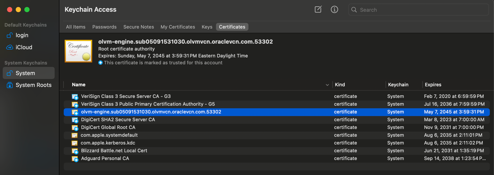

    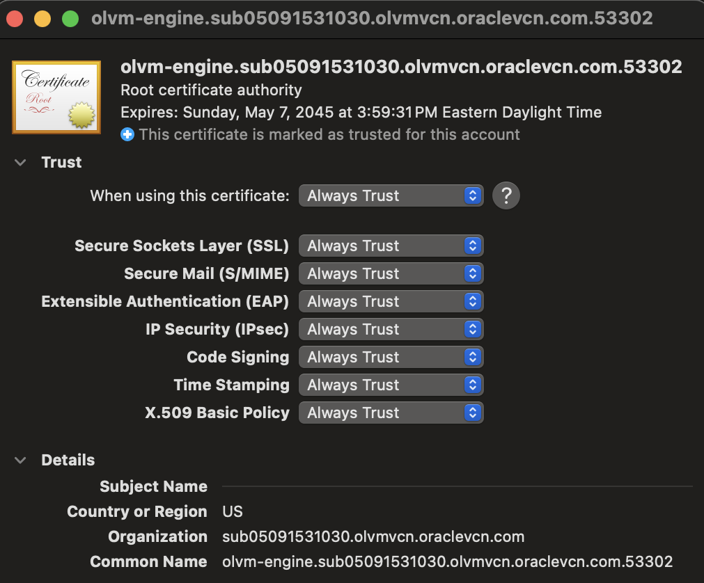

6. Return to the OLVM web page and click **Administration Portal**.

7. Log in with these credentials:

    | Field | Value |
    | --- | --- |
    | Username | `admin@ovirt` |
    | Password | `<the password you created during engine setup>` |

    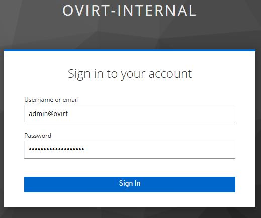

8. Confirm that the Administration Portal opens successfully.

> **Note:** The source content notes that the username for Keycloak and Grafana is `admin`, but the OLVM Administration Portal login for this lab is `admin@ovirt`. :contentReference[oaicite:8]{index=8}

You may now **proceed to the next lab**.

## Learn More

* [Oracle Linux Virtualization Manager Getting Started](https://docs.oracle.com/en/virtualization/oracle-linux-virtualization-manager/getstart/getstarted-manager-install.html)
* [OCI Block Volumes Documentation](https://docs.oracle.com/en-us/iaas/Content/Block/Concepts/overview.htm)

## Acknowledgements
* **Author** - Shawn Kelley
* **Contributors** - Optional
* **Last Updated By/Date** - Perside Foster, April 2026