# Prepare OCI Foundation

## Introduction

This lab walks you through preparing the Oracle Cloud Infrastructure (OCI) foundation required for the OLVM demo environment. You will create a compartment, build the virtual cloud network (VCN), validate routes and security rules, create a network security group (NSG), and provision the VLAN used for virtual machine connectivity.

Estimated Lab Time: 35 minutes

### About OCI Networking

This lab uses a VCN with a public subnet, a private subnet, and a VLAN so that the OLVM engine, KVM hosts, and guest virtual machines can communicate across dedicated network segments. The public subnet is used for the primary VNICs on the engine and KVM hosts, the private subnet is used for host communication, and the VLAN is used for guest virtual machine networking. :contentReference[oaicite:0]{index=0}

### Objectives

In this lab, you will:
* Create a compartment for the OLVM environment
* Create a VCN with public and private subnets
* Validate gateways, route tables, and security lists
* Add required ingress rules
* Create a network security group for the VLAN
* Create the VLAN used by guest virtual machines

### Prerequisites

This lab assumes you have:
* An Oracle Cloud account
* Permissions to create compartments, networking resources, and security rules
* Access to the OCI Console

## Task 1: Create a Compartment

1. Open the **Navigation Menu**, select **Identity & Security**, and under **Identity**, select **Compartments**. :contentReference[oaicite:1]{index=1}

2. Select your working parent compartment or create a new parent compartment if needed. :contentReference[oaicite:2]{index=2}

3. Click **Create Compartment**.

4. Enter the following values:

    | Field | Value |
    | --- | --- |
    | Name | `<lastname-olvm>` |
    | Description | `Oracle Linux Virtualization Manager Demo on OCI` |

5. Click **Create Compartment**.

    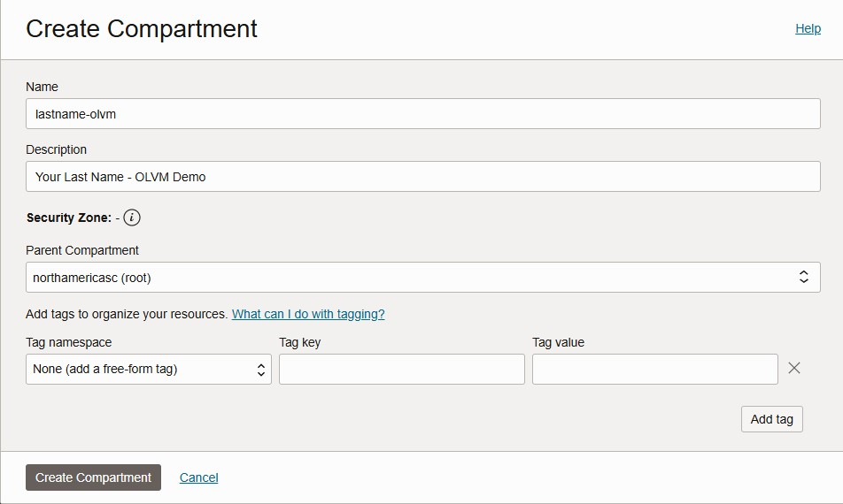

## Task 2: Create the VCN

1. Click your `<lastname-olvm>` compartment. :contentReference[oaicite:3]{index=3}

2. Open the **Navigation Menu**, select **Networking**, and then select **Virtual cloud networks**. :contentReference[oaicite:4]{index=4}

3. Confirm that your compartment is set to `<lastname-olvm>`. :contentReference[oaicite:5]{index=5}

4. Click **Actions**, then select **Start VCN Wizard**.

    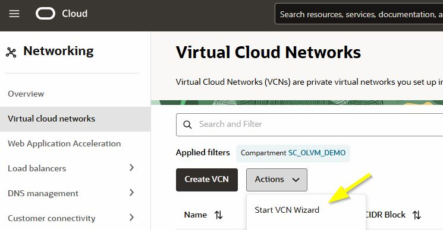

5. Select **Create VCN with Internet Connectivity**, then click **Start VCN Wizard**.

    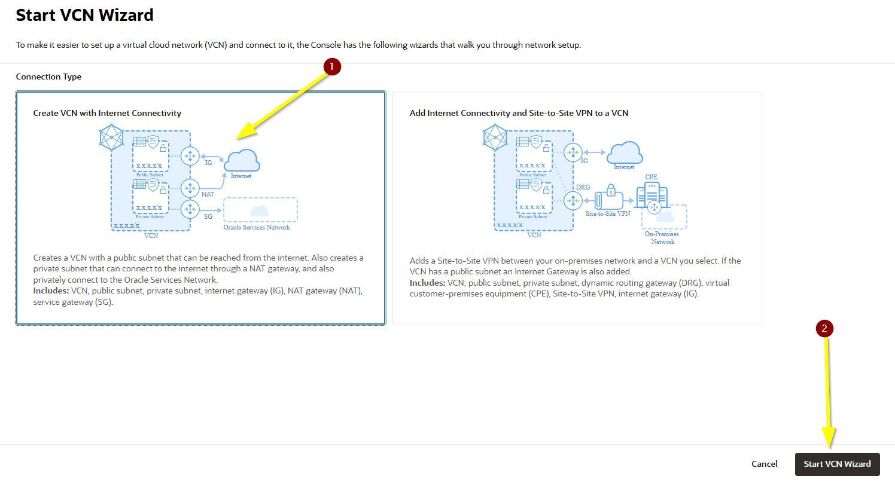

6. Enter the following values:

    | Field | Value |
    | --- | --- |
    | VCN Name | `OLVM-VCN` |
    | Compartment | `<lastname-olvm>` |
    | VCN IPv4 CIDR block | `10.0.0.0/16` |
    | Public Subnet IPv4 CIDR block | `10.0.0.0/24` |
    | Private Subnet IPv4 CIDR block | `10.0.1.0/24` |

7. Click **Create**.

    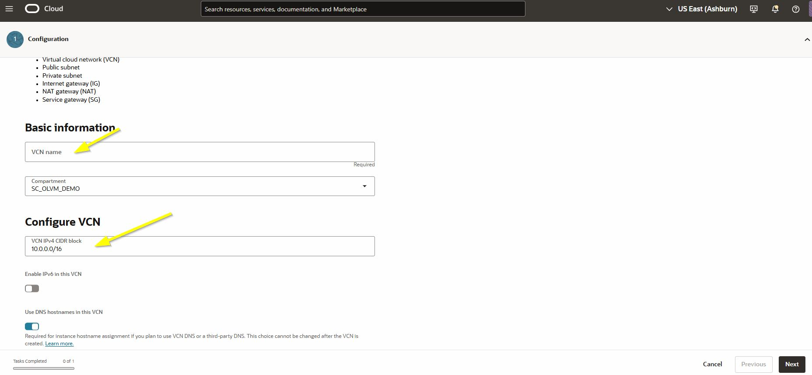

    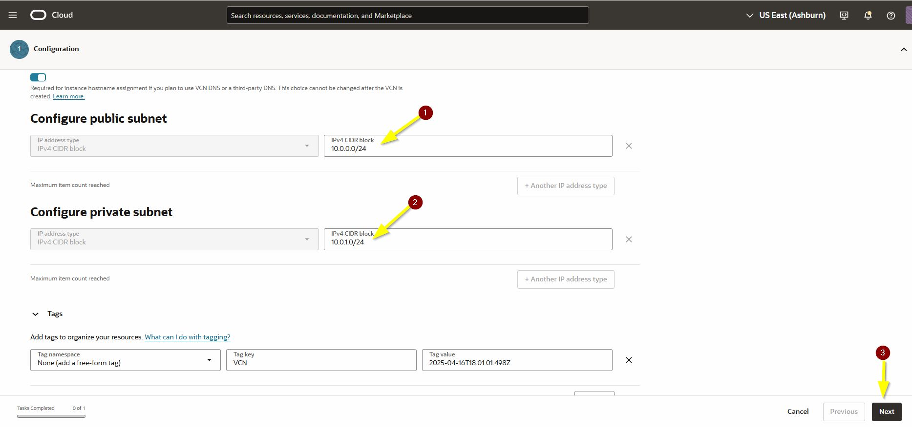

    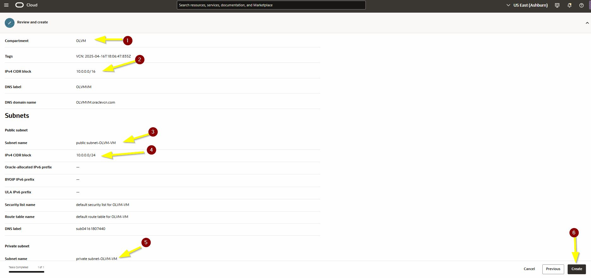

8. Review the configuration and create the VCN.

9. Verify that the VCN was created with the correct name, compartment, CIDR block, and default route table.

    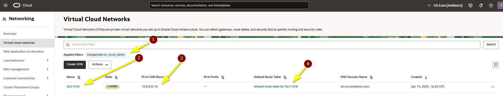

## Task 3: Validate Subnets, Gateways, and Route Tables

1. Open **OLVM-VCN** and click **Subnets**. :contentReference[oaicite:6]{index=6}

2. Verify that these subnets exist:

    * **Public Subnet-OLVM-VCN** with CIDR `10.0.0.0/24`
    * **Private Subnet-OLVM-VCN** with CIDR `10.0.1.0/24`

    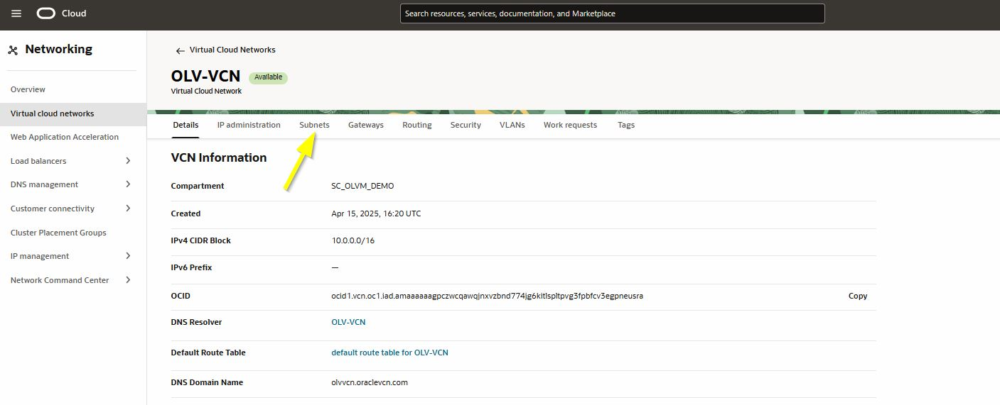

    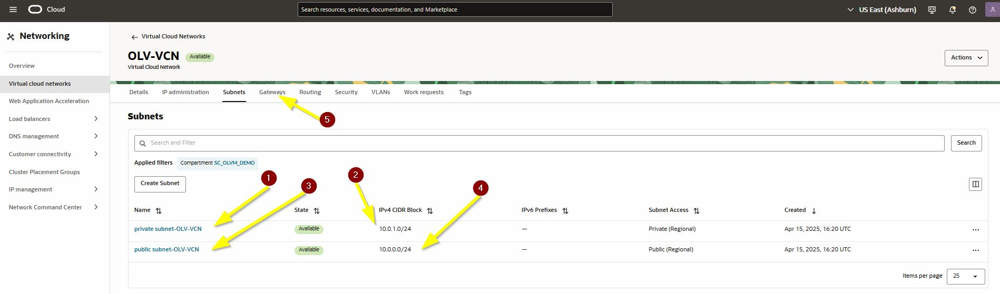

3. Click **Gateways** and verify that these gateways exist:

    * **Internet Gateway-OLVM-VCN**
    * **NAT Gateway-OLVM-VCN**
    * **Service Gateway-OLVM-VCN**

    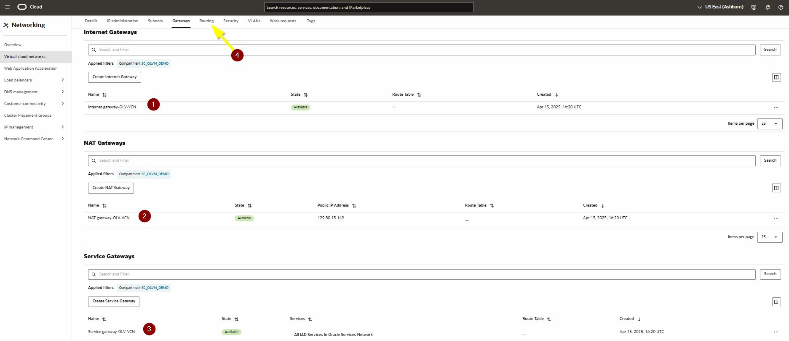

4. Click **Routing** and verify that two route tables are present:

    * **Default Route Table for OLVM-VCN**
    * **Route Table for Private Subnet-OLVM-VCN** :contentReference[oaicite:7]{index=7}

5. Open **Default Route Table for OLVM-VCN**, then click **Route Rules**.

    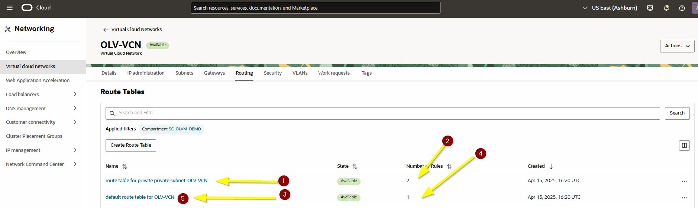

6. Verify that the default route table contains this route rule:

    | Destination | Target Type | Target |
    | --- | --- | --- |
    | `0.0.0.0/0` | Internet Gateway | `Internet Gateway-OLVM-VCN` |

    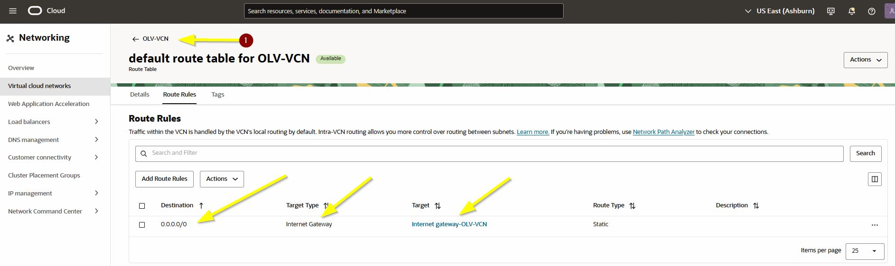

7. Return to **OLVM-VCN**, open **Route Table for Private Subnet-OLVM-VCN**, and click **Route Rules**. :contentReference[oaicite:8]{index=8}

8. Verify that the private route table contains these route rules:

    | Destination | Target Type | Target |
    | --- | --- | --- |
    | `0.0.0.0/0` | NAT Gateway | `NAT Gateway-OLVM-VCN` |
    | `All <region> Services in Oracle Services Network` | Service Gateway | `Service Gateway-OLVM-VCN` |

    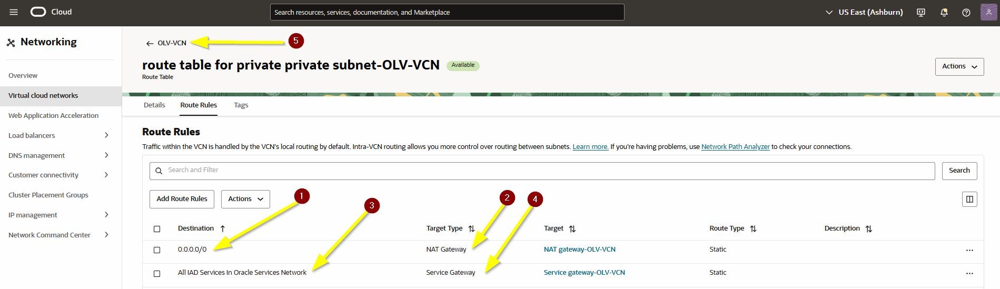

## Task 4: Configure Security Lists

1. In **OLVM-VCN**, click **Security**. :contentReference[oaicite:9]{index=9}

2. Verify that these security lists exist:

    * **Default Security List for OLVM-VCN**
    * **Security List for Private Subnet-OLVM-VCN**

    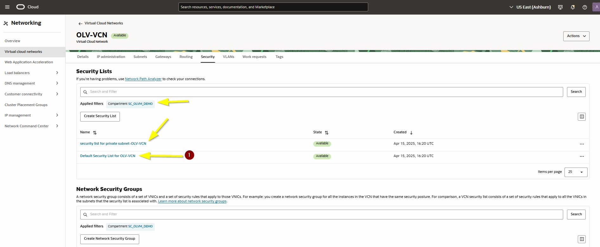

3. Open **Default Security List for OLVM-VCN** and click **Security Rules**.

    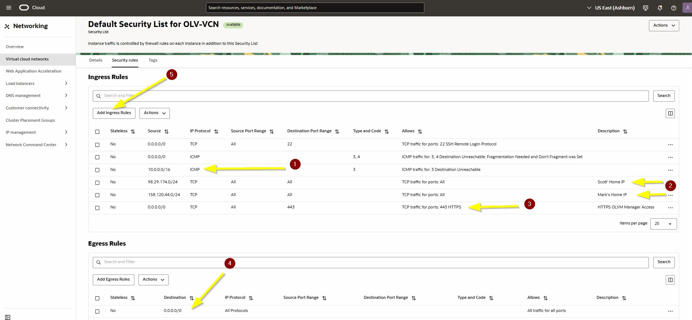

4. Add this ingress rule for ICMP within the VCN:

    | Field | Value |
    | --- | --- |
    | Source Type | CIDR |
    | Source CIDR | `10.0.0.0/16` |
    | IP Protocol | ICMP |
    | Type | All |
    | Code | `3` |
    | Description | `VCN ICMP PING` |

    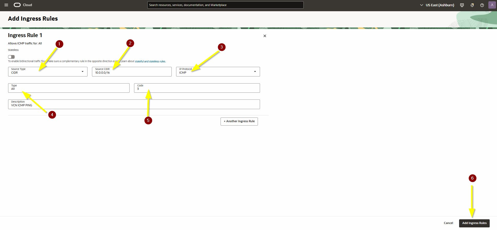

5. Open a new browser tab and go to `https://whatsmyip.org`. Copy your public IP address. Replace the last octet with `0/24` when creating the rule below. :contentReference[oaicite:10]{index=10}

    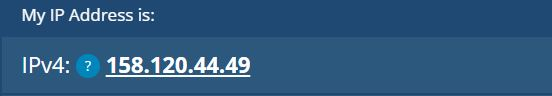

6. Add an ingress rule for your client network:

    | Field | Value |
    | --- | --- |
    | Source Type | CIDR |
    | Source CIDR | `<your-ip-range>/24` |
    | IP Protocol | TCP |
    | Source Port Range | ALL |
    | Destination Port Range | ALL |
    | Description | `My Home Office IP` |

    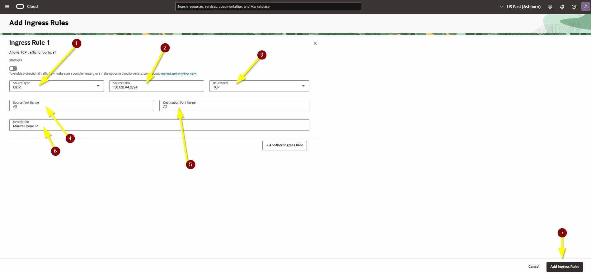

7. Add an ingress rule for HTTPS access to OLVM Manager:

    | Field | Value |
    | --- | --- |
    | Source Type | CIDR |
    | Source CIDR | `0.0.0.0/0` |
    | IP Protocol | TCP |
    | Source Port Range | ALL |
    | Destination Port Range | `443` |
    | Description | `SSL for OLVM Manager` |

    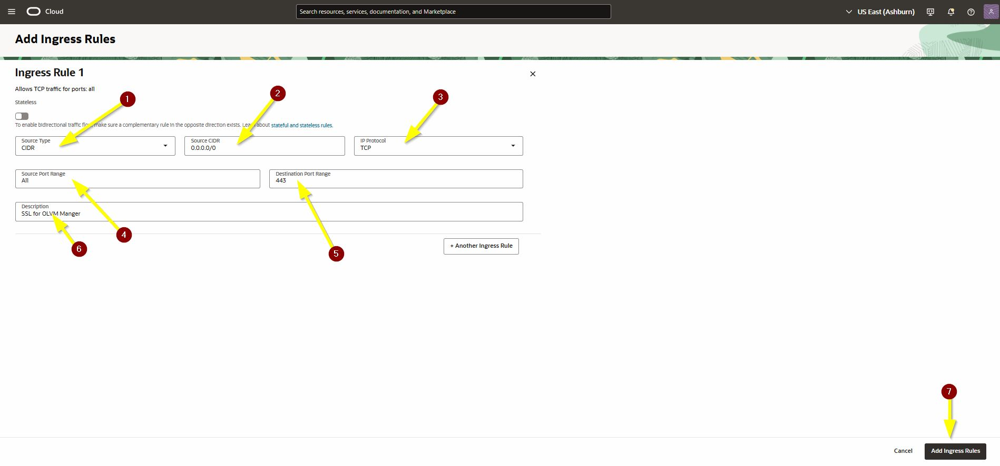

8. Add an ingress rule for noVNC console access:

    | Field | Value |
    | --- | --- |
    | Source Type | CIDR |
    | Source CIDR | `0.0.0.0/0` |
    | IP Protocol | TCP |
    | Source Port Range | ALL |
    | Destination Port Range | `6100` |
    | Description | `noVNC Console Access` |

    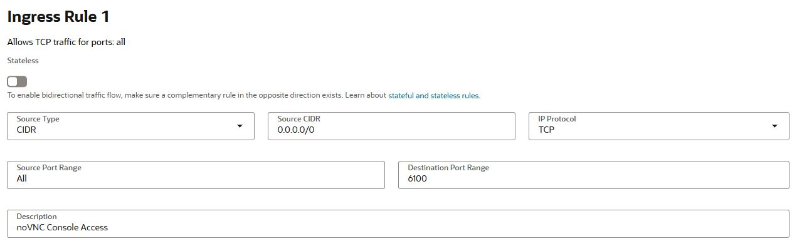

9. Verify that your default security list now includes the required rules.

    

10. Open **Security List for Private Subnet-OLVM-VCN** and click **Security Rules**. :contentReference[oaicite:11]{index=11}

11. Add an ingress rule to allow VCN traffic:

    | Field | Value |
    | --- | --- |
    | Source Type | CIDR |
    | Source CIDR | `10.0.0.0/16` |
    | IP Protocol | TCP |
    | Description | `VCN traffic` |

12. Add an ingress rule to trust traffic within the private subnet:

    | Field | Value |
    | --- | --- |
    | Source Type | CIDR |
    | Source CIDR | `10.0.1.0/24` |
    | IP Protocol | All Protocols |
    | Description | `Private Network Trust` |

    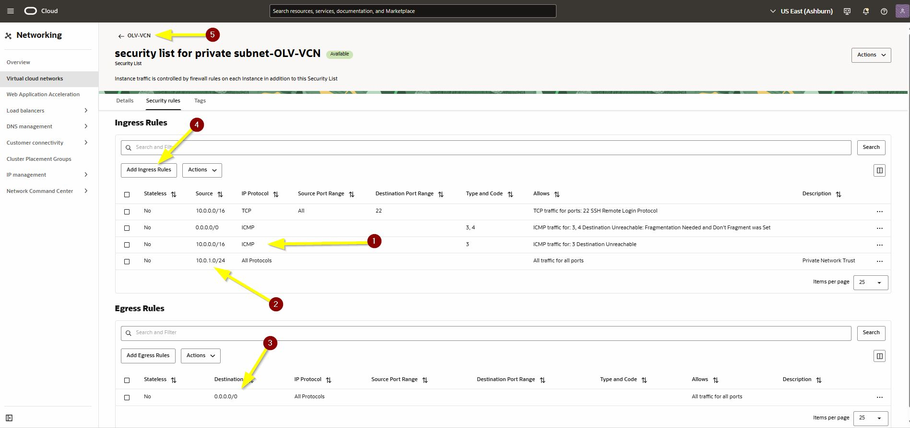

## Task 5: Create a Network Security Group

1. In **OLVM-VCN**, click **Security**, then click **Create Network Security Group**. :contentReference[oaicite:12]{index=12}

    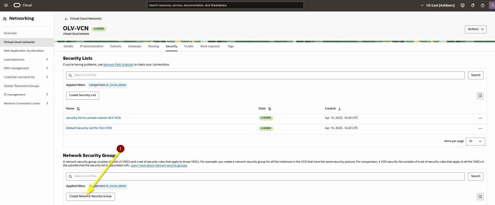

2. Enter the following values:

    | Field | Value |
    | --- | --- |
    | Name | `VLAN_NSG` |
    | Compartment | `<lastname-olvm>` |

3. Add this ingress rule:

    | Field | Value |
    | --- | --- |
    | Source Type | CIDR |
    | Source CIDR | `10.0.0.0/16` |
    | IP Protocol | All Protocols |

4. Add this egress rule:

    | Field | Value |
    | --- | --- |
    | Destination Type | CIDR |
    | Destination CIDR | `0.0.0.0/0` |
    | IP Protocol | All Protocols |

5. Click **Create**.

    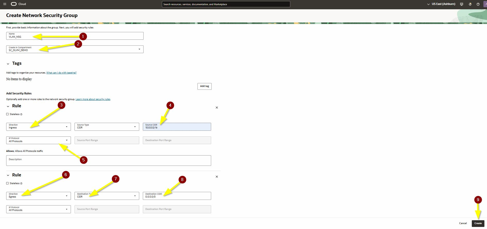

    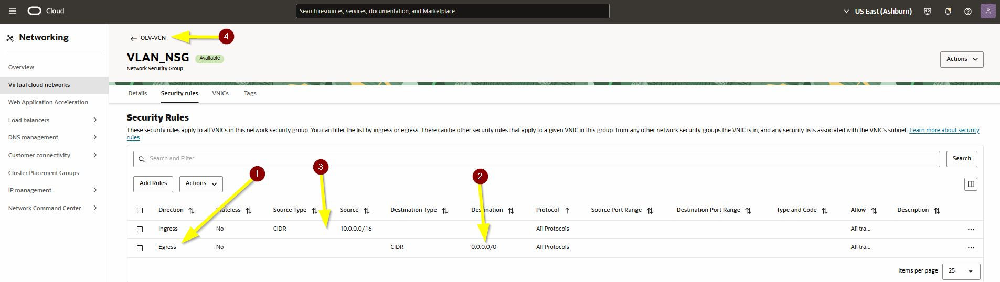

## Task 6: Create the VLAN

1. In **OLVM-VCN**, click **VLANs**. :contentReference[oaicite:13]{index=13}

2. If you receive a warning requesting L2 networking or OCVS enablement, stop the build and work with your internal team before continuing. The source guide explicitly says not to proceed without this capability. :contentReference[oaicite:14]{index=14}

3. Click **Create VLAN** and enter the following values:

    | Field | Value |
    | --- | --- |
    | VLAN Name | `VLAN-VMs` |
    | Compartment | `<lastname-olvm>` |
    | IEEE 802.1Q VLAN Tag | `1` |
    | VLAN Gateway CIDR | `10.0.10.0/24` |
    | Route Table | `Default Route Table for OLVM-VCN` |
    | Network Security Group | `VLAN_NSG` |

4. Click **Create VLAN**.

    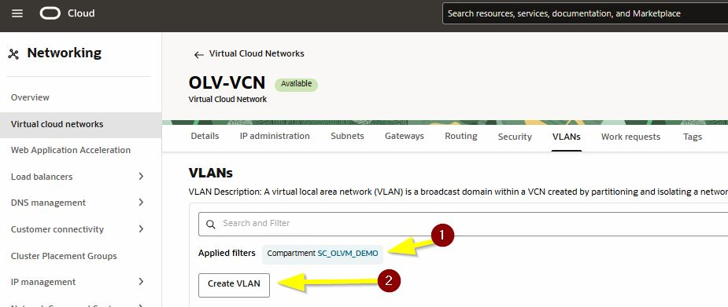

    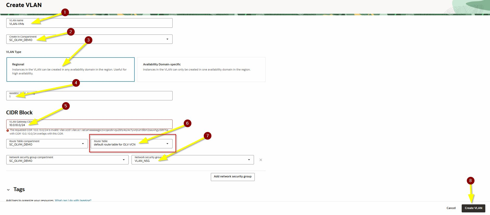

    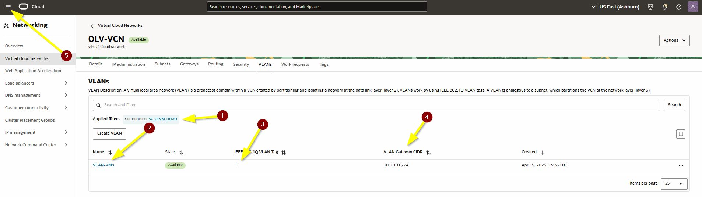

5. Verify that the VLAN was created with these values:

    * VLAN Tag: `1`
    * VLAN Gateway CIDR: `10.0.10.0/24` :contentReference[oaicite:15]{index=15}

You may now **proceed to the next lab**.

## Learn More

* [Oracle Cloud Infrastructure Networking Documentation](https://docs.oracle.com/en-us/iaas/Content/Network/Concepts/overview.htm)
* [VCN Wizard Documentation](https://docs.oracle.com/en-us/iaas/Content/Network/Tasks/quickstartnetworking.htm)

## Acknowledgements
* **Author** - Shawn Kelley
* **Contributors** - Optional
* **Last Updated By/Date** - Perside Foster, April 2026