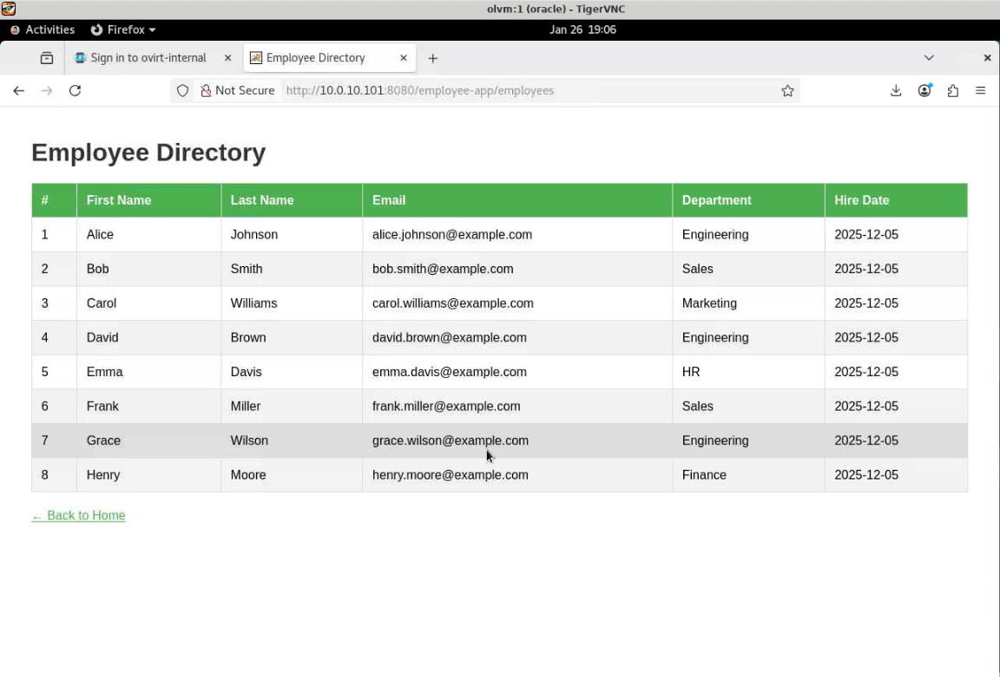

# Deploy Application (Optional)

## Introduction

### Part 4: Application Tier (Optional)

#### Overview

In this part, you will deploy a multi-tier Java web application across your two-host cluster to demonstrate OLVM's capabilities in supporting real-world distributed workloads. **This section is optional and not required for exam preparation.**

The application architecture leverages your existing cluster infrastructure:
- **ol9-mysql** runs on `olkvm01` (database tier)
- **ol9-webapp** runs on `olkvm02` (application tier)
- VMs communicate across the `l2-vm-network`
- The application works seamlessly despite being distributed across hosts

This demonstrates how OLVM enables true infrastructure flexibility—applications can span multiple physical hosts while appearing as a unified system.

The application consists of:
- **Database Tier:** MySQL 8.0 running on `ol9-mysql` VM
- **Application Tier:** Apache Tomcat 9 + Employee Directory web app on `ol9-webapp` VM

Estimated Lab Time: 30–40 minutes

### Objectives

In this lab, you will:
* Deploy MySQL database on a VM (`ol9-mysql` on `olkvm01`)
* Deploy Java web application on a VM (`ol9-webapp` on `olkvm02`)
* Verify multi-tier connectivity across the `l2-vm-network`
* Test distributed application functionality

### Exam Relevance

⭐⭐☆☆☆ Low - This demonstrates real-world OLVM usage but is not tested on Exam: 1Z0-1170

### What This Demonstrates

- VMs on different hosts communicating seamlessly
- Cluster-based resource distribution
- Real-world application deployment patterns
- OLVM's capability to support production workloads

### What You Will Build

```
┌────────────────────────────────────────────────────────────────────────┐
│                    Part 4: Application Tier                            │
│                                                                        │
│  Application Architecture:                                             │
│                                                                        │
│  ┌─────────────────────────────────────────────────────────────────┐   │
│  │                         olkvm01                                 │   │
│  │  ┌──────────────────────┐                                       │   │
│  │  │   ol9-mysql VM       │                                       │   │
│  │  │   10.0.10.100        │ ──────────────┐                       │   │
│  │  │                      │               │                       │   │
│  │  │ • MySQL 8.0          │               │                       │   │
│  │  │ • employee_db        │               │                       │   │
│  │  │ • 8 sample records   │               │                       │   │
│  │  └──────────────────────┘               │                       │   │
│  └─────────────────────────────────────────┼───────────────────────┘   │
│                                            │                           │
│                                            │ JDBC                      │
│                                            ▼                           │
│  ┌─────────────────────────────────────────────────────────────────┐   │
│  │                         olkvm02                                 │   │
│  │  ┌──────────────────────┐                                       │   │
│  │  │   ol9-webapp VM      │                                       │   │
│  │  │   10.0.10.101        │                                       │   │
│  │  │                      │                                       │   │
│  │  │ • Apache Tomcat      │                                       │   │
│  │  │ • OpenJDK 17         │                                       │   │
│  │  │ • Employee Directory │                                       │   │
│  │  │   Web App            │                                       │   │
│  │  └──────────────────────┘                                       │   │
│  └─────────────────────────────────────────────────────────────────┘   │
│           │                                                            │
│           │                                                            │
│           ▼                                                            │
│  [Browser Access: http://10.0.10.101:8080/employee-app/employees]      │
└────────────────────────────────────────────────────────────────────────┘
```

### Prerequisites (Optional)

This lab assumes you have:
* `ol9-mysql` VM running with IP `10.0.10.100`
* `ol9-webapp` VM running with IP `10.0.10.101`
* Network connectivity between VMs over `l2-vm-network`
* Outbound connectivity available (for example, OCI NAT Gateway) if you will install packages from the internet
* VNC access to the `olvm` instance for terminal + browser

> Note: The lab uses simple passwords (for example, `oracle`, `Welcome#123`) for learning purposes. Do not reuse these in production environments.

*This is the "fold" - below items are collapsed by default*

---

## Task 1: Install and Configure MySQL Using an Automation Script (ol9-mysql)

1. Make sure you are on the `olvm` instance.

   

2. Connect to `ol9-mysql` and enter the password (`oracle`):
   ```bash
   <copy>ssh opc@10.0.10.100</copy>
   ```

   **Note:** You are now inside the `ol9-mysql` virtual machine, not on the OLVM infrastructure.

3. Create the MySQL installation script:
   ```bash
   <copy>cat > ~/setup-mysql.sh << 'SCRIPT_EOF'
   #!/bin/bash
   echo "========================================="
   echo "MySQL 8.0 Installation and Configuration"
   echo "========================================="
   echo ""
   # Install MySQL Server from Oracle Linux repos
   echo "[1/7] Installing MySQL Server..."
   sudo dnf install -y mysql-server
   # Start and enable MySQL
   echo "[2/7] Starting MySQL service..."
   sudo systemctl start mysqld
   sudo systemctl enable mysqld
   # Configure MySQL and create database
   echo "[3/7] Configuring MySQL and creating database..."
   mysql -u root << 'EOF'
   ALTER USER 'root'@'localhost' IDENTIFIED BY 'Welcome#123';
   FLUSH PRIVILEGES;
   CREATE DATABASE employee_db;
   CREATE USER 'empapp'@'%' IDENTIFIED BY 'Welcome#123';
   GRANT ALL PRIVILEGES ON employee_db.* TO 'empapp'@'%';
   FLUSH PRIVILEGES;
   USE employee_db;
   CREATE TABLE employees (
      first_name VARCHAR(50) NOT NULL,
      last_name VARCHAR(50) NOT NULL,
      email VARCHAR(100) NOT NULL UNIQUE,
      department VARCHAR(50),
      hire_date DATE
   );
   INSERT INTO employees (first_name, last_name, email, department, hire_date) VALUES
   ('Alice', 'Johnson', 'alice.johnson@example.com', 'Engineering', '2025-12-05'),
   ('Bob', 'Smith', 'bob.smith@example.com', 'Sales', '2025-12-05'),
   ('Carol', 'Williams', 'carol.williams@example.com', 'Marketing', '2025-12-05'),
   ('David', 'Brown', 'david.brown@example.com', 'Engineering', '2025-12-05'),
   ('Emma', 'Davis', 'emma.davis@example.com', 'HR', '2025-12-05'),
   ('Frank', 'Miller', 'frank.miller@example.com', 'Sales', '2025-12-05'),
   ('Grace', 'Wilson', 'grace.wilson@example.com', 'Engineering', '2025-12-05'),
   ('Henry', 'Moore', 'henry.moore@example.com', 'Finance', '2025-12-05');
   EOF
   if [ $? -ne 0 ]; then
      echo "ERROR: MySQL configuration failed"
      exit 1
   fi
   echo "Database configuration completed successfully"
   # Enable remote access
   echo "[4/7] Enabling remote database access..."
   sudo bash -c 'echo "bind-address = 0.0.0.0" >> /etc/my.cnf.d/mysql-server.cnf'
   sudo systemctl restart mysqld
   # Disable firewall
   echo "[5/7] Disabling firewall..."
   sudo systemctl stop firewalld
   sudo systemctl disable firewalld
   # Verify installation
   echo "[6/7] Verifying installation..."
   mysql -u empapp -pWelcome#123 employee_db -e "SELECT COUNT(*) as employee_count FROM employees;"
   echo ""
   echo "========================================="
   echo "MySQL Setup Complete!"
   echo "========================================="
   echo "Database: employee_db"
   echo "User: empapp"
   echo "Password: Welcome#123"
   echo "Employees loaded: 8"
   echo "Remote access: Enabled"
   echo "========================================="
   SCRIPT_EOF</copy>
   ```

4. Make the script executable:
   ```bash
   <copy>chmod +x ~/setup-mysql.sh</copy>
   ```

5. Run the installation script:
   ```bash
   <copy>~/setup-mysql.sh</copy>
   ```

   The script will take approximately 5–10 minutes to complete. It will display progress messages for each step.

6. When complete, you should see:
   ```
   =========================================
   MySQL Setup Complete!
   =========================================
   Database: employee_db
   User: empapp
   Password: Welcome#123
   Employees loaded: 8
   Remote access: Enabled
   =========================================
   ```

7. Leave `ol9-mysql` VM:
   ```bash
   <copy>exit</copy>
   ```

---

## Task 2: Disable SELinux on ol9-webapp (Required for This Lab)

1. Make sure you are on the `olvm` instance.

   

2. Connect to `ol9-webapp` and enter the password (`oracle`):
   ```bash
   <copy>ssh opc@10.0.10.101</copy>
   ```

   **Note:** You are now inside the `ol9-webapp` virtual machine, not on the OLVM infrastructure.

   **IMPORTANT:** SELinux needs to be disabled for Tomcat to run properly via systemd.

3. Disable SELinux temporarily:
   ```bash
   <copy>sudo setenforce 0</copy>
   ```

4. Disable SELinux permanently (survives reboot):
   ```bash
   <copy>sudo sed -i 's/^SELINUX=enforcing/SELINUX=disabled/' /etc/selinux/config</copy>
   ```

5. Verify SELinux is disabled:
   ```bash
   <copy>getenforce</copy>
   ```

   Should return `Permissive`.

---

## Task 3: Install Web Stack Using an Automation Script (ol9-webapp)

1. Create the web application installation script:
   ```bash
   <copy>cat > ~/setup-webapp.sh << 'SCRIPT_EOF'
   #!/bin/bash
   echo "================================================"
   echo "Web Application Stack Installation"
   echo "================================================"
   echo ""
   # Install Apache
   echo "[1/7] Installing Apache HTTP Server..."
   sudo dnf install -y httpd
   sudo systemctl start httpd
   sudo systemctl enable httpd
   # Install Java
   echo "[2/7] Installing OpenJDK 17..."
   sudo dnf install -y java-17-openjdk java-17-openjdk-devel
   echo 'export JAVA_HOME=/usr/lib/jvm/java-17-openjdk' | sudo tee -a /etc/profile.d/java.sh
   echo 'export PATH=$JAVA_HOME/bin:$PATH' | sudo tee -a /etc/profile.d/java.sh
   source /etc/profile.d/java.sh
   # Install Tomcat from OL repos
   echo "[3/7] Installing Apache Tomcat..."
   sudo dnf install -y tomcat tomcat-webapps
   sudo systemctl start tomcat
   sudo systemctl enable tomcat
   # Install MySQL JDBC Driver from OL repos
   echo "[4/7] Installing MySQL JDBC driver..."
   sudo dnf install -y mysql-connector-j
   sudo ln -sf /usr/share/java/mysql-connector-j.jar /usr/share/tomcat/lib/
   # Install Maven from OL repos
   echo "[5/7] Installing Apache Maven..."
   sudo dnf install -y maven
   echo "[6/7] Disabling firewall..."
   sudo systemctl stop firewalld
   sudo systemctl disable firewalld
   echo "[7/7] Verifying services..."
   sudo systemctl status httpd --no-pager | grep Active
   sudo systemctl status tomcat --no-pager | grep Active
   echo ""
   echo "================================================"
   echo "Web Stack Setup Complete!"
   echo "================================================"
   echo "Apache: Running on port 80"
   echo "Tomcat: Running on port 8080"
   echo "Ready for application deployment"
   echo "================================================"
   SCRIPT_EOF</copy>
   ```

2. Make the script executable:
   ```bash
   <copy>chmod +x ~/setup-webapp.sh</copy>
   ```

3. Run the installation script:
   ```bash
   <copy>~/setup-webapp.sh</copy>
   ```

   The script will take approximately 10–15 minutes to complete. It will display progress messages for each step.

4. When complete, you should see:
   ```
   ================================================
   Web Stack Setup Complete!
   ================================================
   Apache: Running on port 80
   Tomcat: Running on port 8080
   Ready for application deployment
   ================================================
   ```

---

## Task 4: Build and Deploy the Employee Directory Application (ol9-webapp)

1. Create the application build and deployment script:

   ```bash
   <copy>cat > ~/deploy-app.sh << 'SCRIPT_EOF'
   #!/bin/bash
   echo "================================================"
   echo "Employee Directory Application Deployment"
   echo "================================================"
   echo ""
   MYSQL_SERVER_IP="10.0.10.100"
   echo "[1/7] Creating application directory structure..."
   mkdir -p ~/employee-app
   cd ~/employee-app
   # Create Maven pom.xml (Tomcat 9 / javax.servlet)
   echo "[2/7] Creating Maven project configuration..."
   cat > pom.xml << 'EOF'
   <project xmlns="http://maven.apache.org/POM/4.0.0"
            xmlns:xsi="http://www.w3.org/2001/XMLSchema-instance"
            xsi:schemaLocation="http://maven.apache.org/POM/4.0.0
                              http://maven.apache.org/xsd/maven-4.0.0.xsd">
      <modelVersion>4.0.0</modelVersion>
      <groupId>com.example</groupId>
      <artifactId>employee-app</artifactId>
      <version>1.0</version>
      <packaging>war</packaging>
      <name>Employee Directory</name>
      <properties>
         <maven.compiler.source>17</maven.compiler.source>
         <maven.compiler.target>17</maven.compiler.target>
         <project.build.sourceEncoding>UTF-8</project.build.sourceEncoding>
      </properties>
      <dependencies>
         <dependency>
               <groupId>javax.servlet</groupId>
               <artifactId>javax.servlet-api</artifactId>
               <version>4.0.1</version>
               <scope>provided</scope>
         </dependency>
         <dependency>
               <groupId>com.mysql</groupId>
               <artifactId>mysql-connector-j</artifactId>
               <version>8.0.33</version>
         </dependency>
      </dependencies>
      <build>
         <finalName>employee-app</finalName>
         <plugins>
               <plugin>
                  <groupId>org.apache.maven.plugins</groupId>
                  <artifactId>maven-war-plugin</artifactId>
                  <version>3.3.2</version>
               </plugin>
         </plugins>
      </build>
   </project>
   EOF
   # Create directory structure
   mkdir -p src/main/java/com/example/employee/{model,dao,servlet}
   mkdir -p src/main/webapp/WEB-INF
   mkdir -p src/main/resources
   # Create Employee model
   cat > src/main/java/com/example/employee/model/Employee.java << 'EOF'
   package com.example.employee.model;
   import java.sql.Date;
   public class Employee {
      private String firstName;
      private String lastName;
      private String email;
      private String department;
      private Date hireDate;

      public String getFirstName() { return firstName; }
      public void setFirstName(String firstName) { this.firstName = firstName; }

      public String getLastName() { return lastName; }
      public void setLastName(String lastName) { this.lastName = lastName; }

      public String getEmail() { return email; }
      public void setEmail(String email) { this.email = email; }

      public String getDepartment() { return department; }
      public void setDepartment(String department) { this.department = department; }

      public Date getHireDate() { return hireDate; }
      public void setHireDate(Date hireDate) { this.hireDate = hireDate; }
   }
   EOF
   # Create EmployeeDAO
   cat > src/main/java/com/example/employee/dao/EmployeeDAO.java << 'EOF'
   package com.example.employee.dao;
   import com.example.employee.model.Employee;
   import java.sql.*;
   import java.util.ArrayList;
   import java.util.List;
   import java.io.InputStream;
   import java.util.Properties;
   public class EmployeeDAO {
      private String dbUrl;
      private String dbUser;
      private String dbPassword;

      static {
         try {
               Class.forName("com.mysql.cj.jdbc.Driver");
         } catch (ClassNotFoundException e) {
               throw new RuntimeException("MySQL JDBC Driver not found", e);
         }
      }

      public EmployeeDAO() {
         try {
               Properties props = new Properties();
               InputStream input = getClass().getClassLoader().getResourceAsStream("db.properties");
               props.load(input);
               this.dbUrl = props.getProperty("db.url");
               this.dbUser = props.getProperty("db.user");
               this.dbPassword = props.getProperty("db.password");
         } catch (Exception e) {
               throw new RuntimeException("Failed to load database properties", e);
         }
      }

      private Connection getConnection() throws SQLException {
         return DriverManager.getConnection(dbUrl, dbUser, dbPassword);
      }

      public List<Employee> getAllEmployees() throws SQLException {
         List<Employee> employees = new ArrayList<>();
         String sql = "SELECT first_name, last_name, email, department, hire_date FROM employees ORDER BY first_name";

         try (Connection conn = getConnection();
               Statement stmt = conn.createStatement();
               ResultSet rs = stmt.executeQuery(sql)) {

               while (rs.next()) {
                  Employee emp = new Employee();
                  emp.setFirstName(rs.getString("first_name"));
                  emp.setLastName(rs.getString("last_name"));
                  emp.setEmail(rs.getString("email"));
                  emp.setDepartment(rs.getString("department"));
                  emp.setHireDate(rs.getDate("hire_date"));
                  employees.add(emp);
               }
         }
         return employees;
      }
   }
   EOF
   # Create EmployeeServlet (javax.servlet for Tomcat 9)
   cat > src/main/java/com/example/employee/servlet/EmployeeServlet.java << 'EOF'
   package com.example.employee.servlet;
   import com.example.employee.dao.EmployeeDAO;
   import com.example.employee.model.Employee;
   import javax.servlet.ServletException;
   import javax.servlet.annotation.WebServlet;
   import javax.servlet.http.*;
   import java.io.IOException;
   import java.util.List;
   @WebServlet("/employees")
   public class EmployeeServlet extends HttpServlet {
      private EmployeeDAO employeeDAO = new EmployeeDAO();

      protected void doGet(HttpServletRequest request, HttpServletResponse response)
               throws ServletException, IOException {
         try {
               List<Employee> employees = employeeDAO.getAllEmployees();
               request.setAttribute("employees", employees);
               request.getRequestDispatcher("/WEB-INF/employees.jsp").forward(request, response);
         } catch (Exception e) {
               throw new ServletException("Database error", e);
         }
      }
   }
   EOF
   # Create database properties
   cat > src/main/resources/db.properties << EOF
   db.url=jdbc:mysql://${MYSQL_SERVER_IP}:3306/employee_db?useSSL=false&allowPublicKeyRetrieval=true
   db.user=empapp
   db.password=Welcome#123
   EOF
   # Create web.xml (Servlet 4.0 for Tomcat 9)
   cat > src/main/webapp/WEB-INF/web.xml << 'EOF'
   <?xml version="1.0" encoding="UTF-8"?>
   <web-app xmlns="http://xmlns.jcp.org/xml/ns/javaee"
            xmlns:xsi="http://www.w3.org/2001/XMLSchema-instance"
            xsi:schemaLocation="http://xmlns.jcp.org/xml/ns/javaee
                              http://xmlns.jcp.org/xml/ns/javaee/web-app_4_0.xsd"
            version="4.0">
      <display-name>Employee Directory</display-name>
      <welcome-file-list>
         <welcome-file>index.jsp</welcome-file>
      </welcome-file-list>
   </web-app>
   EOF
   # Create employees.jsp
   cat > src/main/webapp/WEB-INF/employees.jsp << 'EOF'
   <%@ page contentType="text/html;charset=UTF-8" language="java" %>
   <%@ page import="java.util.List" %>
   <%@ page import="com.example.employee.model.Employee" %>
   <!DOCTYPE html>
   <html>
   <head>
      <title>Employee Directory</title>
      <style>
         body { font-family: Arial, sans-serif; margin: 40px; }
         h1 { color: #333; }
         table { border-collapse: collapse; width: 100%; margin-top: 20px; }
         th, td { border: 1px solid #ddd; padding: 12px; text-align: left; }
         th { background-color: #4CAF50; color: white; }
         tr:nth-child(even) { background-color: #f2f2f2; }
         tr:hover { background-color: #ddd; }
         .back-link { display: inline-block; margin-top: 20px; color: #4CAF50; }
      </style>
   </head>
   <body>
      <h1>Employee Directory</h1>
      <table>
         <thead>
               <tr>
                  <th>#</th>
                  <th>First Name</th>
                  <th>Last Name</th>
                  <th>Email</th>
                  <th>Department</th>
                  <th>Hire Date</th>
               </tr>
         </thead>
         <tbody>
               <%
                  List<Employee> employees = (List<Employee>) request.getAttribute("employees");
                  int count = 1;
                  for (Employee emp : employees) {
               %>
               <tr>
                  <td><%= count++ %></td>
                  <td><%= emp.getFirstName() %></td>
                  <td><%= emp.getLastName() %></td>
                  <td><%= emp.getEmail() %></td>
                  <td><%= emp.getDepartment() %></td>
                  <td><%= emp.getHireDate() %></td>
               </tr>
               <% } %>
         </tbody>
      </table>
      <a href="index.jsp" class="back-link">← Back to Home</a>
   </body>
   </html>
   EOF
   # Create index.jsp
   cat > src/main/webapp/index.jsp << 'EOF'
   <%@ page contentType="text/html;charset=UTF-8" language="java" %>
   <!DOCTYPE html>
   <html>
   <head>
      <title>Employee Directory - Home</title>
      <style>
         body {
               font-family: Arial, sans-serif;
               margin: 0;
               padding: 0;
               display: flex;
               justify-content: center;
               align-items: center;
               height: 100vh;
               background: linear-gradient(135deg, #667eea 0%, #764ba2 100%);
         }
         .container {
               text-align: center;
               background: white;
               padding: 40px;
               border-radius: 10px;
               box-shadow: 0 10px 25px rgba(0,0,0,0.2);
         }
         h1 { color: #333; margin-bottom: 30px; }
         .btn {
               display: inline-block;
               padding: 15px 30px;
               background-color: #4CAF50;
               color: white;
               text-decoration: none;
               border-radius: 5px;
               font-size: 18px;
               transition: background-color 0.3s;
         }
         .btn:hover { background-color: #45a049; }
      </style>
   </head>
   <body>
      <div class="container">
         <h1>Welcome to Employee Directory</h1>
         <p>View all employees in the system</p>
         <a href="employees" class="btn">View Employees</a>
      </div>
   </body>
   </html>
   EOF
   echo "[3/7] Building application with Maven..."
   mvn clean package
   if [ ! -f "target/employee-app.war" ]; then
      echo "ERROR: Build failed - WAR file not created"
      exit 1
   fi
   echo "Build successful - WAR file created"
   echo "[4/7] Deploying application to Tomcat..."
   sudo cp target/employee-app.war /usr/share/tomcat/webapps/
   sudo chown tomcat:tomcat /usr/share/tomcat/webapps/employee-app.war
   echo "[5/7] Waiting for Tomcat to deploy application..."
   echo "This may take 10-20 seconds..."
   for i in {1..30}; do
      if [ -d "/usr/share/tomcat/webapps/employee-app/WEB-INF" ]; then
         echo "Application deployed successfully"
         break
      fi
      sleep 1
      if [ $i -eq 30 ]; then
         echo "WARNING: Application deployment is taking longer than expected"
         echo "Continuing anyway..."
      fi
   done
   echo "[6/7] Configuring JDBC driver loading..."
   sudo mkdir -p /usr/share/tomcat/webapps/employee-app/META-INF
   sudo tee /usr/share/tomcat/webapps/employee-app/META-INF/context.xml > /dev/null << 'EOF'
   <?xml version="1.0" encoding="UTF-8"?>
   <Context>
      <Loader delegate="true"/>
   </Context>
   EOF
   sudo chown -R tomcat:tomcat /usr/share/tomcat/webapps/employee-app/META-INF/
   echo "[7/7] Restarting Tomcat..."
   sudo systemctl restart tomcat
   echo "Waiting for Tomcat to restart..."
   sleep 10
   echo ""
   echo "================================================"
   echo "Application Deployment Complete!"
   echo "================================================"
   echo "Application URL: http://10.0.10.101:8080/employee-app/"
   echo "Database Server: ${MYSQL_SERVER_IP}"
   echo "Testing local access..."
   curl -s http://localhost:8080/employee-app/ | grep -q "Welcome to Employee Directory" && echo "✓ Application is responding" || echo "✗ Application check failed"
   echo "================================================"
   SCRIPT_EOF </copy>
   ```

2. Make the script executable:
   ```bash
   <copy>chmod +x ~/deploy-app.sh</copy>
   ```

3. Run the deployment script:
   ```bash
   <copy>~/deploy-app.sh</copy>
   ```

   The script will take approximately 3–5 minutes to build and deploy. It will display progress messages for each step.

4. When complete, you should see:
   ```
   ================================================
   Application Deployment Complete!
   ================================================
   Application URL: http://10.0.10.101:8080/employee-app/
   Database Server: 10.0.10.100
   Testing local access...
   ✓ Application is responding
   ================================================
   ```

---

## Task 5: Test the Multi-Tier Application

### Test Database Connectivity

1. From the web application server, verify connectivity to the MySQL database:
   ```bash
   <copy>ping -c 3 10.0.10.100</copy>
   ```

   The ping should be successful.

### Access from OLVM Manager (Internal Network)

1. From the OLVM manager VNC session, open Firefox and navigate to:
   ```
   <copy>http://10.0.10.101:8080/employee-app/</copy>
   ```

2. You should see:
   - **Home page**: Purple gradient background with "Welcome to Employee Directory" heading
   - Click **View Employees** button
   - **Employee Directory**: Green table with 8 employees showing names, emails, departments, and hire dates

   

---

## Task 6: Verify the Complete Application Stack

### Application Architecture

You have successfully deployed a complete multi-tier web application.

**Database Tier (10.0.10.100):**
- Oracle Linux 9 VM
- MySQL 8.0 Server
- `employee_db` database with 8 sample records
- Remote access enabled

**Application Tier (10.0.10.101):**
- Oracle Linux 9 VM
- Apache HTTP Server
- Apache Tomcat 9
- OpenJDK 17
- Employee Directory Java Web Application
- MySQL JDBC Driver

**Network Configuration:**
- Both VMs on the same VLAN (`l2-vm-network`)
- Internal communication: `10.0.10.0/24`
- External access via OCI Public IP

---

## Learn More

*(optional - include links to docs, white papers, blogs, etc)*

---

## Acknowledgements

* **Author** - <Name, Title, Group>
* **Contributors** - <Name, Group> -- optional
* **Last Updated By/Date** - <Name, Month Year>
```
