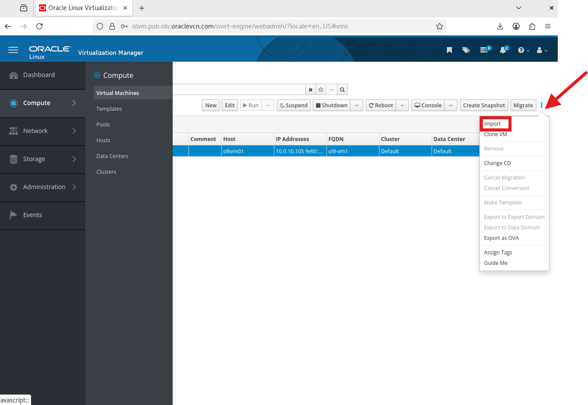

# Deploy Multi Tier Application

## Introduction

### Part 4: Application Tier (Optional)

### Overview

In this part, you will deploy a complete multi-tier web application across your two-host cluster by importing pre-built OVA files. There is no need to install operating systems, configure databases, or set up application servers manually. Each OVA contains a fully configured, ready-to-run VM.

This demonstrates one of OLVM's most powerful capabilities: packaging working virtual machines — complete with their OS, software, data, and configuration — and redeploying them on a different OLVM system with minimal effort.

Estimated Lab Time: 10–20 minutes

### Objectives

In this lab, you will:
* Deploy MySQL database on a VM (`ol9-mysql` on `olkvm01`)
* Deploy Java web application on a VM (`ol9-webapp` on `olkvm02`)
* Verify multi-tier connectivity across the `l2-vm-network`
* Test distributed application functionality

### What You Will Build

```
┌────────────────────────────────────────────────────────────────────────┐
│                    Part 4: Application Tier                            │
│                                                                        │
│  ┌─────────────────────────────────────────────────────────────────┐   │
│  │                         olkvm01                                 │   │
│  │  ┌──────────────────────┐                                       │   │
│  │  │   ol9-mysql VM       │                                       │   │
│  │  │   10.0.10.100        │ ──────────────┐                       │   │
│  │  │                      │               │                       │   │
│  │  │ • MySQL 8.0          │               │                       │   │
│  │  │ • employee_db        │               │                       │   │
│  │  │ • 8 sample records   │               │                       │   │
│  │  └──────────────────────┘               │                       │   │
│  └─────────────────────────────────────────┼───────────────────────┘   │
│                                            │ JDBC                      │
│                                            ▼                           │
│  ┌─────────────────────────────────────────────────────────────────┐   │
│  │                         olkvm02                                 │   │
│  │  ┌──────────────────────┐                                       │   │
│  │  │   ol9-webapp VM      │                                       │   │
│  │  │   10.0.10.101        │                                       │   │
│  │  │                      │                                       │   │
│  │  │ • Apache Tomcat      │                                       │   │
│  │  │ • OpenJDK 17         │                                       │   │
│  │  │ • Employee Directory │                                       │   │
│  │  └──────────────────────┘                                       │   │
│  └─────────────────────────────────────────────────────────────────┘   │
│           │                                                            │
│           ▼                                                            │
│  [Browser Access: http://10.0.10.101:8080/employee-app/employees]      │
└────────────────────────────────────────────────────────────────────────┘
```


## Task 1: Download the OVA File Virtual Machine 1

1. From the OLVM manager terminal  copy ol9-mysql  from object bucket to olkvm01 

    ```bash
    <copy>ssh olkvm01 "curl -L https://objectstorage.us-ashburn-1.oraclecloud.com/p/YU_c5CCO0XELLIqVwtAl77N4RXfTJXFCugLN7eDjoMzX9VMWHTGDJuAzpPbvN0gp/n/idhwewbjlvpy/b/olvm-ova/o/ol9-mysql.ova -o /tmp/ol9-mysql.ova"</copy>
    ```
    > This file is large and may take several minutes to download.
    
## Task 2: Import the OVA via OLVM Administration Portal

1. Go to **Compute** → **Virtual Machines** → **Import**.(click on the 3 dots)
       
2. Data Center: **Default**
3. Source: **Virtual Appliance (OVA)**
4. Host: **olkvm01**
5. File Path: `/tmp`
6. Click **Load**.
7. Under Virtual Machines on Source, select **ol9-mysql.ova**.
8. Use the move arrow to move it to Virtual Machines to Import.
9. Click **Next**.
10. Click **ol9-mysql** → **Network Interfaces**.
11. Select `l2-vm-network` for both Network Name and Profile Name.
12. Click **OK**.
13. Wait for the ol9-mysql VM status to show as **Down**.

## Task 3: Start and Test the ol9-mysql VM

1. Select the ol9-mysql VM and click **Run**. Wait for status to change to **Up**.

2. From the OLVM manager terminal, SSH into the database VM (username: `opc`, password: `oracle`):

    ```bash
    <copy>ssh opc@10.0.10.100</copy>
    ```

3. Verify MySQL is running and confirm employee data is present:

    ```bash
    <copy>mysql -u empapp -pWelcome#123 employee_db -e "SELECT COUNT(*) as employee_count FROM employees;"</copy>
    ```
   You should see a count of **8** employee records.

4. Exit the database VM:

    ```bash
    <copy>exit</copy>
    ```


## Task 4: Download the OVA File Virtual Machine 2

1. From the OLVM manager terminal  copy  ol9-webapp  from object bucket to olkvm02 

    ```bash
    <copy>ssh olkvm02 "curl -L https://objectstorage.us-ashburn-1.oraclecloud.com/p/QVbUx0DOX8QmXrip09IIfBEANwGCA2aQ4SojhJ5__ZX7lPjTN15Eg-174doal5-o/n/idhwewbjlvpy/b/olvm-ova/o/ol9-webapp.ova -o /tmp/ol9-webapp.ova"</copy>
    ```
    > This file is large and may take several minutes to download.

## Task 5: Import the OVA via OLVM Administration Portal
> Repeat the process from Task 2

1. Go to **Compute** → **Virtual Machines** → **Import**.
2. Data Center: **Default**
3. Source: **Virtual Appliance (OVA)**
4. Host: **olkvm02**
5. File Path: `/tmp`
6. Click **Load**.
7. Under Virtual Machines on Source, select **ol9-webapp.ova**.
8. Use the move arrow to move it to Virtual Machines to Import.
9. Click **Next**.
10. Click **ol9-webapp** → **Network Interfaces**.
11. Select `l2-vm-network` for both Network Name and Profile Name.
12. Click **OK**.
13. Wait for the ol9-webapp VM status to show as **Down**.

## Task 6: Start and Test the ol9-webapp VM

1. Select the ol9-webapp VM and click **Run**. Wait for status to change to **Up**.

2. From the OLVM manager terminal, SSH into the web application VM (username: `opc`, password: `oracle`):
    ```bash
    <copy>ssh opc@10.0.10.101</copy>
    ```

3. Verify the application is responding:
    ```bash
    <copy>curl -s http://localhost:8080/employee-app/ | grep -q "Welcome to Employee Directory" && echo "✓ Application is responding" || echo "✗ Application check failed"</copy>
    ```

4. Verify connectivity to the MySQL database:
    ```bash
    <copy>ping -c 3 10.0.10.100</copy>
    ```
   The ping should succeed, confirming both VMs can communicate over the l2-vm-network.

5. Exit the application VM:

    ```bash
    <copy>exit</copy>
    ```


## Task 7: Access the Application from OLVM Manager

1. From the OLVM manager VNC session, open Firefox and navigate to (wait about 3 minutes for data to load):

    ```
    <copy>http://10.0.10.101:8080/employee-app/</copy>
    ```

2. You should see:
    - **Home page**: Purple gradient background with "Welcome to Employee Directory" heading
    - Click the **"View Employees"** button
    - **Employee Directory**: Green table displaying 8 employees with names, emails, departments, and hire dates


### ✅ Deploy Multi Tier Application Checkpoint

At this point, you should have:
- ✓ ol9-mysql running on olkvm01 with MySQL 8.0 and 8 employee records
- ✓ ol9-webapp running on olkvm02 with Tomcat and Employee Directory app
- ✓ Both VMs communicating across l2-vm-network
- ✓ Employee Directory web application accessible in the browser


## Learn More

- Oracle Linux Virtualization Manager install lab (official): https://docs.oracle.com/en/learn/olvm-install/index.html 
- Oracle Luna Labs: https://luna.oracle.com/ 


## Acknowledgements

- **Author** - Shawn Kelley, John Priest 
- **Contributors** - Perside Foster
- **Last Updated By/Date** - Perside Foster , April 1, 2026
