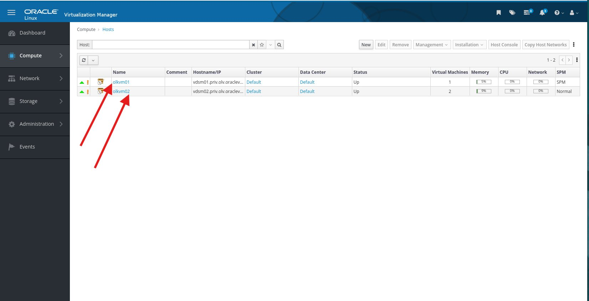

# Configure KVM Cluster

## Introduction

In this lab, you will prepare both KVM hosts and add them to the OLVM default cluster. When the lab is complete, `olkvm01` and `olkvm02` should both reach `Up` status and be ready for networking, storage, and VM placement.

**Estimated Lab Time:** 45-60 minutes, including host installation and status transitions.

### Objectives

In this lab, you will:

- Configure the required repositories on both KVM hosts
- Add `olkvm01` and `olkvm02` to the **Default** cluster in the Administration Portal
- Wait for both hosts to reach **Up** status
- Know where to check logs if host installation does not complete

### Prerequisites

This lab assumes you have:

- Completed the Lab 2 checkpoint
- Access to the OLVM Administration Portal
- SSH access to the OLVM manager from your local machine
- SSH connectivity from `olvm` to both KVM hosts

> **Important:** Do not start Lab 4 until both hosts show status `Up`. Starting network or storage tasks while a host is still installing can leave the environment inconsistent.

## Task 1: Configure the First KVM Host (`olkvm01`)

1. From your local PowerShell window, connect to the OLVM manager:

    ```bash
    <copy>ssh -i C:\Users\<you>\.ssh\olvm-cluster-id_rsa oracle@<olvm-public-ip></copy>
    ```

2. Connect to `olkvm01`:

    ```bash
    <copy>ssh olkvm01</copy>
    ```

    The first SSH connection can take 2-5 minutes after provisioning or reboot. If the prompt does not appear immediately, wait before retrying.

3. Install the OLVM release package:

    ```bash
    <copy>sudo dnf install -y oracle-ovirt-release-45-el8</copy>
    ```

4. Install the required UEK kernel modules

    ```bash
    <copy>sudo dnf install -y kernel-uek-modules-extra</copy>
    ```

5. Clear the DNF cache:

    ```bash
    <copy>sudo dnf clean all</copy>
    ```

6. Verify that the repositories are visible:

    ```bash
    <copy>sudo dnf repolist</copy>
    ```

7. Exit back to the manager host:

    ```bash
    <copy>exit</copy>
    ```

## Task 2: Add `olkvm01` to the Cluster

1. Switch to the **Administration Portal** in Firefox.

2. Navigate to **Compute -> Hosts**.

    

3. Click **New**.

4. Select the **Default** data center from the **Host Cluster** drop-down list.

5. For **Name**, enter:
    ```bash
    <copy>olkvm01</copy>
    ```

6. For **Hostname**, enter the FQDN used for management traffic:

    > **Tip:** To confirm the correct FQDN for your environment, run `hostname -f` on `olkvm01` from the manager terminal before filling in this field.

    ```
    <copy>vdsm01.priv.olv.oraclevcn.com</copy>
    ```

7. Under **Authentication**, select **SSH Public Key**.

8. Switch back to the terminal and copy the engine public key to the host:

    ```bash
    <copy>sudo ssh-keygen -y -f /etc/pki/ovirt-engine/keys/engine_id_rsa | ssh olkvm01 -T "sudo tee -a /root/.ssh/authorized_keys"</copy>
    ```

9. Return to the browser and click **OK**.

10. When the **Power Management Configuration** dialog appears, click **OK** again. OCI instances do not use power management in this lab.

11. The host status moves through **Installing** and **Initializing** before it reaches **Up**.

    

    **Expected time:** 10-20 minutes.

    If the host stays in **Installing** or **Initializing** for more than 25 minutes, or changes to **Non Operational**, stop and review:

    - `/var/log/ovirt-engine/engine.log` on the manager
    - `/var/log/vdsm/vdsm.log` on the host

12. After a KVM host is added to a cluster, do not make ad hoc network changes in OCI, NetworkManager, or `/etc/sysconfig/network-scripts/`.

13. Wait for `olkvm01` to show status **Up** before you continue.

## Task 3: Configure the Second KVM Host (`olkvm02`)

1. From the manager terminal, connect to `olkvm02`:

    ```bash
    <copy>ssh olkvm02</copy>
    ```

2. Install the OLVM release package:

    ```bash
    <copy>sudo dnf install -y oracle-ovirt-release-45-el8</copy>
    ```

3. Install the required UEK kernel modules

    ```bash
    <copy>sudo dnf install -y kernel-uek-modules-extra</copy>
    ```

4. Clear the DNF cache:

    ```bash
    <copy>sudo dnf clean all</copy>
    ```

5. Verify that the repositories are visible:

    ```bash
    <copy>sudo dnf repolist</copy>
    ```

6. Exit back to the manager host:

    ```bash
    <copy>exit</copy>
    ```

## Task 4: Add `olkvm02` to the Cluster

1. In the **Administration Portal**, navigate to **Compute -> Hosts -> New**.

2. Select the **Default** data center from the **Host Cluster** drop-down list.

3. For **Name**, enter:

    ```
    <copy>olkvm02</copy>
    ```
4. For **Hostname**, enter the FQDN used for management traffic:

    > **Tip:** To confirm the correct FQDN for your environment, run `hostname -f` on `olkvm02` from the manager terminal before filling in this field.

    ```
    <copy>vdsm02.priv.olv.oraclevcn.com</copy>
    ```

5. Under **Authentication**, select **SSH Public Key**.

6. Switch to the terminal and copy the engine public key to the host:

    ```bash
    <copy>sudo ssh-keygen -y -f /etc/pki/ovirt-engine/keys/engine_id_rsa | ssh olkvm02 -T "sudo tee -a /root/.ssh/authorized_keys"</copy>
    ```

7. Return to the browser and click **OK**, then click **OK** again in the power management dialog.

8. Wait for `olkvm02` to show status **Up** before you continue.

    Use the same 10-20 minute expectation and the same troubleshooting guidance from Task 2 if the host does not finish installation cleanly.

### Configure KVM Cluster Checkpoint

At this point, you should have:

- `olkvm01` showing status **Up**
- `olkvm02` showing status **Up**
- Both hosts in the **Default** cluster
- No host installation tasks still running

You are ready for Lab 4 only when all checkpoint items above are complete.

## Learn More

- Oracle Linux Virtualization Manager install lab (official): https://docs.oracle.com/en/learn/olvm-install/index.html

## Acknowledgements

- **Author** - Shawn Kelley, John Priest
- **Contributors** - Perside Foster
- **Last Updated By/Date** - Perside Foster, May 6, 2026
