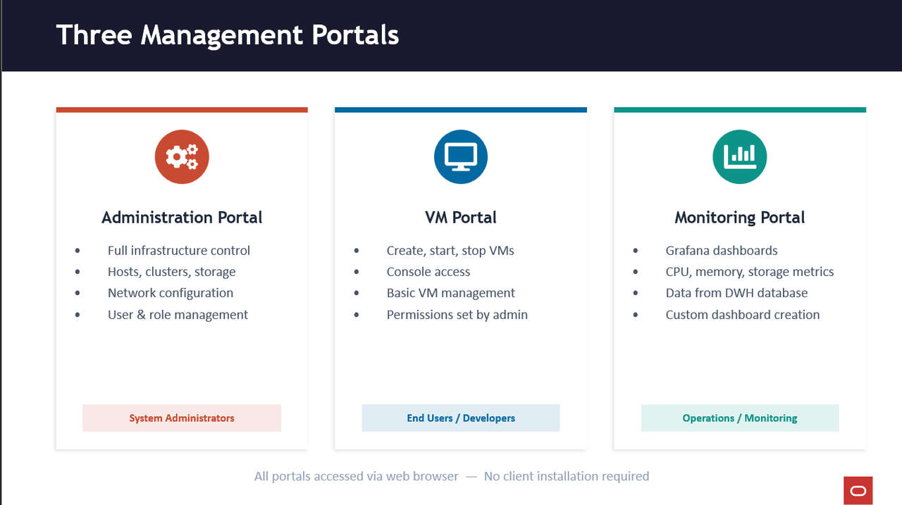

# Configure KVM Cluster

## Introduction

In this lab, you will add two Oracle Linux KVM hosts (`olkvm01` and `olkvm02`) to the OLVM Engine and verify they are fully integrated into the **Default** cluster. When you add a host, the Engine installs the host agent (**VDSM**) and required dependencies, deploys certificates, configures host networking, and validates the host until it reaches an **Up** status.

Estimated Lab Time: 30–45 minutes

### Objectives

In this lab, you will:
- Review KVM host architecture and the role of VDSM/libvirt/KVM/QEMU
- Configure required repositories on both KVM hosts
- Add both hosts (`olkvm01`, `olkvm02`) to the **Default** cluster in the Administration Portal
- Understand OLVM hierarchy (Data Center → Cluster → Hosts → VMs) and why it matters
- Verify both hosts reach **Up** status and know where to check logs if they do not
- Review OLVM management portals and complete optional exam practice

### Prerequisites

This lab assumes you have:
- Completed the OLVM Engine installation and can log in to the **Administration Portal**
- SSH connectivity from the Engine to both KVM hosts
- Hostnames resolvable from the Engine (for example, `ssh olkvm01`, `ssh olkvm02`)

---

## Task 1: KVM Host Architecture — Key Components (Reference)

```
┌─────────────────────────────────────────┐
│              ENGINE HOST                │
│         (oVirt Engine / WildFly)        │
│    Communicates with VDSM on hosts      │
└──────────────┬──────────────────────────┘
               │
    ┌──────────▼──────────────────────────┐
    │           KVM HOST                  │
    │                                     │
    │  ┌─────────┐  ┌──────────────────┐  │
    │  │  VDSM   │  │   libvirtd       │  │
    │  │ (host   │──│  (manages VM     │  │
    │  │  agent) │  │   lifecycle)     │  │
    │  └────┬────┘  └───────┬──────────┘  │
    │       │               │             │
    │  ┌────▼───────────────▼──────────┐  │
    │  │         KVM Module            │  │
    │  │      (kernel space)           │  │
    │  └───────────┬───────────────────┘  │
    │              │                      │
    │  ┌───────────▼───────────────────┐  │
    │  │     QEMU Processes            │  │
    │  │    (user space — one per VM)  │  │
    │  │  ┌─────┐ ┌─────┐ ┌─────┐      │  │
    │  │  │ VM1 │ │ VM2 │ │ VM3 │      │  │
    │  │  │guest│ │guest│ │guest│      │  │
    │  │  │agent│ │agent│ │agent│      │  │
    │  │  └─────┘ └─────┘ └─────┘      │  │
    │  └───────────────────────────────┘  │
    └─────────────────────────────────────┘
```

| Component | Where it Runs | Role |
|-----------|--------------|------|
| **KVM** | Kernel space (loadable kernel module) | Full virtualization using hardware extensions; shares physical hardware with VMs |
| **QEMU** | User space (one process per VM) | Emulates hardware (CPU, memory, network, disk); executes VM code directly on host CPU |
| **VDSM** | KVM host (daemon) | Host agent; intermediary between engine and host; manages VMs, networks, storage |
| **libvirtd** | KVM host (service) | API layer for managing hypervisors; VDSM uses libvirt to manage VM lifecycle and collect stats |
| **Guest Agent** | Inside each VM | Communicates with engine; reports OS details, IPs, and resource usage |

### Critical Relationships

- Engine → talks to → VDSM (on each host)
- VDSM → uses → libvirt → manages → KVM/QEMU
- KVM runs in kernel space; VMs run as QEMU processes in user space

---

## Task 2: Configure the First KVM Host (olkvm01)

> **Context:** All SSH commands using hostnames (for example, `ssh olkvm01`) are executed **from the OLVM Engine**, which has private DNS resolution for the cluster hosts.

1. From the OLVM Engine terminal (inside your VNC session), connect to the first host:

   ```bash
   <copy>ssh olkvm01</copy>
   ```

2. Install the Oracle Linux Virtualization Manager Release package (enables/disables required repositories):

   ```bash
   <copy>sudo dnf install -y oracle-ovirt-release-45-el8</copy>
   ```

3. Clear the dnf cache:

   ```bash
   <copy>sudo dnf clean all</copy>
   ```

4. Verify the repositories:

   ```bash
   <copy>sudo dnf repolist</copy>
   ```

5. Exit back to the Engine:

   ```bash
   <copy>exit</copy>
   ```

---

## Task 3: Add KVM Host (olkvm01) to the Cluster

1. Log in to the **Administration Portal**.

2. Using the side navigation menu, go to **Compute → Hosts**.

3. On the Hosts pane, click **New**.

4. The **New Host** dialog opens with the **General** tab selected.

5. Select the **Default** data center from the **Host Cluster** drop-down list.

   Installing Oracle Linux Virtualization Manager creates a data center and cluster named **Default**.

   **OLVM hierarchy explained:**
   ```text
   Data Center (physical location)
      ↓
   Cluster (group of hosts with same CPU type)
      ↓
   Hosts (physical servers running KVM)
      ↓
   Virtual Machines
   ```

   **Data Center**
   - Logical container for clusters
   - Defines shared storage and networking
   - Typically represents a physical location or administrative boundary
   - VMs can't migrate between data centers

   **Cluster**
   - Group of hosts that share:
     - CPU type (Intel/AMD and compatible generation for live migration)
     - Storage domains
     - Network configuration
   - Enables VM live migration between hosts in the cluster
   - Provides high availability (HA) for VMs
   - Requires at least 2 hosts for HA features

   **Default setup:** `engine-setup` creates a “Default” data center with a “Default” cluster. You can rename them or create new ones as needed.

6. Enter a name for the host:

   ```text
   <copy>olkvm01</copy>
   ```

7. In the **Hostname** field, enter the fully-qualified domain name or IP address of the host:

   ```text
   <copy>vdsm01.priv.olv.oraclevcn.com</copy>
   ```

   This entry is the fully-qualified name of the **secondary VNIC** attached to the KVM host.

   **Why use VNIC hostname (`vdsm01.priv...`)**

   In this lab, the KVM host has **two network interfaces (VNICs)**:

   1. **Primary VNIC (ens3)** — Public subnet  
      - For SSH access from outside  
      - For external connectivity  
      - Hostname example: `olkvm01.examplevcn.oraclevcn.com`

   2. **Secondary VNIC (ens5)** — Private subnet  
      - For OLVM management traffic (Engine ↔ VDSM)  
      - For VM migration  
      - For storage traffic  
      - Hostname: `vdsm01.priv.olv.oraclevcn.com`

   **Why separate management network**
   - **Security**: isolates management traffic from the public internet
   - **Performance**: dedicated bandwidth for migration/storage
   - **Best practice**: production deployments separate management and VM networks

   **What VDSM listens on:** When you add the host using the secondary VNIC hostname, VDSM binds to that interface for Engine communications.

8. Under **Authentication**, select the **SSH Public Key** authentication method.

   This action displays the engine's SSH public key within the **SSH PublicKey** field.

9. Switch to the terminal within the VNC session (Engine terminal) and copy the SSH public key to the host’s `/root/.ssh/authorized_keys`:

   ```bash
   <copy>sudo ssh-keygen -y -f /etc/pki/ovirt-engine/keys/engine_id_rsa | ssh olkvm01 -T "sudo tee -a /root/.ssh/authorized_keys"</copy>
   ```

   **What this does:** Enables passwordless SSH access from the Engine to the KVM host by copying the Engine public key to the host’s authorized_keys.

   **Why:** The Engine needs SSH key authentication to install VDSM, deploy configurations, and manage the host.

10. Switch back to the Administration Portal and click **OK**.

11. The **Power Management Configuration** screen may appear. Click **OK** (OCI instances do not allow configuring power management).

12. The host appears in the host list and the Engine begins installing the host agent (VDSM) and required packages.

### What happens during host installation (important)

When the Engine adds a host, it typically performs:

1. **SSH connection** — Engine connects using the SSH key you provided
2. **Repository configuration** — installs release packages if needed
3. **Package installation** — installs host components and dependencies:
   - `vdsm`
   - `vdsm-client`
   - `libvirt`
   - `qemu-kvm`
4. **Certificate deployment** — copies Engine CA and generates host certificate
5. **Network configuration** — configures management networking (bridges, etc.)
6. **Service startup** — starts/enables VDSM and libvirt services
7. **Firewall configuration** — opens required ports for VDSM communication
8. **Host verification** — validates connectivity and marks host **Up**

### Status meanings

- **Installing** — VDSM and packages being installed
- **Initializing** — services starting, network configuring
- **Up** — Host is ready to run VMs
- **Non Operational** — Host has issues (check logs)
- **Maintenance** — Host is intentionally offline for updates

### Troubleshooting tip

If installation fails, check:
- Engine: `/var/log/ovirt-engine/engine.log`
- Host: `/var/log/vdsm/vdsm.log`

> **Note:** After a KVM host is added to a cluster, avoid any spontaneous changes to network configuration in `/etc/sysconfig/network-scripts/`, through NetworkManager (for example `nmcli`), or in OCI, unless the lab instructs you to.

13. Wait for `olkvm01` to show **Up** before continuing.

---

## Task 4: Configure the Second KVM Host (olkvm02)

> **Note:** You previously configured `olkvm01`. Now repeat the same process for the second KVM host (`olkvm02`) to enable high availability and VM migration capabilities.

1. From the Engine terminal, connect to the second host:

   ```bash
   <copy>ssh olkvm02</copy>
   ```

2. Install the OLVM release package:

   ```bash
   <copy>sudo dnf install -y oracle-ovirt-release-45-el8</copy>
   ```

3. Clear the dnf cache:

   ```bash
   <copy>sudo dnf clean all</copy>
   ```

4. Verify repositories:

   ```bash
   <copy>sudo dnf repolist</copy>
   ```

5. Exit back to the Engine:

   ```bash
   <copy>exit</copy>
   ```

---

## Task 5: Add KVM Host (olkvm02) to the Cluster

1. Log in to the **Administration Portal**.

2. Go to **Compute → Hosts**.

3. Click **New**.

4. Select the **Default** data center/cluster from the **Host Cluster** drop-down list.

5. Enter:
   - **Name:** `olkvm02`
   - **Hostname:** `vdsm02.priv.olv.oraclevcn.com`

6. Under **Authentication**, select **SSH Public Key**.

7. From the Engine terminal, copy the Engine public key to `olkvm02`:

   ```bash
   <copy>sudo ssh-keygen -y -f /etc/pki/ovirt-engine/keys/engine_id_rsa | ssh olkvm02 -T "sudo tee -a /root/.ssh/authorized_keys"</copy>
   ```

8. Click **OK**.

9. If **Power Management Configuration** is displayed, click **OK** (OCI instances do not allow configuring power management).

10. Wait for `olkvm02` status to show **Up**.

---

## Task 6: Validate Both Hosts

1. In **Compute → Hosts**, verify:
   - `olkvm01` is **Up**
   - `olkvm02` is **Up**

2. If either host does not reach **Up**, use the troubleshooting tips:
   - Engine log: `/var/log/ovirt-engine/engine.log`
   - Host log: `/var/log/vdsm/vdsm.log`

---

## Task 7: Management Portals Review (Reference)



### Three management portals (web-based)

1. **Administration Portal** (used in this workshop)
   - Full control over everything: hosts, clusters, storage domains, networks, VMs, users

2. **VM Portal**
   - Simplified interface for end users
   - Create/start/stop VMs; console access via VNC or RDP
   - Capabilities are controlled by admin roles (role-based access)

3. **Monitoring Portal (Grafana)**
   - Integrated Grafana dashboards
   - Uses Engine history/data warehouse data
   - CPU, memory, storage, network metrics
   - Grafana commonly runs on port **3000**

---

## Task 8: Lab Part 2 — Exam Practice (Optional)

### KVM Host Prerequisites

```quiz
Q: 1. What is the minimum Oracle Linux version required for a KVM host?
- A. Oracle Linux 7.5
* B. Oracle Linux 8.5 or later
- C. Oracle Linux 9.0
- D. Oracle Linux 8.0

Q: 2. What is the MINIMUM CPU requirement for a KVM host?
- A. Single-core 32-bit CPU
* B. 64-bit dual-core CPU
- C. 64-bit quad-core CPU
- D. 64-bit eight-core CPU

Q: 3. What is the MINIMUM RAM required for a KVM host?
- A. 1 GB
* B. 2 GB
- C. 4 GB
- D. 8 GB

Q: 4. What is the MINIMUM network interface requirement for a KVM host?
- A. One NIC with 100 Mbps bandwidth
* B. One NIC with 1 Gbps bandwidth
- C. Two NICs with 1 Gbps bandwidth
- D. Four NICs with 1 Gbps bandwidth
```

### Adding Host to Engine

```quiz
Q: 5. Where in the Administration Portal do you add a new KVM host?
- A. Storage -> Hosts
* B. Compute -> Hosts
- C. Network -> Hosts
- D. Configuration -> Hosts

Q: 6. Which two authentication methods can be used when adding a KVM host? (Choose 2)
* A. Password authentication
- B. Kerberos
* C. SSH key authentication
- D. Certificate authentication

Q: 7. For which user account must authentication credentials be provided when adding a host?
- A. admin user
* B. root user
- C. ovirt user
- D. vdsm user
```

### VDSM & Host Architecture

```quiz
Q: 8. What is the role of the VDSM service on a KVM host?
- A. It manages the PostgreSQL database
* B. It acts as a host agent running continuously as a daemon on the KVM host
- C. It provides the web-based administration interface
- D. It handles SSL certificate generation

Q: 9. How does the oVirt engine communicate with VDSM on the KVM hosts?
- A. Through shared storage
* B. Through the VDSM service (host agent)
- C. Through the PostgreSQL database
- D. Through SNMP traps

Q: 10. What happens to a virtual machine if the oVirt engine goes offline?
- A. The VM automatically suspends
* B. The VM continues to run on the KVM host
- C. The VM is migrated to another host
- D. The VM shuts down gracefully
```

---

## Learn More

(Optional) Add links to docs.oracle.com pages or internal references relevant to your workshop.

## Acknowledgements

- **Author** - <Name, Title, Group>
- **Contributors** - <Name, Group> (optional)
- **Last Updated By/Date** - <Name, Month Year>
