# Set Up Networking

## Introduction

### Networking, Storage, and VM Setup

#### Overview

In this part, you will configure Networking, Storage, and VM for your virtual machines, import a VM template, and create two VMs with external access.

Estimated Lab Time: 60–75 minutes

### Objectives (Exam: 1Z0-1170 Alignment)

In this lab, you will:
* Create logical networks for VM traffic (Exam Topic: Networking & Storage)
* Configure shared storage domains (Exam Topic: Networking & Storage)
* Import templates and create VMs (Exam Topic: Administrating Virtual Machines)
* Enable external VM access (Exam Topic: Networking & Storage)

### What You Will Build

```
┌─────────────────────────────────────────────────────────────────────────┐
│                  Part 3: Networking, Storage, and VM                    │
│                                                                         │
│  ┌─────────────────┐      ┌─────────────────┐   ┌─────────────────┐     │
│  │   OLVM Engine   │      │    olkvm01      │   │    olkvm02      │     │
│  │     (olvm)      │      │   (KVM Host)    │   │   (KVM Host)    │     │
│  │                 │      │                 │   │                 │     │
│  │ • Admin Portal  │ ───> │ • VDSM Agent    │   │ • VDSM Agent    │     │
│  │ • REST API      │      │ • l2-vm-network │   │ • l2-vm-network │     │
│  │ • PostgreSQL    │      │                 │   │                 │     │
│  └─────────────────┘      │ ┌─────────────┐ │   │ ┌─────────────┐ │     │
│                           │ │ ol9-mysql   │ │   │ │ ol9-webapp  │ │     │
│                           │ │ 10.0.10.100 │ │   │ │ 10.0.10.101 │ │     │
│                           │ └─────────────┘ │   │ └─────────────┘ │     │
│                           └─────────┬───────┘   └────────┬────────┘     │
│                                     │                    │              │
│                                     └──────────┬─────────┘              │
│                                                │                        │
│                              ┌─────────────────┴─────────────────┐      │
│                              │     Shared Storage Domain         │      │
│                              │    (Fibre Channel / LUNs)         │      │
│                              │    • VM Disks  • Templates        │      │
│                              └───────────────────────────────────┘      │
└─────────────────────────────────────────────────────────────────────────┘
```

### Steps

1. Create a logical network for virtual machines (`l2-vm-network`)
2. Assign the logical network to `olkvm01`
3. Assign the logical network to `olkvm02`
4. Add Fibre Channel storage domain
5. Import an Oracle Linux virtual machine template
6. Create the first virtual machine from the template (`ol9-mysql`) **on `olkvm01`**
   - Run the virtual machine
   - Provide external access to the virtual machine
   - Test virtual machine external access
7. Create the second virtual machine from the template (`ol9-webapp`) **on `olkvm02`**
   - Run the virtual machine
   - Provide external access to the virtual machine
   - Test virtual machine external access

> Note (consistency check): This page contains the detailed steps for items 1–3 and the OCI NAT configuration typically needed for external access. Items 4–7 are listed above as part of the overall Part 3 workflow, but the detailed procedures for those items are not included in the content you provided here—so they remain as a roadmap section only.

### Prerequisites (Optional)

This lab assumes you have:
* An Oracle Cloud account
* All previous labs successfully completed

*This is the "fold" - below items are collapsed by default*

---

## Task 1: Create a Logical Network

1. Using the side navigation menu, go to **Network** and then click **Networks**.

2. On the **Networks** pane, click **New**.

3. The **New Logical Network** dialog box opens with the **General** tab selected on the sidebar.

   The Default data center is pre-selected in the drop-down list.

4. For the **Name** field, enter a name for the new network:
   ```
   <copy>l2-vm-network</copy>
   ```

5. Under the **Network Parameters** section, the **VM Network** check box is selected by default. Leave the **VM Network** check box selected to create the new VLAN-based virtual machine network.

6. Click **OK** to create the network.

### Reference / Exam Notes: Logical Networks

**What is a logical network:**

A logical network is a virtual network layer in OLVM that defines how VMs communicate.

**Types of logical networks:**

1. **VM Network** (what we're creating)
   - Used by virtual machines for their network traffic
   - Can be VLAN-tagged or untagged
   - Isolated from management network
   - Example: Production VMs, Development VMs, DMZ

2. **Management Network (ovirtmgmt)**
   - Created automatically during engine-setup
   - Used for engine ↔ VDSM communication
   - Critical for host management
   - Usually not available to VMs

3. **Migration Network**
   - Optional dedicated network for live VM migration
   - Improves migration performance
   - Prevents migration traffic from affecting VM performance

4. **Display Network**
   - Optional network for RDP/VNC console traffic
   - Separates console traffic from data traffic

5. **Gluster Network**
   - For GlusterFS storage communication
   - Not used in this lab

**Logical vs Physical:**
- **Physical network** = Network interface card (NIC) on the host
- **Logical network** = Virtual network configured in OLVM
- Multiple logical networks can share one physical NIC (using VLANs)

**VLAN tagging:**
- Allows multiple virtual networks on one physical interface
- Each network has a VLAN ID (1-4094)
- Packets are tagged with VLAN ID for routing
- In this lab, OCI VLAN provides the underlying network infrastructure

**Exam relevance (1Z0-1170):** Logical network concepts and configuration are heavily tested in the "Networking" domain. You must understand VM networks, VLANs, and network assignment to hosts.

---

## Task 2: Assign a Logical Network to the First KVM Host (olkvm01)

1. Using the side navigation menu, go to **Compute** and click **Hosts**.

   The Hosts pane opens.

2. Under the **Name** column, click the `olkvm01` host to add the network.

   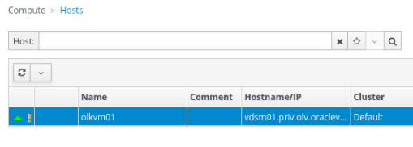

3. After clicking the host's name, the **General** tab opens with details about the host.

4. Click the **Network Interfaces** tab on the horizontal menu.

5. The **Network Interfaces** tab opens with details about the network interfaces on the host.

6. Click the **Setup Host Networks** button.

   The **Setup Host Networks** dialog box opens for the host. The **Interfaces** column lists any physical interfaces on the host, and the **Assigned Logical Networks** column displays any logical networks assigned to the interface. The **Unassigned Logical Networks** column displays the unassigned logical networks.

   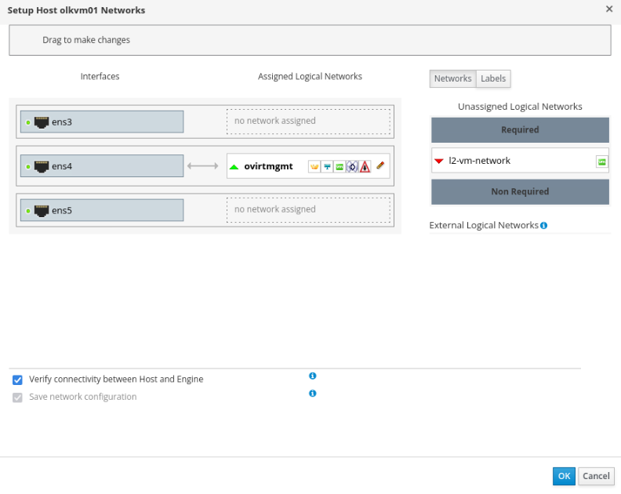

7. Select `l2-vm-network` from the **Unassigned Logical Networks** column by left-clicking the network and, while holding down the mouse, drag the network over to the last box to the right to add the network.

   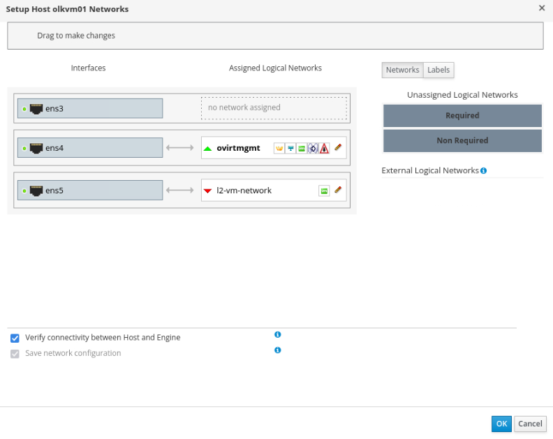

   In the example screenshot, the interface labels the box as the `ens5` network interface. Your environment may differ depending on your configuration.

8. Click **OK** to save the settings and add the network.

### What just happened

When you drag the logical network to a physical interface and click **OK**:

1. **Bridge creation** - VDSM creates a Linux bridge on the host:
   - Bridge name: Based on network name (e.g., `br-l2-vm-network`)
   - Physical interface (`ens5`) gets attached to the bridge
   - VMs will attach to this bridge for network access

2. **VLAN configuration** - If VLAN ID is set, interface gets tagged:
   - Creates VLAN interface (e.g., `ens5.100` for VLAN 100)
   - Traffic is tagged with VLAN ID

3. **Firewall rules** - VDSM updates iptables/firewalld to allow traffic

4. **Network persistence** - Configuration saved to disk

**Linux bridge explained:**
```
VM1 (vnet0) ─┐
              ├─ Bridge (br-l2-vm-network) ─ ens5 ─ Physical Network
VM2 (vnet1) ─┘
```

- Bridge acts like a virtual switch
- Each VM gets a virtual interface (vnet0, vnet1, etc.)
- Virtual interfaces connect to the bridge
- Bridge connects to physical interface
- VMs can communicate with each other and external networks

**Important:** After network changes, don't manually edit `/etc/sysconfig/network-scripts/`—always use the OLVM UI or API. Manual changes will be overwritten and can break connectivity.

**Exam relevance (1Z0-1170):** Understanding how OLVM implements logical networks using Linux bridges is tested. You should know how VMs connect to networks and troubleshoot connectivity issues.

---

## Task 3: Assign a Logical Network to the Second KVM Host (olkvm02)

1. Using the side navigation menu, go to **Compute** and click **Hosts**.

   The Hosts pane opens.

2. Under the **Name** column, click the `olkvm02` host to add the network.

   

3. After clicking the host's name, the **General** tab opens with details about the host.

4. Click the **Network Interfaces** tab on the horizontal menu.

5. The **Network Interfaces** tab opens with details about the network interfaces on the host.

6. Click the **Setup Host Networks** button.

   The **Setup Host Networks** dialog box opens for the host. The **Interfaces** column lists any physical interfaces on the host, and the **Assigned Logical Networks** column displays any logical networks assigned to the interface. The **Unassigned Logical Networks** column displays the unassigned logical networks.

   

7. Select `l2-vm-network` from the **Unassigned Logical Networks** column by left-clicking the network and, while holding down the mouse, drag the network over to the last box to the right to add the network.

   

   In the example screenshot, the interface labels the box as the `ens5` network interface. Your environment may differ depending on your configuration.

8. Click **OK** to save the settings and add the network.

---

## Task 4: Configure OCI NAT Gateway for VM Internet Access

VMs on the VLAN need internet access to download packages. Instead of configuring external access for each VM individually, we'll set up a NAT Gateway that provides outbound internet access for all VMs on the VLAN.

> **OCI-specific step:**  
> In a real on-prem OLVM deployment, physical routers and firewalls provide internet access for VLAN-based VM networks.  
> In OCI, VLANs are isolated by default, so we configure a NAT Gateway to enable outbound connectivity.

### Create a NAT Gateway

1. From the Luna Desktop, double-click the **Luna-Lab** icon.

   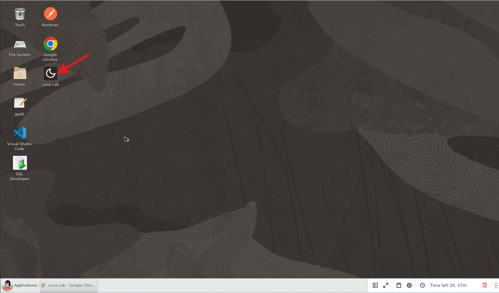

2. Click the link under **Quick Links** labeled **OCI Console**. The Oracle Cloud sign-in page opens in a new browser tab.

3. From the Luna Lab page, copy and paste the assigned user name and password to sign in.

   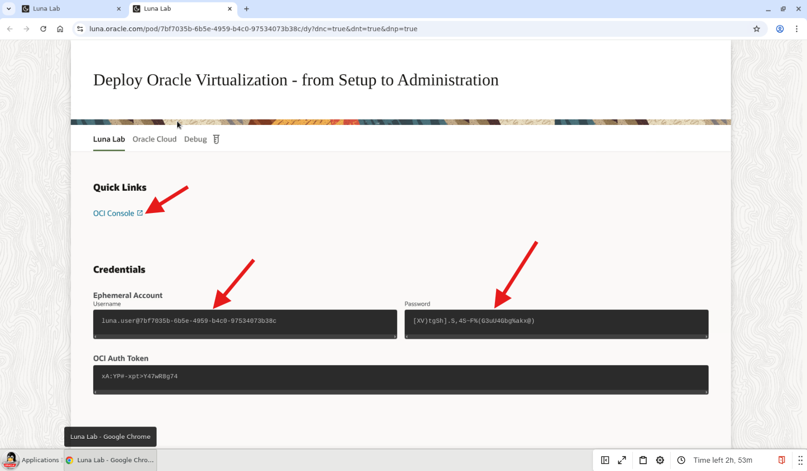

4. From the OCI Console navigation menu, click **Networking → Virtual cloud networks**.

   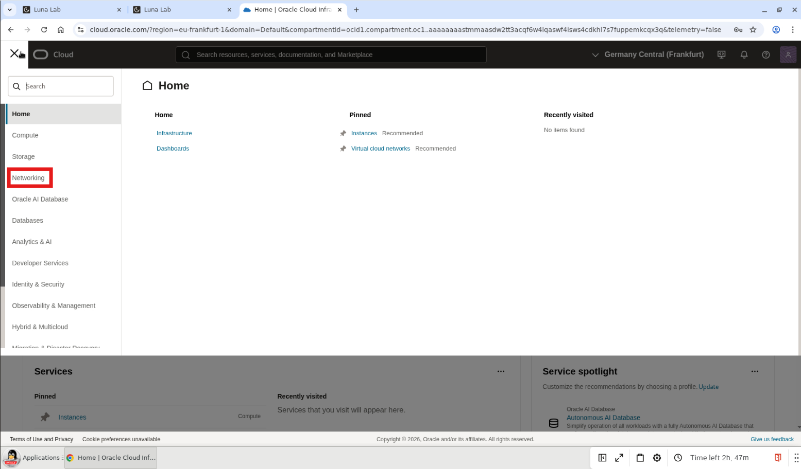

5. Click the name of your Virtual Cloud Network (VCN) in the table.

   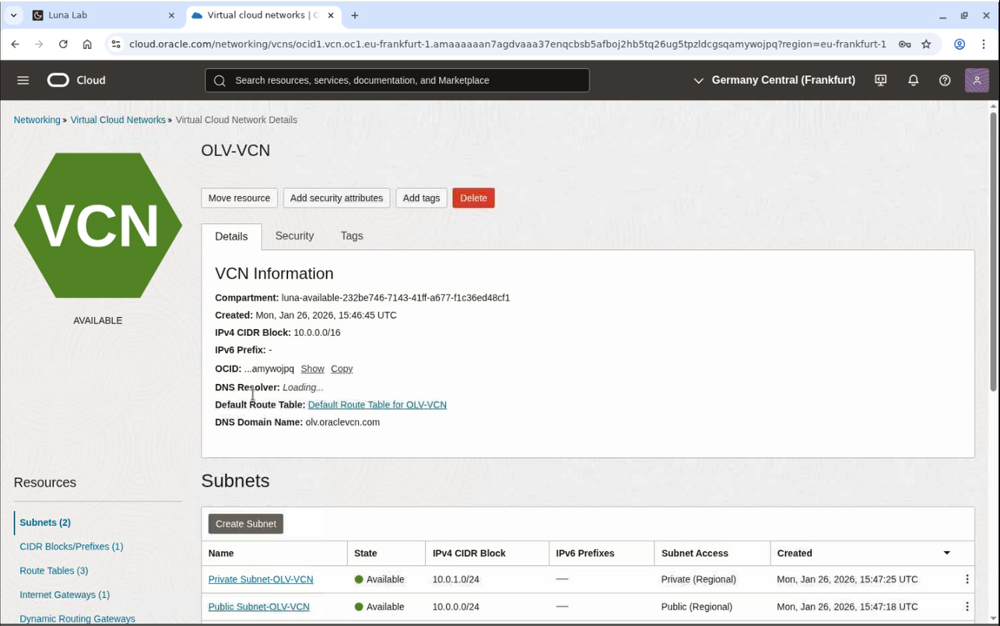

6. From the **Resources** menu on the left, click **NAT Gateways**.

   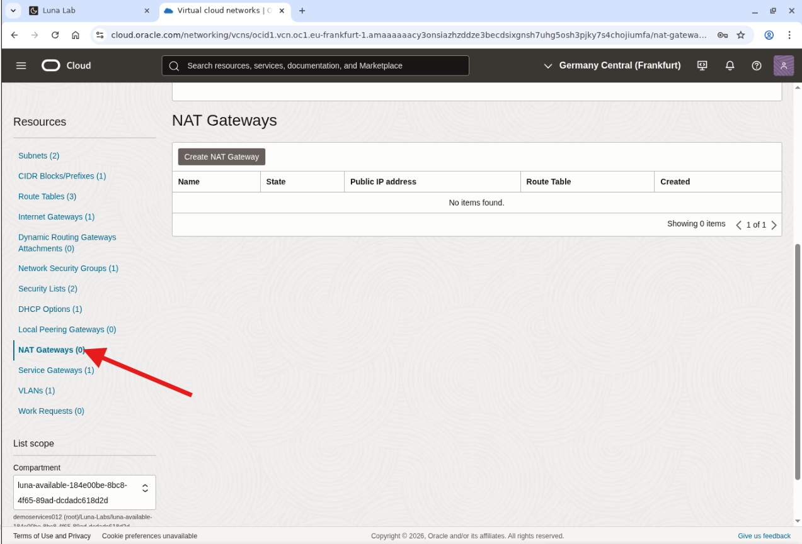

7. Click **Create NAT Gateway**.

8. Configure the NAT Gateway:
   - **Name**: `vm-nat-gateway`
   - **Create In Compartment**: (leave default)
   - **Ephemeral Public IP Address**: (selected by default)

9. Click **Create NAT Gateway**.

   The NAT Gateway is created and displays in the list.

### Create a Route Table for the VLAN

1. From the **Resources** menu on the left, click **Route Tables**.

2. Click **Create Route Table**.

3. Configure the route table:
   - **Name**: `vlan-route-table`
   - **Create In Compartment**: (leave default)

4. Click **+ Another Route Rule** and configure:
   - **Target Type**: NAT Gateway
   - **Destination CIDR Block**: `0.0.0.0/0`
   - **Target NAT Gateway**: Select `vm-nat-gateway`

5. Click **Add Route Rules**.

### Associate the Route Table with the VLAN

1. Click the **OLVCN** link.

   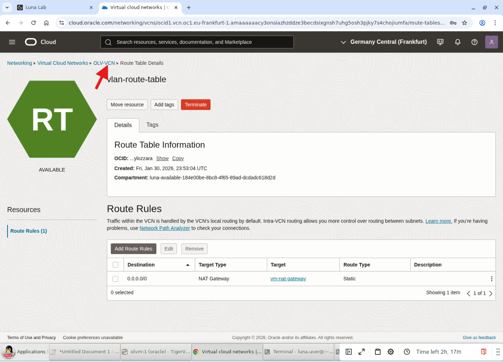

2. From the **Resources** menu on the left, click **VLANs**.

   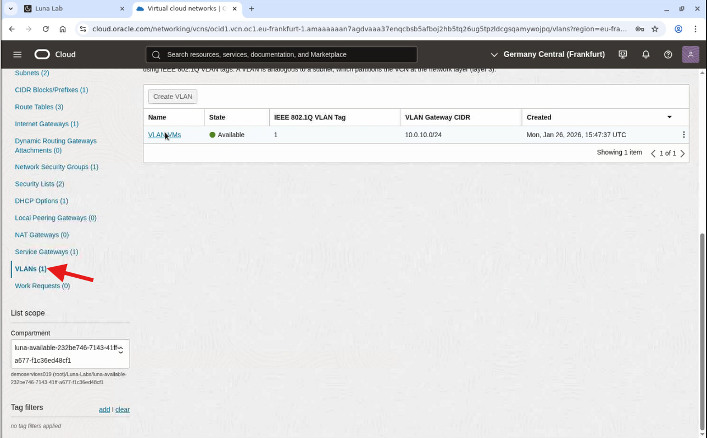

3. Click the name of the VLAN in the table.

4. Click **Edit**.

5. Under **Route Table**, select `vlan-route-table`.

   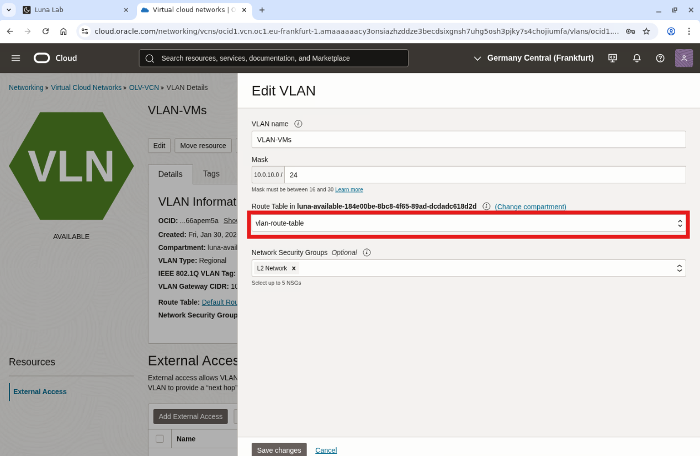

6. Click **Save Changes**.

---

## Learn More

*(optional - include links to docs, white papers, blogs, etc)*

* [Oracle Cloud Infrastructure Networking](http://docs.oracle.com)

---

## Acknowledgements

* **Author** - <Name, Title, Group>
* **Contributors** - <Name, Group> -- optional
* **Last Updated By/Date** - <Name, Month Year>
