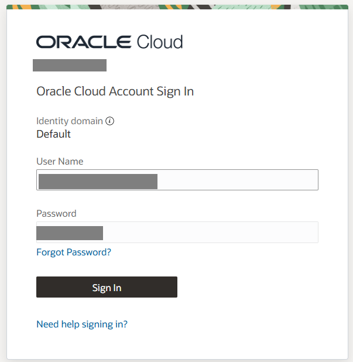
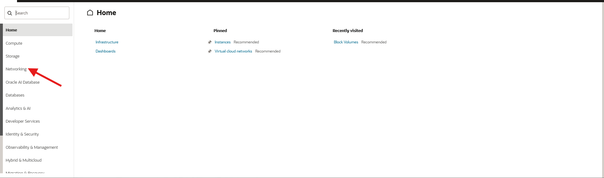
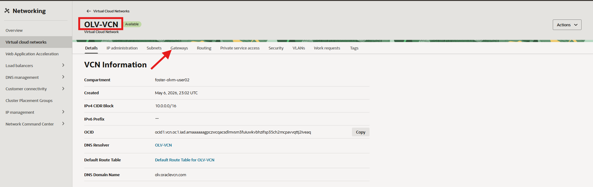
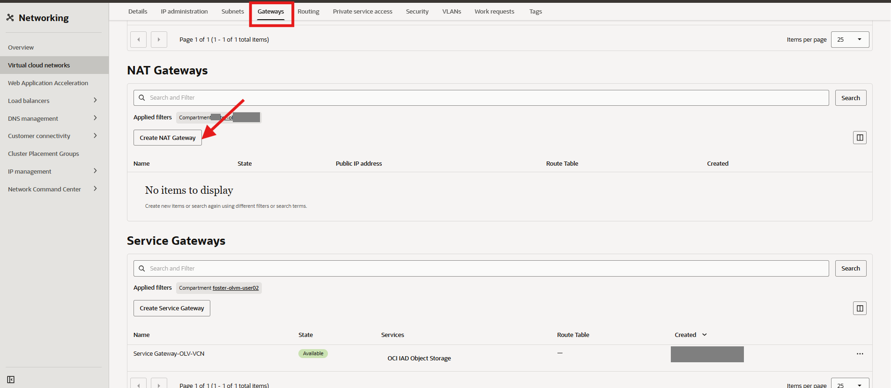
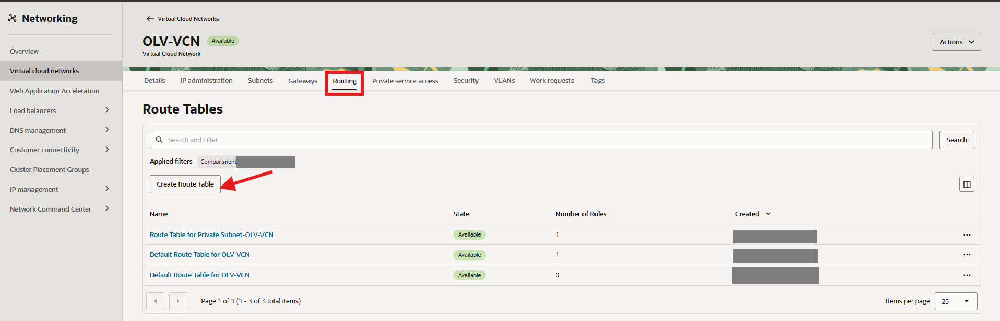
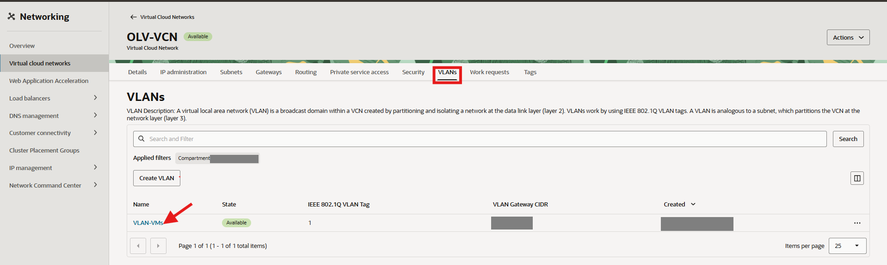
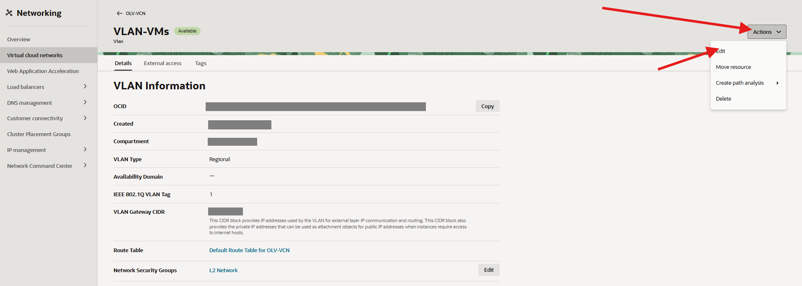
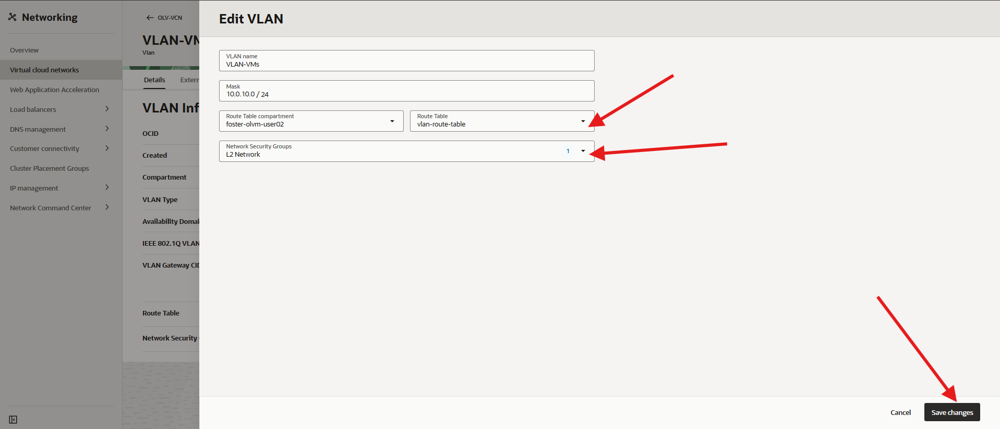
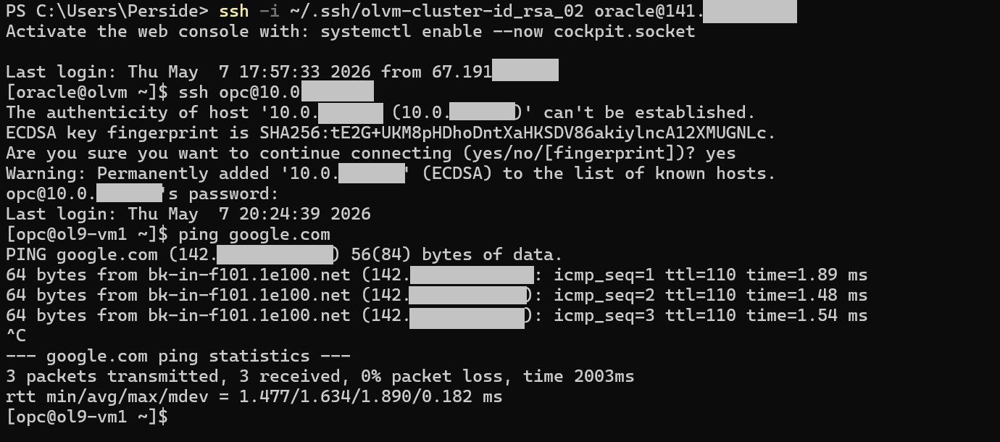

# Configure OCI NAT Gateway for VM Internet Access

## Introduction

VMs on the VLAN need internet access to download packages. Instead of configuring external access for each VM individually, this lab uses an OCI NAT Gateway so all VMs on the VLAN can use outbound internet connectivity through a shared OCI networking path.

> **OCI-specific step:**
> In a real on-prem OLVM deployment, physical routers and firewalls provide internet access for VLAN-based VM networks.
> In OCI, VLANs are isolated by default, so you configure a NAT Gateway to enable outbound connectivity.

### Objectives

In this lab, you will:

- Create an OCI NAT Gateway for outbound VM traffic
- Create a route table that sends `0.0.0.0/0` traffic to the NAT Gateway
- Associate the route table with the VLAN used by the OLVM VMs
- Access a VM on the VLAN by using the `olvm` host as a jump point

Estimated Time: 15-25 minutes

### Video Walkthrough

[](video:https://objectstorage.us-ashburn-1.oraclecloud.com/n/idhwewbjlvpy/b/olvm-train-oci/o/videos/olvm-on-oci-lab5-no-presenter.mp4)

## Prerequisites

This lab assumes you have:

- Completed Lab 4 or later so the OLV-VCN and VLAN already exist
- Access to the Luna Desktop and the workshop OCI Console link
- The SSH private key and public IP address for the `olvm` host
- Permission to create OCI NAT Gateways and Route Tables in the target compartment

## Task 1: Create a NAT Gateway

1. From your browser, sign in to OCI.

    


2. From the OCI Console navigation menu, click **Networking -> Virtual Cloud Networks**.

    

3. Click the name of your Virtual Cloud Network (VCN) in the table. Then click the **Gateway** tab.
    - **Name:** `OLV-VCN`

    

4. From the `OLV-VCN` `Gateways page` click **NAT Gateways** tab.

    

5. Click **Create NAT Gateway**.

6. Configure the NAT Gateway:

    - **Name:** `vm-nat-gateway`
    - **Create In Compartment:** leave the default value
    - **Ephemeral Public IP Address:** selected by default

7. Click **Create NAT Gateway**.

    The NAT Gateway is created and displays in the list.

## Task 2: Create a Route Table for the VLAN

1. From the `OLV-VCN` page click **Routing** tab.

    

2. Click **Create Route Table**.

3. Configure the route table:

    - **Name:** `vlan-route-table`
    - **Create In Compartment:** leave the default value

4. Click **+ Another Route Rule** and configure the route:

    - **Target Type:** NAT Gateway
    - **Destination CIDR Block:** `0.0.0.0/0`
    - **Target NAT Gateway:** `vm-nat-gateway`

5. Click the **Create** button.

## Task 3: Associate the Route Table with the VLAN


1. From the `OLV-VCN` page click **VLANs** tab, then click the name of the VLAN in the table.

    


2. Click **Edit**.

    

3. Under **Route Table**, select `vlan-route-table`.

    

4. Click **Save Changes**.


## Task 4: Access a VLAN VM through the OLVM host

The NAT Gateway only allows the VMs to reach the internet; it does not open a path for you to SSH directly into a VM from your laptop. To reach a VM on the 10.0.10.x network from your laptop, first connect to the olvm host and then connect from olvm to the VLAN VM as described in this task.

1. From your laptop, open a terminal and connect to the `olvm` host by using the private key you created earlier.

    ```powershell
    ssh -i ~/.ssh/olvm-cluster-id_rsa oracle@<olvm-public-ip>
    ```

    Replace `<olvm-public-ip>` with the public IP address of your `olvm` instance.

2. From the `olvm` host, connect to the VM on the VLAN network.

    ```bash
    ssh opc@10.0.10.105
    ```

3. If prompted, type `yes` to accept the host key.

4. Enter the `opc` user password for the VM if prompted.

5. Verify that you are connected to the VM and that outbound internet access still works.

    ```bash
    ping google.com
    ```

    The ping should succeed, confirming that:
    - the `olvm` host can reach the VLAN VM
    - the VM still has outbound internet access through the NAT Gateway


    

6. Exit the VM:

    ```bash
    <copy>exit</copy>
    ```

### Configure OCI NAT Gateway Checkpoint

At this point, you should have:

- Created the `vm-nat-gateway` NAT Gateway
- Created the `vlan-route-table` route table
- Added a `0.0.0.0/0` route that targets the NAT Gateway
- Associated the route table with the VLAN used by the OLVM VMs
- Verified that a VLAN VM can be reached through the `olvm` host

## Acknowledgements

- **Author** - Shawn Kelley, John Priest
- **Contributors** - Perside Foster
- **Last Updated By/Date** - Perside Foster, May 8, 2026
