# Deploy OLVM Engine
## Introduction

### Oracle Virtualization - The big picture

   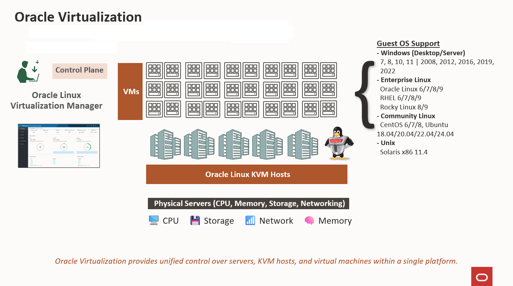

#### WHAT DOES ORACLE VIRTUALIZATION LOOK LIKE? — The complete platform, from control plane to infrastructure

#### Platform layers:
1. Physical Servers — The foundation. Provide CPU, memory, storage, and networking.
2. Oracle Linux KVM Hosts — The middle layer. Run multiple virtual machines with different guest operating systems, including Linux and Windows.
3. Oracle Linux Virtualization Manager (OLVM) — The centralized control plane. Logically separated from the KVM hosts and the VMs they run.

   > **Note**: This separation is intentional — it improves reliability and scalability, and simplifies management across many hosts. The control plane (OLVM) focuses on centralized management from one place. KVM hosts focus on workload execution using KVM in the Linux kernel.
   

#### Key concept — User Space vs Kernel Space: Linux divides memory into two areas. 
- **Kernel space** is the memory area where the operating system core and hardware drivers run — it has direct access to hardware. 
- **User space** is the memory area where applications run — they must request hardware access through the kernel. In OLVM, KVM runs in kernel space for near-native performance, while each VM runs as a QEMU (Quick Emulator) process in user space. You'll see this distinction in the architecture stack next.

## Architecture Overview

### THE VIRTUALIZATION STACK - This is the most important diagram of the lab and exam

   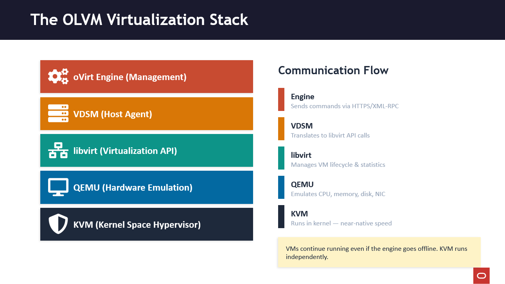


**Walk through from top to bottom:**
1. oVirt ENGINE — The brain. Java app on WildFly server (formerly JBoss) + PostgreSQL. Sends commands down.
2. VDSM — Virtual Desktop and Server Manager. Daemon on EVERY KVM host. The agent.
3. libvirt — The API layer. VDSM talks to libvirt, not directly to KVM.
4. QEMU — Quick Emulator. Emulates hardware (CPU, memory, disk, NIC) for each VM. Each VM is a QEMU process in USER SPACE.
5. KVM — The actual hypervisor. Runs in KERNEL SPACE. Provides near-native performance.

   > **Note**: If the engine goes offline, VMs keep running! The engine is management only. KVM handles execution independently.


   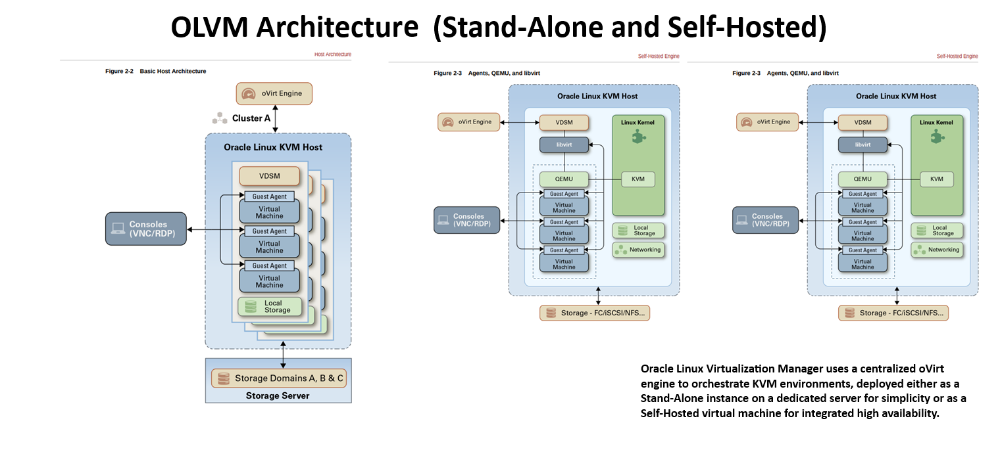

### Three deployment sizes
   

   | | Small | Medium | Large |
   |---|---|---|---|
   | **Hosts** | 1–5 | 5–50 | 50–200 |
   | **VMs** | Up to 50 | 50–500 | 500–2,000 |
   | **CPU (recommended)** | 4 cores | 8 cores | 16 cores |
   | **RAM (recommended)** | 16 GB | 32 GB | 64 GB |
   | **Disk (recommended)** | 50 GB | 100 GB | 200 GB |
   | **CPU (minimum)** | 2 cores | — | — |
   | **RAM (minimum - Standalone)** | 4 GB | — | — |
   | **RAM (minimum - Self-Hosted Engine)** | 16 GB | — | — |
   | **Disk (minimum)** | 25 GB | — | — |
   | **Deployment Types** | Standalone & Self-Hosted Engine | Standalone & Self-Hosted Engine | Standalone & Self-Hosted Engine |

   > **Note** — Minimum values are provided only for Small deployments; Medium and Large deployments should follow recommended values.

## Task 1: Architecture and Infrastrucute  Exam Practice  #1

### Architecture Quiz

```quiz
Q: 1. What is a Standalone Engine in Oracle Linux Virtualization Manager?
* A. A management engine installed on a dedicated server separate from the virtualization hosts.
- B. An engine that runs as a virtual machine within the same cluster it manages.
- C. A host that only provides storage and networking services.
- D. A management console that only functions when connected to the public cloud.

Q: 2. What is a Self-Hosted Engine in Oracle Linux Virtualization Manager?
- A. An engine that requires a dedicated physical server
* B. A management engine that runs as a VM directly on the virtualization hosts    		
- C. An engine that runs in Oracle Cloud Infrastructure
- D. A backup engine for disaster recovery

Q: 3. What is the primary benefit of using a Self-Hosted Engine deployment?
- A. It requires more hardware resources
* B. It eliminates the need for a separate management server      		 
- C. It increases the complexity of deployment
- D. It requires Oracle Linux Enterprise Kernel

Q: 4. What component monitors and manages the Self-Hosted Engine VM on each host?
- A. oVirt engine service  
- B. VDSM daemon
* C. HA agent (ovirt-ha-agent)     		 
- D. PostgreSQL database

Q: 5. What is the core component that serves as the backbone of Oracle Linux Virtualization Manager?
- A. KVM hypervisor
- B. VDSM agent
* C. oVirt engine 		
- D. PostgreSQL database

Q: 6. Which three tasks does the oVirt engine perform? (Choose 3)
* A. Discovering KVM hosts ✓**		 
- B. Running virtual machine processes
* C. Configuring storage for virtualized data centers 	 
* D. Configuring networking for virtualized data centers 		 
- E. Providing hardware emulation for VMs

Q: 7. What is the role of VDSM in Oracle Linux Virtualization Manager?
- A. It provides hardware emulation for virtual machines
* B. It acts as a host agent running continuously as a daemon on the KVM host 		 
- C. It manages the PostgreSQL database
- D. It provides the web-based user interface

Q: 8. What does QEMU (Quick Emulator) provide in the virtualization stack?
- A. Network connectivity between VMs
* B. Hardware component emulation such as CPU, memory, network, and disk devices 		 
- C. User authentication services
- D. Database management

Q: 9. Where does KVM operate within the system?
- A. In user space as an application
* B. In the kernel space		 
- C. On a separate management server
- D. In the cloud

Q: 10. What is the relationship between VDSM and libvirt?
- A. VDSM replaces libvirt completely
* B. VDSM relies on libvirt to manage the lifecycle of VMs and collect statistics 		 
- C. libvirt runs inside VDSM
- D. They operate independently without interaction
```

### Infrastructure Quiz

```quiz
Q: 1. What is the minimum Oracle Linux version required for installing the OLVM Manager (Engine)?
- A. Oracle Linux 7.5
* B. Oracle Linux 8.5 and higher 
- C. Oracle Linux 9.0
- D. Oracle Linux 6.8

Q: 2. Which two CPU technologies must be supported for the Engine host processor? **(Choose 2)**
* A. Intel VT-x 
- B. Intel SGX
* C. AMD-V 
- D. ARM TrustZone

Q: 3. What are the RECOMMENDED hardware requirements for an OLVM(Engine) SMALL deployment? **(Choose 3)**
- A. 2 cores
* B. 4 cores 
* C. 16 GB or greater RAM 
- D. 32 GB RAM
* E. 50 GB or greater local writable disk 
```

## Task 2: Open a VNC Session to the Manager

1. Open a new terminal and connect to the olvm instance via SSH.

   The `-L` option enables local forwarding, which opens a local port to connect through an SSH tunnel to the remote VNC server.
      ```bash
      <copy>ssh -L 5914:localhost:5901 oracle@<ip_address_of_instance></copy>
      ```   
   **What this does:** Creates an SSH tunnel that forwards local port 5914 to the remote VNC server on port 5901.
      
   **How SSH tunneling works:**
      - Your local machine (for this lab LUNA sandbox) listens on port 5914
      - Traffic sent to localhost:5914 gets encrypted and sent through SSH
      - SSH server forwards it to localhost:5901 on the remote machine
      - VNC server on remote machine responds back through the tunnel


   **Three-Tier Architecture:**
      ```
      ┌─────────────────┐         ┌─────────────────┐         ┌─────────────────┐
      │   YOUR COMPUTER │         │  LUNA SANDBOX   │         │  OLVM MANAGER   │
      │   (Your laptop) │────────>│   (Desktop)     │────────>│   (Remote VM)   │
      │                 │         │                 │         │                 │
      │  Web Browser    │         │  VNC Viewer     │         │  VNC Server     │
      │  (HTML5)        │         │  localhost:5914 │         │  localhost:5901 │
      └─────────────────┘         └─────────────────┘         └─────────────────┘
         Internet                    SSH Tunnel                  On Manager
      ```
      
      **Data Flow:**
      1. Terminal runs: `ssh -L 5914:localhost:5901 oracle@<olvm-public-ip>`
      2. TigerVNC on Luna connects to localhost:5914
      3. Traffic tunnels through SSH to OLVM Manager port 5901
      4. You see OLVM Manager desktop and configure the system 

      **Command breakdown:**
      ```bash
      <copy>ssh -L 5914:localhost:5901 oracle@<olvm-public-ip></copy>
      ```
         
      This command means:
      - `-L 5914:localhost:5901` - "Create a local port forwarding tunnel"
      - `5914` - Listen on port 5914 on **my local** computer
      - `localhost:5901` - Port 5901 on the **remote server's** localhost (where VNC is running)
      - `oracle@<manager-ip>` - Connect via SSH to the remote server

   
      **Why:** VNC port 5901 is not directly accessible from the internet (firewalled). SSH tunneling provides secure, encrypted access.

      **Note:** SSH tunneling is a general Linux system administration skill, not specific to OLVM exam objectives. OLVM uses VNC ports 5900-6923 (extended beyond standard 5900-5999)
   


1. Open the TigerVNC from your local machine.
    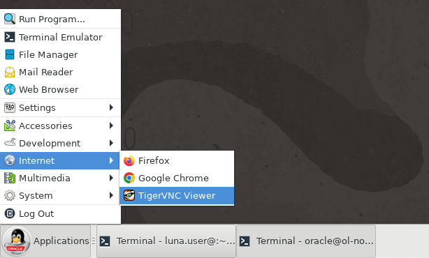


1. Log on to the deployed server's GUI environment by entering `localhost:5914` into the VNC Server text box and pressing the Connect button.

    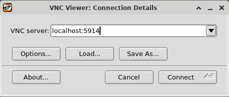

1. Enter the `oracle` user's password of oracle and press the OK button.

    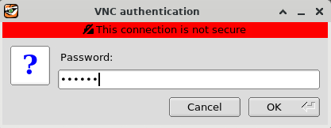

1. The Server's GUI desktop is displayed with a first-time login setup.

    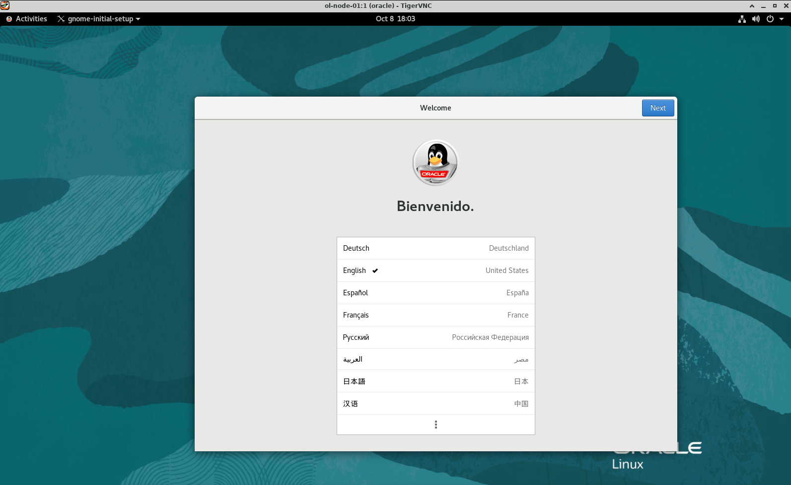

1. Press the Next button three times, then the Skip button, followed by the Start Using Oracle Linux Server button. Finally, close or minimize the Getting Started window.

    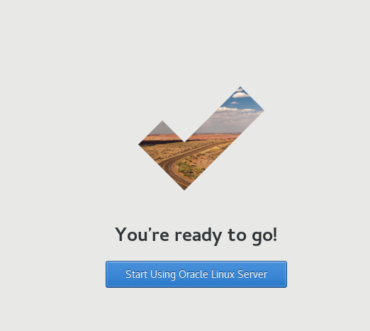

---

## Task 3: Install the OLVM Engine

1. Open the VNC Activities Menu.

   

1. Open a terminal within the VNC session.

   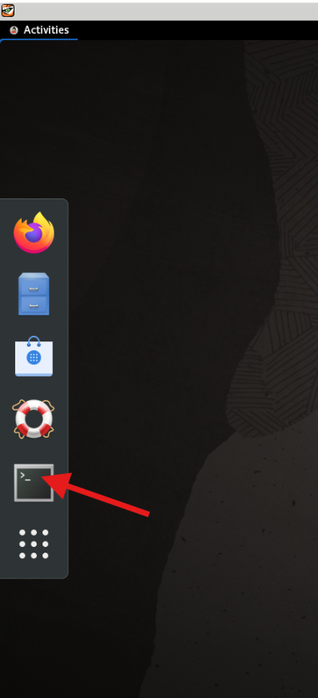

1. Enable copy and paste to the VNC session.
      ```bash
      <copy>vncconfig -nowin &</copy>
      ```

1. Install the Oracle Linux Virtualization Manager Release package, which automatically enables/disables the required repositories.
      ```bash
      <copy>sudo dnf install -y oracle-ovirt-release-45-el8</copy>
      ```  
   **What this does:** Installs the OLVM repository configuration package for release 4.5 on Oracle Linux 8.
   
   **Why:** This package automatically enables/disables the required YUM/DNF repositories needed for OLVM installation. Without it, you'd have to manually configure each repository URL, GPG keys, and priorities.
   
   **Repositories enabled:**
   - `ovirt-4.5` - Core OLVM/oVirt packages (engine, VDSM, etc.)
   - `ovirt-4.5-extra` - Additional components (virt-viewer, etc.)
   - `ol8_kvm_appstream` - KVM hypervisor and libvirt packages
   - `ol8_gluster_appstream` - GlusterFS for distributed storage (optional)
   - `ol8_UEKR7` - Unbreakable Enterprise Kernel Release 7
   
   **Version note:** "45" refers to OLVM 4.5, which is based on oVirt 4.5. Always match the release version to your Oracle Linux version (OL8 in this case).
   
   **Exam relevance (1Z0-1170):** Repository configuration is part of the "Installation & Configuration" exam domain. Know which repositories are required.


1. Clear the dnf cache.
      ```bash
      <copy>sudo dnf clean all</copy>
      ```
   **What this does:**
   1. clean dbcache: Removes the metadata database.
   2. clean expire-cache: Forces a check for new repository data.
   3. clean metadata: Removes XML files used to find packages.
   4. clean packages: Removes any cached .rpm files currently in the system. 

1. Install the Manager package. Downloads the core Oracle Linux Virtualization Manager software and all necessary dependencies (like Java and JBoss) from the Oracle Yum repositories. Does not start the manager. It only places the files on the disk.
      ```bash
      <copy>sudo dnf install -y ovirt-engine</copy>
      ```
1. List the configured repositories and verify that the required repositories are enabled. 
      ```bash
      <copy>sudo dnf repolist</copy>
      ```
1. You must enable the following repositories:

   - ol8\_baseos\_latest
   - ol8\_appstream
   - ol8\_kvm\_appstream
   - ovirt-4.5
   - ovirt-4.5-extra
   - ol8\_gluster\_appstream
   - ol8\_UEKR7

   If a required repository is not enabled, use the dnf config-manager command to enable it.
      ```bash
      <copy>sudo dnf config-manager --enable <repository_name></copy>
      ```
1. Configure the Manager.
      ```bash
      <copy>sudo engine-setup --accept-defaults</copy>
      ```
   **What this does:** Runs the OLVM Engine configuration wizard with all default answers accepted automatically.
   
   **Behind the scenes, engine-setup:**
   1. **Configures PostgreSQL database** - Creates ovirt_engine database, sets up users and permissions
   2. **Installs Apache/Tomcat** - Sets up web server for Administration Portal and REST API
   3. **Generates SSL certificates** - Creates CA and host certificates for secure communications
   4. **Configures firewall** - Opens required ports (443 for HTTPS, 5432 for PostgreSQL)
   5. **Creates admin user** - Sets up admin@ovirt user in the internal authentication domain
   6. **Initializes oVirt Engine** - Deploys the engine web application and starts services
   7. **Creates default data center and cluster** - Named "Default" by default
   
   **Without --accept-defaults:** The wizard would prompt you for each configuration option, including:
   - Installation type (standalone vs self-hosted)
   - Firewall configuration
   - Database connection details
   - PKI configuration
   - Network settings
   
   **Time:** Takes 5-10 minutes to complete all configuration steps.
   
   **Output files:**
   - Configuration stored in: `/etc/ovirt-engine/`
   - Logs available at: `/var/log/ovirt-engine/setup/`
   - Answer file saved for future reference: `/var/lib/ovirt-engine/setup/answers/`
   
   **Admin password:** The wizard will prompt for admin@ovirt password even with --accept-defaults. This is the only interactive prompt. Password must be 8+ characters with uppercase, lowercase, number, and special character.

   >**CRITICAL:** When engine-setup completes, WRITE DOWN the admin password!
   
   **Exam relevance (1Z0-1170):** Understanding what engine-setup configures is critical for the "Installation & Configuration" domain. You should know the major components it sets up (database, web server, certificates, firewall). Practice with --help - engine-setup --help shows options


## Task 4: OLVM Engine — Exam Practice #2

**REPOSITORIES & PREREQUISITE MODULES**
```quiz
Q: 1. Which six repositories must be enabled on the Oracle Linux system for OLVM Engine? **(Choose 6)**
* A. BaseOS Latest	
* B. AppStream	
* C. KVM AppStream	
* D. oVirt	  
* E. oVirt  Extras	
* F. UEKR7	
- G. Docker CE
- H. Kubernetes

Q: 2. What command is used to install the Oracle oVirt release package for Enterprise Linux 8?
- A. dnf install ovirt-release-el8
- B. dnf install oracle-ovirt-el8
* C. dnf install oracle-ovirt-release-45-el8 
- D. dnf install ovirt-engine-release


**ENGINE INSTALLATION & CONFIGURATION**

Q: 3. What command is used to install the OLVM Engine package?
- A. yum install olvm-engine
* B. dnf install ovirt-engine 
- C. dnf install olvm-manager
- D. yum install oracle-engine

Q: 4. What command is used to configure the OLVM Engine after package installation?
- A. ovirt-setup
* B. engine-setup 
- C. olvm-configure
- D. manager-setup

Q: 5. Which five configuration groupings are part of the engine-setup process? **(Choose 5)**
* A. Database configuration 
- B. Hardware configuration 
* C. Network configuration 
* D. Administration user setup 
* E. Certificates and security 
* F. Service configurations 
- G. Storage domain setup

Q: 6. What does the engine-setup command display after all questions are answered?
- A. Error log
* B. Summary of entered values
- C. Installation progress bar
- D. Database schema

**FIREWALL & PORTS**

Q: 7. Which two ports are used for web interface and REST API access? **(Choose 2)**
* A. 80 (TCP) 
- B. 8080 (TCP)
* C. 443 (TCP) 
- D. 8443 (TCP)

Q: 8. What is the default port number for PostgreSQL database communication?
- A. 3306
* B. 5432 
- C. 5433
- D. 27017
```


## Task 5: Login to the Administration Portal

1. Get the FQDN for the manager host.
      ```bash
      <copy>hostname -f</copy>
      ```   
   **What this does:** Displays the Fully Qualified Domain Name (FQDN) of the host.
   
   **Example output:** `olvm.examplevcn.oraclevcn.com`
   
   **Why FQDN matters:**
   - The engine's SSL certificate is bound to the FQDN
   - You must access the web interface using the FQDN in the URL
   
   **What is FQDN:** hostname + domain name
   - Hostname: `olvm`
   - Domain: `examplevcn.oraclevcn.com`
   - FQDN: `olvm.examplevcn.oraclevcn.com`
   
   **Exam relevance (1Z0-1170):** FQDN configuration is part of 'Perform Engine Setup' requirements.

1. Open the VNC Activities Menu.

   

1. Open Firefox within the VNC session.

   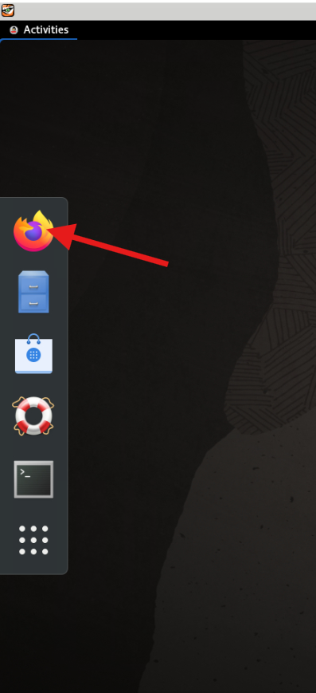

1. Enter the following link  to access the engine's Web UI for this lab.
   ```
   https://olvm.pub.olv.oraclevcn.com
   ```

   **Security Warning:** Firefox will display "Warning: Potential Security Risk Ahead" because the OLVM engine uses a self-signed SSL certificate. This is expected and safe in this lab environment.

   To proceed:
   1. Click the `Advanced` button
   2. Click `Accept the Risk and Continue`


   The Welcome page displays.

    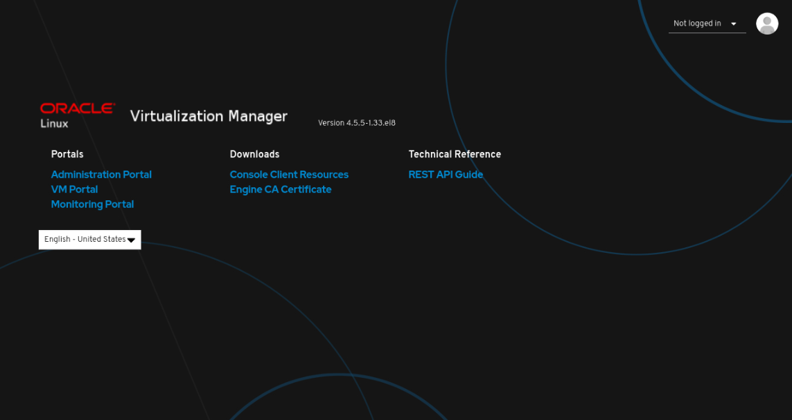   

1. Under Downloads, click Engine CA Certificate.

   The `pki-resource` certificate file downloads to the browser's downloads folder on the file system.

1. Import the certificate into the browser.

   1. Open the browser menu and click Settings.
   2. Use the search and enter `cert`.
   3. Click the View Certificates… button.
      
      The Certificate Manager dialog box opens.
   
   4. Click the Import… button.
      
      The Select File containing CA certificates(s) to import dialog box opens.
   
   5. From the Certificate Files drop-down list, select All Files.
   6. Click the `pki-resource` file from the file selection panel.
   7. Click the Open button.
      
      The Download Certificate dialog box opens.
   
   8. Click the check box next to Trust this CA to identify websites., and click OK.
   9. Click OK.
   10. Close the browser Settings tab.

1. From the engine's Web UI, click Administration Portal.

   The Login page displays.

1. Enter `admin@ovirt` for the Username and the password you specified when configuring the Manager.

1. The Administration Portal displays after a successful login.

    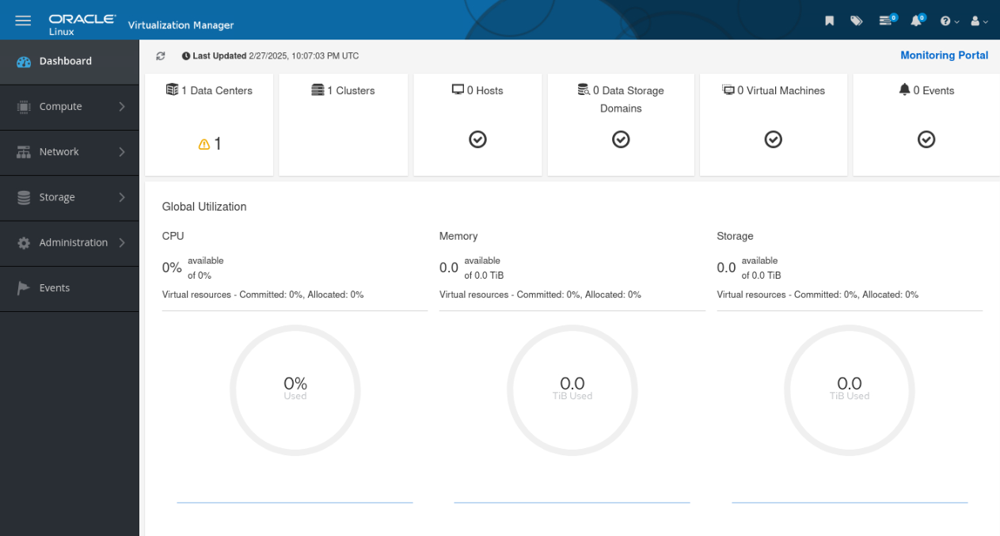

---
## Task 6: OLVM Engine — Exam Practice  #3

**ARCHITECTURE & ADMINISTRATION PORTAL**

```quiz
Q: 1. Oracle Linux Virtualization Manager is built from which open-source project?
- A. OpenStack
* B. oVirt 
- C. Proxmox
- D. XenServer

Q: 2. Which three portals are available in the OLVM Engine web interface? **(Choose 3)**
*  A. Administration Portal 
- B. Developer Portal
* C. VM Portal 
* D. Monitoring Portal (Grafana) 
- E. Storage Portal

Q: 3. How many PostgreSQL databases are used by Oracle Linux Virtualization Manager?
- A. One
* B. Two  
- C. Three
- D. Four
```