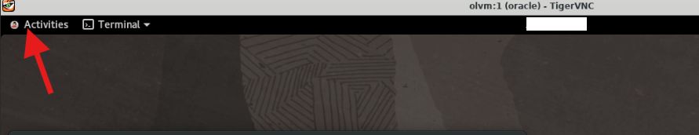
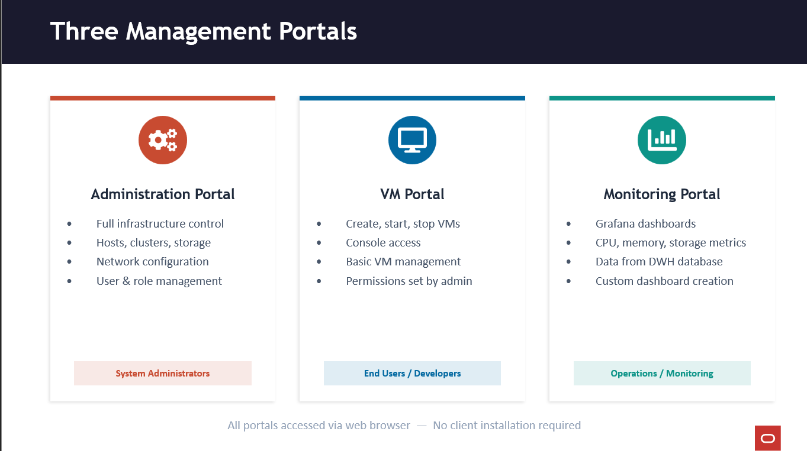

# Configure KVM Cluster
## Introduction

### Overview

### KVM Host Architecture — Key Components

```
┌─────────────────────────────────────────┐
│              ENGINE HOST                │
│         (oVirt Engine / WildFly)        │
│    Communicates with VDSM on hosts      │
└──────────────┬──────────────────────────┘
               │
    ┌──────────▼──────────────────────────┐
    │           KVM HOST                  │
    │                                     │
    │  ┌─────────┐  ┌──────────────────┐  │
    │  │  VDSM   │  │   libvirtd       │  │
    │  │ (host   │──│  (manages VM     │  │
    │  │  agent) │  │   lifecycle)     │  │
    │  └────┬────┘  └───────┬──────────┘  │
    │       │               │             │
    │  ┌────▼───────────────▼──────────┐  │
    │  │         KVM Module            │  │
    │  │      (kernel space)           │  │
    │  └───────────┬───────────────────┘  │
    │              │                      │
    │  ┌───────────▼───────────────────┐  │
    │  │     QEMU Processes            │  │
    │  │    (user space — one per VM)  │  │
    │  │  ┌─────┐ ┌─────┐ ┌─────┐      │  │
    │  │  │ VM1 │ │ VM2 │ │ VM3 │      │  │
    │  │  │guest│ │guest│ │guest│      │  │
    │  │  │agent│ │agent│ │agent│      │  │
    │  │  └─────┘ └─────┘ └─────┘      │  │
    │  └───────────────────────────────┘  │
    └─────────────────────────────────────┘
```

| Component | Where it Runs | Role |
|-----------|--------------|------|
| **KVM** | Kernel space (loadable kernel module) | Full virtualization using hardware extensions; shares physical hardware with VMs |
| **QEMU** | User space (one process per VM) | Emulates hardware (CPU, memory, network, disk); executes VM code directly on host CPU |
| **VDSM** | KVM host (daemon) | Host agent; intermediary between engine and host; manages VMs, networks, storage |
| **libvirtd** | KVM host (service) | API layer for managing hypervisors; VDSM uses libvirt to manage VM lifecycle and collect stats |
| **Guest Agent** | Inside each VM | Communicates with engine over virtualized serial connection; reports machine name, OS details, IP addresses, installed apps, network/RAM usage |

### Critical Relationships
- Engine → talks to → VDSM (on each host)
- VDSM → uses → libvirt → manages → KVM/QEMU
- Guest Agent → communicates over → virtualized serial connection → to engine
- KVM runs in kernel space; VMs run as QEMU processes in user space


### What you will build

In this part, you will add KVM hosts to your cluster and verify their integration with the OLVM engine. These hosts will run your virtual machines.

### Learning Objectives (Exam: 1Z0-1170 Alignment)
- Configure KVM host prerequisites (Exam Topic: Host & Cluster Management)
- Add hosts to the Default cluster (Exam Topic: Host & Cluster Management)
- Verify VDSM agent functionality (Exam Topic: Host & Cluster Management)


```
┌─────────────────────────────────────────────────────────────────────────┐
│                     Part 2: Host Configuration                          │
│                                                                         │
│  ┌─────────────────┐      ┌─────────────────┐   ┌─────────────────┐     │
│  │   OLVM Engine   │      │    olkvm01      │   │    olkvm02      │     │
│  │     (olvm)      │      │   (KVM Host)    │   │   (KVM Host)    │     │
│  │                 │      │                 │   │                 │     │
│  │ • Admin Portal  │ ───> │ • VDSM Agent    │   │ • VDSM Agent    │     │
│  │ • REST API      │      │ • libvirt/KVM   │   │ • libvirt/KVM   │     │
│  │ • PostgreSQL    │      │ • Status: Up    │   │ • Status: Up    │     │
│  └─────────────────┘      └─────────────────┘   └─────────────────┘     │
│                                                                         │
│  Hosts added to Default cluster; Ready for VMs                          │
└─────────────────────────────────────────────────────────────────────────┘
```

### Estimated Time
30-45 minutes

### Steps

1. Configure the first KVM host (olkvm01)
2. Add the first KVM host to the cluster
3. Configure the second KVM host (olkvm02)
4. Add the second KVM host to the cluster


## Configure the First KVM Host (olkvm01)

1. Open the VNC Activities Menu.

   

1. Switch to the terminal within the VNC session.

1. Connect via SSH to the olkvm01 instance.
   ```bash
   ssh olkvm01
   ```
> **Context:** All SSH commands using hostnames (e.g., `ssh olkvm01`) are executed **from the OLVM engine**, which has private DNS resolution for the cluster hosts.

1. Install the Oracle Linux Virtualization Manager Release package, which automatically enables/disables the required repositories.
   ```bash
   sudo dnf install -y oracle-ovirt-release-45-el8
   ```   

1. Clear the dnf cache.
   ```bash
   sudo dnf clean all
   ```

1. List the configured repositories and verify that the required repositories are enabled.
   ```bash
   sudo dnf repolist
   ```


1. Exit the session.
   ```bash
   exit
   ```

   You should now be on the Manager host.


## Add KVM Host (olkvm01) 
1. Open the VNC Activities Menu.

   

1. Switch to the Firefox browser within the VNC session.

1. Log in to the Administration Portal.

1. Using the side navigation menu, go to Compute and click Hosts.

1. On the Hosts pane, click the New button.

1. The New Host dialog box opens with the General tab selected on the sidebar.

1. Select the Default data center from the Host Cluster drop-down list.

   Installing Oracle Linux Virtualization Manager creates a data center and cluster named Default.
   
   **OLVM hierarchy explained:**
   
   ```
   Data Center (physical location)
      ↓
   Cluster (group of hosts with same CPU type)
      ↓
   Hosts (physical servers running KVM)
      ↓
   Virtual Machines
   ```
   
   **Data Center:**
   - Logical container for clusters
   - Defines shared storage and networking
   - Typically represents a physical location or administrative boundary
   - VMs can't migrate between data centers
   
   **Cluster:**
   - Group of hosts that share same:
     - CPU type (Intel or AMD, same generation for live migration)
     - Storage domains
     - Network configuration
   - Enables VM live migration between hosts in the cluster
   - Provides high availability (HA) for VMs
   - Requires at least 2 hosts for HA features
   
   **Why this hierarchy:**
   - **CPU compatibility** - VMs can only migrate between hosts with compatible CPUs
   - **Resource pooling** - Cluster shares resources for load balancing
   - **HA and migration** - Automatic VM restart/migration on host failure
   
   **Default setup:** engine-setup creates "Default" data center with "Default" cluster - you can rename or create new ones.
   
   **Exam relevance (1Z0-1170):** Understanding the data center/cluster hierarchy is fundamental and heavily tested in "Installation & Configuration" and "Host & Cluster Management" domains. You can rename and configure this data center and cluster or add new data centers and clusters to meet your needs.

1. Enter a name for the host in the Name field.
   ```
   olkvm01
   ```

1. In the Hostname field, enter the fully-qualified domain name or IP address of the host.
   ```
   vdsm01.priv.olv.oraclevcn.com
   ```

   This entry is the fully-qualified name of the secondary VNIC attached to the KVM host.
   
   **Why use VNIC hostname (vdsm01.priv...):**
   
   In this lab, the KVM host has **two network interfaces (VNICs)**:
   
   1. **Primary VNIC (ens3)** - Public subnet
      - For SSH access from outside
      - For external connectivity
      - Hostname: `olkvm01.examplevcn.oraclevcn.com`
   
   2. **Secondary VNIC (ens5)** - Private subnet
      - For OLVM management traffic (engine ↔ VDSM)
      - For VM migration
      - For storage traffic
      - Hostname: `vdsm01.priv.olv.oraclevcn.com`
   
   **Why separate management network:**
   - **Security** - Isolates management traffic from public internet
   - **Performance** - Dedicated bandwidth for VM migrations and storage
   - **Best practice** - Production deployments always separate management and VM networks
   
   **What VDSM listens on:** When you add the host using the secondary VNIC hostname, VDSM binds to that interface for all engine communications.
   
   **Exam relevance (1Z0-1170):** Interface configuration supports 'Configuring Bonds, vLANs and Logical Networks'.

1. Under Authentication, select the SSH Public Key authentication method.

   This action displays the engine's SSH public key within the SSH PublicKey field.

1. Open the VNC Activities Menu.

   

1. Switch to the terminal within the VNC session.


1. From the OLVM engine terminal: Copy the SSH public key to the `/root/.ssh/authorized_keys` file on the KVM host.
   ```bash
   sudo ssh-keygen -y -f /etc/pki/ovirt-engine/keys/engine_id_rsa | ssh olkvm01 -T "sudo tee -a /root/.ssh/authorized_keys"
   ``` 
    
   **What this does:** Enables passwordless SSH access from the engine to the KVM host by copying the engine's public key to the host's authorized_keys file.

   **Why:** The engine needs SSH key authentication to install VDSM, deploy configurations, and manage the host.
   
   **Exam relevance (1Z0-1170):** Understanding SSH key-based authentication for host management is part of "Host & Cluster Management" domain.

1. Switch back to the Firefox browser and Administration Portal

1. Click OK. The Power Management Configuration screen displays.

1. Click OK as OCI instances do not allow configuring power management.  
   The panel updates and adds the new host to the list of hosts in the Manager. While the Manager is installing the host agent (VDSM) and other required packages on the host, the panel shows the host's status as Installing. You can view the progress of the installation in the Hosts details pane. The host status changes to Up when the installation is complete.   

   **What happens during host installation:**  The engine performs these steps automatically when you click OK to add the host:   
   1. **SSH connection** - Engine connects to host using the SSH key you copied
   2. **Repository configuration** - Installs ovirt-release package (if not already present)
   3. **Package installation** - Installs VDSM and dependencies:
      - `vdsm` - Virtual Desktop and Server Manager (host agent)
      - `vdsm-client` - Command-line tool for VDSM
      - `libvirt` - Virtualization API library
      - `qemu-kvm` - KVM hypervisor and QEMU
   4. **Certificate deployment** - Copies engine's CA certificate and generates host certificate
   5. **Network configuration** - Sets up management network (ovirtmgmt bridge)
   6. **Service startup** - Starts and enables vdsmd and libvirtd services
   7. **Firewall configuration** - Opens required ports for VDSM communication
   8. **Host verification** - Checks connectivity, storage, and network before marking "Up"
   
   **What is VDSM:**
   - VDSM = Virtual Desktop and Server Manager
   - Runs as a daemon (`vdsmd`) on each KVM host
   - Acts as the "agent" that receives commands from the engine
   - Translates engine requests into libvirt/KVM operations
   - Reports host status, VM status, and metrics back to engine
   
   **Communication flow:**

   ```
   Engine (Management)
      ↓ (HTTPS/XML-RPC)
   VDSM (Host Agent)
      ↓ (libvirt API)
   Libvirt (Virtualization Library)
      ↓
   KVM + QEMU (Hypervisor)
      ↓
   Virtual Machines
   ```

   **Status meanings:**
   - **Installing** - VDSM and packages being installed
   - **Initializing** - Services starting, network configuring
   - **Up** - Host is ready to run VMs
   - **Non Operational** - Host has issues (check logs)
   - **Maintenance** - Host is intentionally offline for updates
   
   **Troubleshooting tip:** If installation fails, check `/var/log/ovirt-engine/engine.log` on the engine and `/var/log/vdsm/vdsm.log` on the host.
   
   **Exam relevance (1Z0-1170):** Understanding the host installation process, VDSM's role, and troubleshooting failed host additions is critical for the exam. This is heavily tested in "Host & Cluster Management" domain.

   **Note:** After a KVM host is added to a cluster, it is also crucial to avoid any spontaneous changes to the network configuration in `/etc/sysconfig/network-scripts/`, through the NetworkManager (e.g. nmcli), or in OCI.

1. Wait for the host status to show as Up before continuing with the tutorial.

## Management Portals Review



#### THREE MANAGEMENT PORTALS - All web-based, no client installation.

1. ADMINISTRATION PORTAL (what you'll use in the lab):
   - The 'nerve center' - full control over everything
   - Hosts, clusters, storage domains, networks, VMs, users
   - You log in as admin@ovirt in Part 1 of the lab

2. VM PORTAL:
   - Simplified interface for end users
   - Create/start/stop VMs, console access via VNC or RDP
   - Capabilities controlled by the admin (role-based)
   - Console protocols: VNC and RDP

3. MONITORING PORTAL (Grafana):
   - Integrated Grafana dashboards
   - Pulls data from ovirt_engine_history database (Data Warehouse)
   - CPU, memory, storage, network metrics
   - Grafana runs on port 3000 


## Lab Part 2: KVM Host - Exam Practice 

### KVM HOST PREREQUISITES

1. What is the minimum Oracle Linux version required for a KVM host?
- A. Oracle Linux 7.5
- **B. Oracle Linux 8.5 or later ✓**
- C. Oracle Linux 9.0
- D. Oracle Linux 8.0

2. What is the MINIMUM CPU requirement for a KVM host?
- A. Single-core 32-bit CPU
- **B. 64-bit dual-core CPU ✓**
- C. 64-bit quad-core CPU
- D. 64-bit eight-core CPU

3. What is the MINIMUM RAM required for a KVM host?
- A. 1 GB
- **B. 2 GB ✓**
- C. 4 GB
- D. 8 GB

4. What is the MINIMUM network interface requirement for a KVM host?
- A. One NIC with 100 Mbps bandwidth
- **B. One NIC with 1 Gbps bandwidth ✓**
- C. Two NICs with 1 Gbps bandwidth
- D. Four NICs with 1 Gbps bandwidth

### ADDING HOST TO ENGINE

5. Where in the Administration Portal do you add a new KVM host?
- A. Storage -> Hosts
- **B. Compute -> Hosts ✓**
- C. Network -> Hosts
- D. Configuration -> Hosts

6. Which two authentication methods can be used when adding a KVM host? **(Choose 2)**
- **A. Password authentication ✓**
- B. Kerberos
- **C. SSH key authentication ✓**
- D. Certificate authentication

7. For which user account must authentication credentials be provided when adding a host?
- A. admin user
- **B. root user ✓**
- C. ovirt user
- D. vdsm user


### VDSM & HOST ARCHITECTURE

8. What is the role of the VDSM service on a KVM host?
- A. It manages the PostgreSQL database
- **B. It acts as a host agent running continuously as a daemon on the KVM host ✓**
- C. It provides the web-based administration interface
- D. It handles SSL certificate generation

9. How does the oVirt engine communicate with VDSM on the KVM hosts?
- A. Through shared storage
- **B. Through the VDSM service (host agent) ✓**
- C. Through the PostgreSQL database
- D. Through SNMP traps

10. What happens to a virtual machine if the oVirt engine goes offline?
- A. The VM automatically suspends
- **B. The VM continues to run on the KVM host ✓**
- C. The VM is migrated to another host
- D. The VM shuts down gracefully


## Configure the Second KVM Host (olkvm02)

> **Note:** You previously configured olkvm01. Now repeat the same process for the second KVM host (olkvm02) to enable high availability and VM migration capabilities.

1. Open the VNC Activities Menu.

   
   
1. Switch to the terminal within the VNC session.

1. Connect via SSH to the **olkvm02** instance.
   ```bash
   ssh olkvm02
   ```
1. Install the Oracle Linux Virtualization Manager Release package, which automatically enables/disables the required repositories.
   ```bash
   sudo dnf install -y oracle-ovirt-release-45-el8
   ```   

1. Clear the dnf cache.
   ```bash
   sudo dnf clean all
   ```

1. List the configured repositories and verify that the required repositories are enabled.
   ```bash
   sudo dnf repolist
   ```

1. Exit the session.
   ```bash
   exit
   ```

   You should now be on the Manager host.

---

## Add KVM Host (olkvm02)

1. Log in to the Administration Portal.


1. From the Administration Portal use the side navigation menu , go to Compute and click Hosts.

1. On the Hosts pane, click the New button.

1. The New Host dialog box opens with the General tab selected on the sidebar.

1. Select the Default data center from the Host Cluster drop-down list.

1. Enter a name for the host in the Name field.
   ```
   olkvm02
   ```

1. In the Hostname field, enter the fully-qualified domain name or IP address of the host.
   ```
   vdsm02.priv.olv.oraclevcn.com
   ```

1. Under Authentication, select the SSH Public Key authentication method.

1. Switch to the terminal within the VNC session.

1. Copy the SSH public key to the `/root/.ssh/authorized_keys` file on the KVM host.
   ```bash
   sudo ssh-keygen -y -f /etc/pki/ovirt-engine/keys/engine_id_rsa | ssh olkvm02 -T "sudo tee -a /root/.ssh/authorized_keys"
   ``` 
1. Switch back to the Firefox browser and Administration Portal

1. Click OK. The Power Management Configuration screen displays.

1. Click OK as OCI instances do not allow configuring power management.  

1. Wait for the host status to show as Up before continuing with the tutorial.
