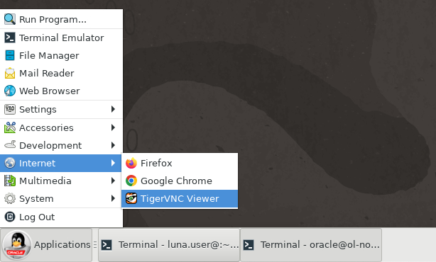
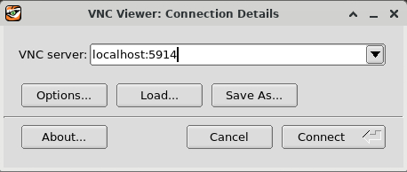
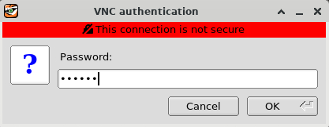
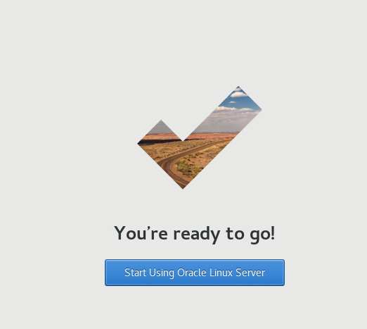
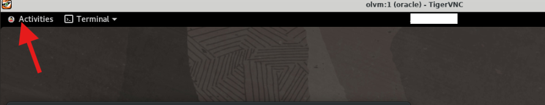
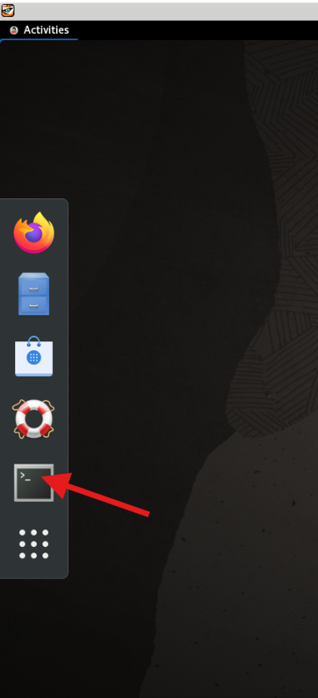
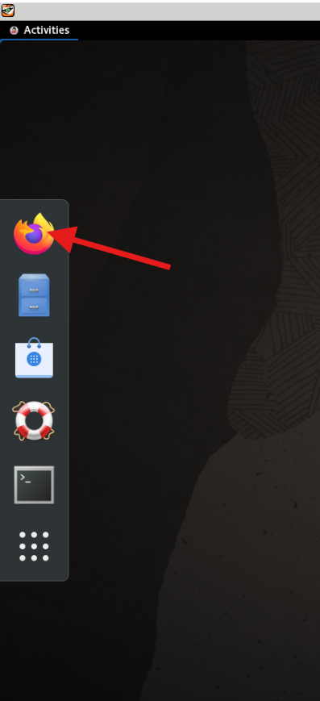
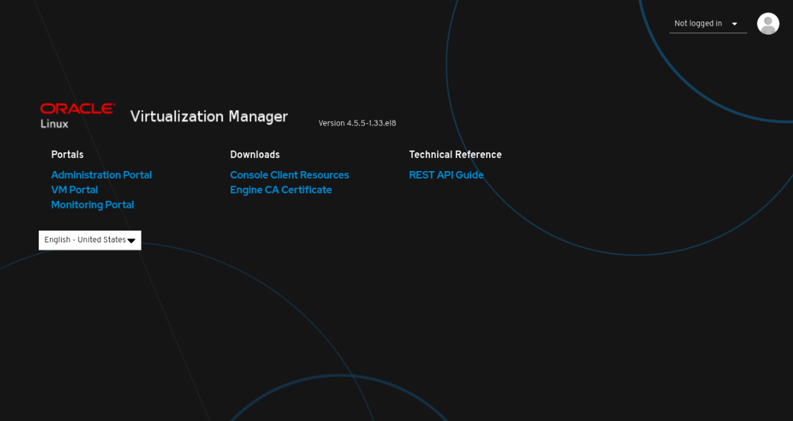

# Deploy OLVM Engine (Hands-on)

## Introduction

In this lab, you will connect to the OLVM Manager host using a secure SSH tunnel to VNC, install the required OLVM Engine packages, run `engine-setup`, and then validate access to the Engine web interface (Administration Portal).

Estimated Lab Time: 60–90 minutes

### Objectives

In this lab, you will:
- Open a VNC session to the OLVM Manager via SSH tunneling
- Install OLVM repositories and Engine packages
- Verify required repositories are enabled
- Run `engine-setup` and record the `admin@ovirt` credentials
- Log in to the Administration Portal and validate the deployment

### Prerequisites

This lab assumes you have:
- A deployed OLVM Manager instance and its IP address
- SSH connectivity to the OLVM Manager
- Access to the Luna desktop environment with TigerVNC available

---

## Task 1: Open a VNC Session to the Manager

1. Open a new terminal and connect to the `olvm` instance via SSH.

   The `-L` option enables local forwarding, which opens a local port to connect through an SSH tunnel to the remote VNC server.

   ```bash
   <copy>ssh -L 5914:localhost:5901 oracle@<ip_address_of_instance></copy>
   ```

   **What this does:** Creates an SSH tunnel that forwards local port **5914** to the remote VNC server on port **5901**.

   **How SSH tunneling works:**
   - Your local machine (for this lab: LUNA sandbox) listens on port 5914
   - Traffic sent to `localhost:5914` gets encrypted and sent through SSH
   - SSH server forwards it to `localhost:5901` on the remote machine
   - VNC server on remote machine responds back through the tunnel

   **Three-Tier Architecture:**
   ```text
   ┌─────────────────┐         ┌─────────────────┐         ┌─────────────────┐
   │   YOUR COMPUTER │         │  LUNA SANDBOX   │         │  OLVM MANAGER   │
   │   (Your laptop) │────────>│   (Desktop)     │────────>│   (Remote VM)   │
   │                 │         │                 │         │                 │
   │  Web Browser    │         │  VNC Viewer     │         │  VNC Server     │
   │  (HTML5)        │         │  localhost:5914 │         │  localhost:5901 │
   └─────────────────┘         └─────────────────┘         └─────────────────┘
      Internet                    SSH Tunnel                  On Manager
   ```

   **Data Flow:**
   1. Terminal runs: `ssh -L 5914:localhost:5901 oracle@<olvm-public-ip>`
   2. TigerVNC on Luna connects to `localhost:5914`
   3. Traffic tunnels through SSH to OLVM Manager port `5901`
   4. You see OLVM Manager desktop and configure the system

   **Why:** VNC port 5901 is not directly accessible from the internet (firewalled). SSH tunneling provides secure, encrypted access.

   **Note:** SSH tunneling is a general Linux administration skill, not specific to OLVM exam objectives. OLVM uses VNC ports 5900–6923.

2. Open **TigerVNC** from your local machine.

   

3. Log on to the deployed server's GUI environment by entering `localhost:5914` into the VNC Server field and clicking **Connect**.

   

4. Enter the `oracle` user's password (`oracle`) and click **OK**.

   

5. If prompted by first-time login setup, click **Next** three times, click **Skip**, then click **Start Using Oracle Linux Server**. Close or minimize any “Getting Started” windows.

   

---

## Task 2: Install the OLVM Engine

1. Open the VNC **Activities** menu.

   

2. Open a terminal within the VNC session.

   

3. Enable copy and paste to the VNC session.

   ```bash
   <copy>vncconfig -nowin &</copy>
   ```

4. Install the Oracle Linux Virtualization Manager Release package, which automatically enables/disables the required repositories.

   ```bash
   <copy>sudo dnf install -y oracle-ovirt-release-45-el8</copy>
   ```

   **What this does:** Installs the OLVM repository configuration package for release 4.5 on Oracle Linux 8.

   **Why:** This package automatically enables/disables the required YUM/DNF repositories needed for OLVM installation. Without it, you'd have to manually configure each repository URL, GPG keys, and priorities.

   **Repositories enabled:**
   - `ovirt-4.5` - Core OLVM/oVirt packages (engine, VDSM, etc.)
   - `ovirt-4.5-extra` - Additional components (virt-viewer, etc.)
   - `ol8_kvm_appstream` - KVM hypervisor and libvirt packages
   - `ol8_gluster_appstream` - GlusterFS for distributed storage (optional)
   - `ol8_UEKR7` - Unbreakable Enterprise Kernel Release 7

   **Version note:** "45" refers to OLVM 4.5, which is based on oVirt 4.5. Always match the release version to your Oracle Linux version (OL8 in this case).

5. Clear the dnf cache.

   ```bash
   <copy>sudo dnf clean all</copy>
   ```

   **What this does:**
   1. clean dbcache: Removes the metadata database.
   2. clean expire-cache: Forces a check for new repository data.
   3. clean metadata: Removes XML files used to find packages.
   4. clean packages: Removes any cached .rpm files currently in the system.

6. Install the Manager package.

   ```bash
   <copy>sudo dnf install -y ovirt-engine</copy>
   ```

7. List the configured repositories and verify that the required repositories are enabled.

   ```bash
   <copy>sudo dnf repolist</copy>
   ```

8. You must enable the following repositories:

   - `ol8_baseos_latest`
   - `ol8_appstream`
   - `ol8_kvm_appstream`
   - `ovirt-4.5`
   - `ovirt-4.5-extra`
   - `ol8_gluster_appstream`
   - `ol8_UEKR7`

   If a required repository is not enabled, use the dnf config-manager command to enable it.

   ```bash
   <copy>sudo dnf config-manager --enable <repository_name></copy>
   ```

9. Configure the Manager.

   ```bash
   <copy>sudo engine-setup --accept-defaults</copy>
   ```

   **What this does:** Runs the OLVM Engine configuration wizard with all default answers accepted automatically.

   **Behind the scenes, engine-setup:**
   1. **Configures PostgreSQL database** - Creates ovirt_engine database, sets up users and permissions
   2. **Installs Apache/Tomcat** - Sets up web server for Administration Portal and REST API
   3. **Generates SSL certificates** - Creates CA and host certificates for secure communications
   4. **Configures firewall** - Opens required ports (443 for HTTPS, 5432 for PostgreSQL)
   5. **Creates admin user** - Sets up admin@ovirt user in the internal authentication domain
   6. **Initializes oVirt Engine** - Deploys the engine web application and starts services
   7. **Creates default data center and cluster** - Named "Default" by default

   **Admin password:** The wizard prompts for the `admin@ovirt` password even with `--accept-defaults`. This is the only interactive prompt. Password must be 8+ characters with uppercase, lowercase, number, and special character.

   > **CRITICAL:** When engine-setup completes, write down the admin password.

---

## Task 3: Login to the Administration Portal

1. Get the FQDN for the manager host.

   ```bash
   <copy>hostname -f</copy>
   ```

   **What this does:** Displays the Fully Qualified Domain Name (FQDN) of the host.

   **Why FQDN matters:**
   - The engine's SSL certificate is bound to the FQDN
   - You must access the web interface using the FQDN in the URL

2. Open Firefox within the VNC session.

   

3. Enter the following link to access the engine's Web UI for this lab.

   ```text
   https://olvm.pub.olv.oraclevcn.com
   ```

   **Security Warning:** Firefox will display "Warning: Potential Security Risk Ahead" because the OLVM engine uses a self-signed SSL certificate. This is expected and safe in this lab environment.

   To proceed:
   1. Click **Advanced**
   2. Click **Accept the Risk and Continue**

   The Welcome page displays.

   

4. Under Downloads, click **Engine CA Certificate**.

   The `pki-resource` certificate file downloads to the browser's downloads folder.

5. Import the certificate into the browser.
   1. Open the browser menu and click **Settings**
   2. Use search and enter `cert`
   3. Click **View Certificates…**
   4. Click **Import…**
   5. From the Certificate Files drop-down list, select **All Files**
   6. Select the `pki-resource` file
   7. Click **Open**
   8. Check **Trust this CA to identify websites**
   9. Click **OK**
   10. Close the browser Settings tab

6. From the engine's Web UI, click **Administration Portal**.

7. Enter `admin@ovirt` for the Username and the password you specified when configuring the Manager.

   The Administration Portal displays after a successful login.

   

---

## Learn More

- (Optional) Add links relevant to your workshop, such as the official install guide or product docs.

## Next Steps

- Review architecture and complete knowledge checks: [olvm-engine-exam-practice.md](olvm-engine-exam-practice.md)

## Acknowledgements

- **Author** - <Name, Title, Group>
- **Contributors** - <Name, Group> (optional)
- **Last Updated By/Date** - <Name, Month Year>
```

