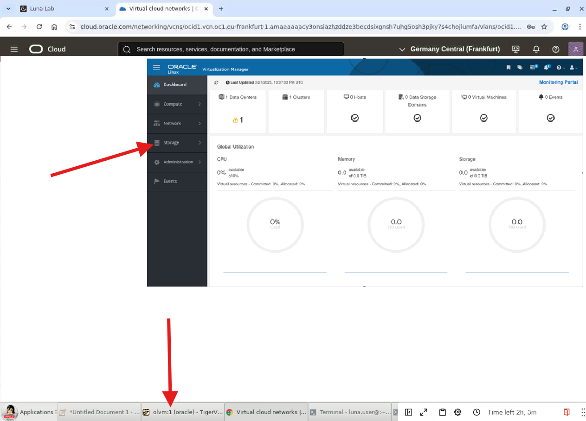

# Configure Storage

## Introduction

In this lab, you will add a Fibre Channel (FC) data storage domain in Oracle Linux Virtualization Manager (OLVM). OLVM uses centralized storage for virtual machine disk images, ISO files, templates, and snapshots. In this tutorial, two OCI Block Volumes are attached to the KVM host and appear as Fibre Channel LUNs.

Estimated Lab Time: 20–30 minutes

### Objectives

In this lab, you will:
* Understand OLVM storage domains and common storage types
* Add a Fibre Channel **Data** storage domain to the default data center
* Verify the storage domain becomes **Active**

### Prerequisites (Optional)

This lab assumes you have:
* Access to the OLVM Administration Portal (Manager UI)
* At least one OLVM host available (for example, `olkvm01`)
* Fibre Channel LUNs presented to the host (in this lab, OCI Block Volumes attached to the host)
* All previous labs successfully completed

*This is the "fold" - below items are collapsed by default*

---

## Task 1: Add a Fibre Channel Data Domain

1. Review the context for this lab:

   Oracle Linux Virtualization Manager uses a centralized storage system for virtual machine disk images, ISO files, and snapshots. In this tutorial, two OCI Block Volumes are attached to the KVM host and appear as Fibre Channel LUNs.

2. Go back to the **OLVM Manager**.

   

3. Using the side navigation menu, go to **Storage** and click **Domains**.

   The **Storage Domains** pane opens.

4. On the **Storage Domains** pane, click **New Domain**.

   The **New Domain** dialog box opens.

5. In the **Name** field, enter a name for the data domain:
   ```
   <copy>amd-storage-domain-01</copy>
   ```

6. From the **Data Center** drop-down list, select **Default**.

7. From the **Domain Function** drop-down list, select **Data**.

8. From the **Storage Type** drop-down list, select **Fibre Channel**.

9. From the **Host to Use** drop-down list, select the `olkvm01` host.

10. When you select **Fibre Channel** as the **Storage Type**, confirm that the **New Domain** dialog box displays known targets with unused LUNs.

11. Click **Add** next to the first **LUN ID**.

12. Click **OK**.

    You can click **Tasks** in the upper right corner of the UI to monitor the various processing steps that occur when attaching the FC data domain to the data center.

13. Wait for the **Cross Data Center Status** to show as **Active** before continuing the tutorial.

---

## Reference / Exam Notes (1Z0-1170): Storage Domains and Fibre Channel

### What is a storage domain

A storage domain is a logical entity in OLVM that represents a storage resource where VM disks, templates, ISOs, and snapshots are stored.

### Types of storage domains

1. **Data Domain** (what we're creating)
   - Stores VM disk images
   - Stores templates
   - Stores snapshots
   - Can have multiple data domains per data center

2. **ISO Domain**
   - Stores ISO files (installation media)
   - Optional (can upload ISOs to data domain instead)
   - One per data center

3. **Export Domain**
   - Used for importing/exporting VMs and templates
   - Optional
   - Can be shared between data centers

### Supported storage types

- **NFS** - Network File System (most common for smaller deployments)
- **iSCSI** - Block storage over IP networks
- **Fibre Channel** - High-speed block storage (what we're using)
- **Local Storage** - Direct-attached disks (no HA or migration)
- **GlusterFS** - Distributed file system (scalable storage)
- **POSIX** - Any POSIX-compliant filesystem

### Why Fibre Channel in this lab

- OCI Block Volumes are attached to the host
- They appear to the host as Fibre Channel LUNs
- Provides realistic enterprise storage experience
- High performance for VM disk I/O

### LUN (Logical Unit Number)

- Each Block Volume appears as a separate LUN
- LUNs are discovered automatically by OLVM
- Multiple hosts can access the same LUN (shared storage)

### Shared storage requirement

- For VM migration and HA, storage must be accessible by all hosts in the cluster
- Fibre Channel and iSCSI provide shared block storage
- NFS provides shared file storage
- Local storage does **not** support migration or HA

**Exam relevance (1Z0-1170):** Storage domain types, configuration, and requirements are heavily tested in the "Storage Management" domain. You must understand when to use each storage type.

---

## Learn More

*(optional - include links to docs, white papers, blogs, etc)*

* [Oracle Linux Virtualization Manager documentation](http://docs.oracle.com)

---

## Acknowledgements

* **Author** - <Name, Title, Group>
* **Contributors** - <Name, Group> -- optional
* **Last Updated By/Date** - <Name, Month Year>
