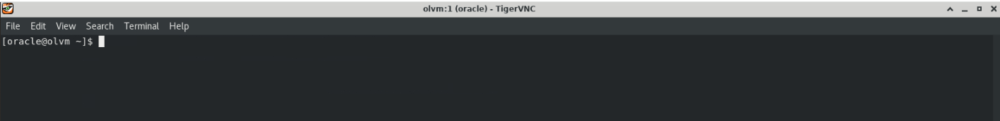
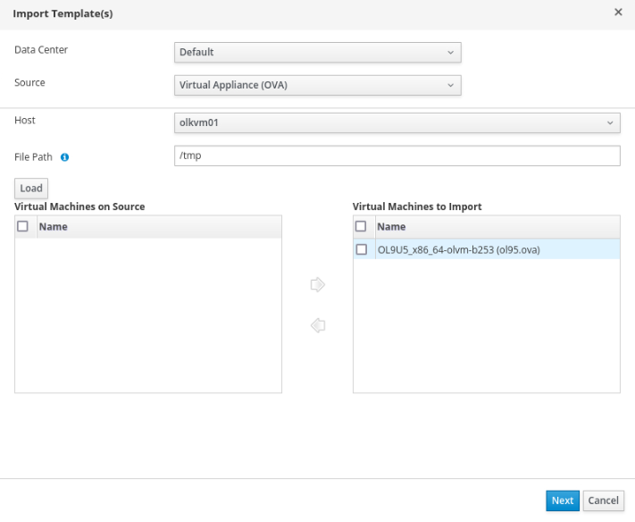

# Import Templates

## Introduction

Oracle Linux Virtualization Manager (OLVM) allows the import of existing OVA templates. Oracle provides pre-built OVA templates from the [Oracle Linux Cloud Images](https://yum.oracle.com/oracle-linux-templates.html) page.

Estimated Lab Time: 20–30 minutes

### Objectives

In this lab, you will:
* Download an Oracle-provided OVA template to the KVM host filesystem
* Import the OVA into OLVM as a template
* Verify the import completes successfully

### Prerequisites (Optional)

This lab assumes you have:
* Access to the OLVM Administration Portal
* Access to the VNC session for the lab environment
* SSH connectivity to `olkvm01` from the `olvm` instance
* An available **Data** storage domain (for example, created in the storage lab) to store the imported template

*This is the "fold" - below items are collapsed by default*

---

## Task 1: Start the Template Import in OLVM

1. Using the side navigation menu, go to **Compute** and click **Templates**.

   The **Templates** pane opens.

2. Click the **Import** button.

   The **Import Template(s)** dialog box opens.

3. Keep the default selections for the **Data Center**, **Source**, and **Host** drop-down lists.

4. For the **File Path**, enter:
   ```
   /tmp
   ```

   This folder on the `olkvm01` host is from where the UI will try to import the OVA template.

---

## Task 2: Download the OVA Template to the Host (`olkvm01`)

1. Switch to the terminal within the VNC session. Make sure you are on the `olvm` instance.

   

2. Download the OVA template.

   This command SSHs into `olkvm01` and downloads the template there (required because the import reads from the host's filesystem).

   ```bash
   <copy>ssh olkvm01 "curl -L https://yum.oracle.com/templates/OracleLinux/OL9/u5/x86_64/OL9U5_x86_64-olvm-b253.ova -o /tmp/ol95.ova"</copy>
   ```

---

## Task 3: Load and Import the OVA Template in OLVM

1. Switch to the browser within the VNC session.

2. Click the **Load** button.

   The OVA template appears within the dual list box's **Virtual Machines on Source** section.

3. Click the OVA template and then click the **Right Arrow** button to send the OVA template to the **Virtual Machines to Import** side of the dual list box.

   

4. Click **Next**.

5. Review the template information, then click **OK**.

6. Wait for the status to show as **OK**.

---

## Reference / Exam Notes (1Z0-1170): OVA Templates and Import Concepts

### What is an OVA template

**OVA** = Open Virtualization Archive

- Industry-standard format for distributing VMs
- Single file containing:
  - Disk images (usually QCOW2 or VMDK format)
  - VM configuration (CPU, RAM, networks)
  - Metadata (OS type, virtualization settings)

### Oracle Linux Cloud Images

- Pre-built, tested VM templates
- Optimized for cloud/virtualization platforms
- Include cloud-init for automatic configuration
- No manual OS installation needed
- Updated regularly with security patches

### Template vs VM

- **Template** - Read-only master image
  - Cannot be started directly
  - Used as a base to create VMs
  - Changes to template don't affect existing VMs

- **VM** - Running instance created from template
  - Has its own disk (thin-provisioned or cloned)
  - Can be started, stopped, modified
  - Independent from the template

### Import process (high level)

1. Download OVA file to host's `/tmp` directory
2. OLVM reads OVA metadata
3. Disk image is uploaded to a storage domain
4. Template is created in the OLVM database
5. Template becomes available for creating VMs

### Why `/tmp`

The import process needs local access to the file. For this lab, you download directly to `/tmp` for simplicity. In production, you'd typically use an NFS storage domain for template imports.

### Thin provisioning

When creating VMs from templates, OLVM uses thin provisioning by default:

- Template disk is stored once
- Each VM disk only stores differences from the template
- Saves storage space when you have many VMs from the same template

**Exam relevance (1Z0-1170):** Template import, management, and thin provisioning concepts are tested in "VM Lifecycle Management" and "Storage" domains.

---

## Learn More

*(optional - include links to docs, white papers, blogs, etc)*

* [Oracle Linux Virtualization Manager documentation](http://docs.oracle.com)
* [Oracle Linux Cloud Images (OVA templates)](https://yum.oracle.com/oracle-linux-templates.html)

---

## Acknowledgements

* **Author** - <Name, Title, Group>
* **Contributors** - <Name, Group> -- optional
* **Last Updated By/Date** - <Name, Month Year>
