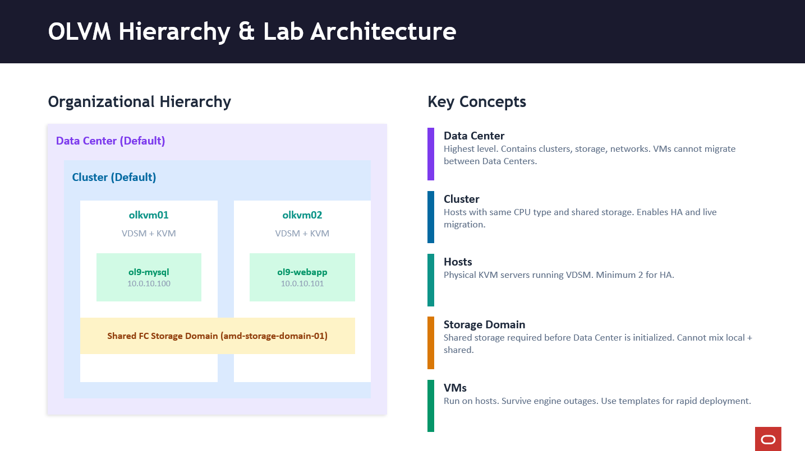

# Create Virtual Machines

## Introduction

In this lab, you will create two virtual machines (VMs) in Oracle Linux Virtualization Manager (OLVM) from an imported Oracle Linux 9 OVA template. You will configure each VM with cloud-init (authentication + static networking), run each VM, and verify connectivity (VM-to-VM and outbound internet) through the VLAN/NAT configuration.

Estimated Lab Time: 45–60 minutes

### Objectives

In this lab, you will:
* Create the `ol9-mysql` VM on host `olkvm01` using a template
* Create the `ol9-webapp` VM on host `olkvm02` using a template
* Configure cloud-init authentication and static networking on first boot
* Run the VMs and validate network connectivity
* Review OLVM hierarchy and practice exam-aligned questions

### Prerequisites (Optional)

This lab assumes you have:
* An imported OLVM template available: `OL9U5_x86_64-olvm-b253`
* A VM logical network available and assigned to hosts: `l2-vm-network`
* A configured network path for VM traffic (for example, VLAN + NAT Gateway in OCI, if applicable)
* Access to the OLVM Administration Portal and a VNC session for the lab environment
* SSH/network access from the `olvm` instance to the VMs on the VM network

*This is the "fold" - below items are collapsed by default*

---

## Task 1: Create Virtual Machine 1 (ol9-mysql) on Host (olkvm01)

1. Using the side navigation menu, go to **Compute** and then click **Virtual Machines**.

   The **Virtual Machines** pane opens.

2. Click **New**.

   The **New Virtual Machine** dialog box opens.

3. From the **Template** drop-down list, select:
  ```bash
   <copy>OL9U5_x86_64-olvm-b253</copy>
   ```

4. From the **Operating System** drop-down list, select:
  ```bash
   <copy>Oracle Linux 9.x x64</copy>
   ```

5. In the **Name** field, enter:
  ```bash
   <copy>ol9-mysql</copy>
   ```

6. From the `nic1` drop-down list, select the VM network interface:
  ```bash
   <copy>l2-vm-network(l2-vm-network)</copy>
   ```

7. Click **Show Advanced Options**.

   The Advanced Options menu opens. This menu enables setting additional options for the VM, such as host selection, a password, SSH key, or static network.

### Reference: Cloud-init (Why we use it here)

**What is cloud-init:**

Cloud-init is an industry-standard tool for VM initialization. It runs on first boot to:
- Set hostname
- Create user accounts
- Set passwords or SSH keys
- Configure networking (static IP, DNS, routes)
- Run custom scripts
- Install packages

**First boot vs subsequent boots:**
- Cloud-init only runs on **first boot** (or when you specifically trigger **Run Once** with **Initial Run**)
- After first boot, cloud-init is disabled
- Changes to user/password must be done manually after first boot

**Exam relevance (1Z0-1170):** Cloud-init configuration is tested in "VM Lifecycle Management". You must understand how to configure VMs with static networking and user accounts during creation.

### Configure host placement and cloud-init (Initial Run)

8. Click **Host**.

9. Click **Start Running On**.

10. Click **Specific Host(s)** and select:
    - `olkvm01`

11. Click **Initial Run**.

12. Click **Authentication**.

13. In the **User Name** field, enter:
    ```bash
    <copy>opc</copy>
    ```

14. In the **Password** and **Verify Password** fields, enter a password for the user (for lab use `oracle`):
    ```bash
    <copy>oracle</copy>
    ```

    For production systems, the recommendation is to use **SSH Authorized Key**.

15. Click **Networks**.

16. In the **DNS Servers** field, enter:
    ```bash
    <copy>8.8.8.8</copy>
    ```

17. Click the checkbox next to **In-guest Network Interface Name**.

18. Click **Add new**.

19. In the **In-guest Network Interface** section, click **Add new**. In the **Name** field, enter:
    ```bash
    <copy>eth0</copy>
    ```

20. From the **IPv4 Boot Protocol** drop-down list, select `Static`.

    Due to linking the virtual machine network to the OCI VLAN network, there is no default DHCP server to assign IP addresses.

21. In the **IPv4 Address** field, enter:
    ```bash
    <copy>10.0.10.100</copy>
    ```

22. In the **IPv4 Netmask** field, enter:
    ```bash
    <copy>255.255.255.0</copy>
    ```

23. In the **IPv4 Gateway** field, enter:
    ```bash
    <copy>10.0.10.1</copy>
    ```

24. Click **OK**.

25. Wait for the VM status to change from **Importing** to **Down**.

---

## Task 2: Run Virtual Machine 1 (ol9-mysql) and Validate Connectivity

1. Switch to the terminal within the VNC session.

2. Install the Virtual Machine Viewer package.

   This package allows viewing a virtual machine using the OLVM console.

   ```bash
   <copy>sudo dnf install -y virt-viewer</copy>
   ```

3. Switch to the browser within the VNC session.

4. Select the `ol9-mysql` virtual machine and click **Run**.

5. Click **Console**.

   This action downloads a `console.vv` file that you can click to open the virtual machine remote viewer.

6. Click the `console.vv` file from the browser's download list.

   The virtual machine remote viewer application opens.

7. From the VM remote viewer, log into the VM using the user name and password you defined.

8. Check the VM network settings:
   ```bash
   <copy>ip a</copy>
   ```

   The output shows the `eth0` network interface using an IP address of `10.0.10.100`.

9. Verify internet connectivity from the MySQL VM:
   ```bash
   <copy>ping -c 3 8.8.8.8</copy>
   ```

   Note (consistency fix): `8.8.8.8` is an external IP (Google DNS), not the gateway. A successful ping confirms outbound connectivity is working.

10. Ping an external address (for example, `google.com`):
    ```bash
    <copy>ping -c 3 google.com</copy>
    ```

    Both pings should succeed, confirming the NAT Gateway is working.

11. Exit `ol9-mysql` to return to the `olvm` engine:
    ```bash
    <copy>exit</copy>
    ```

---

## Task 3: Create Virtual Machine 2 (ol9-webapp) on Host (olkvm02)

1. In the OLVM Administration Portal, go to **Compute** and then click **Virtual Machines**.

2. Click **New**.

3. From the **Template** drop-down list, select:
   ```bash
   <copy>OL9U5_x86_64-olvm-b253</copy>
   ```

4. From the **Operating System** drop-down list, select:
   ```bash
   <copy>Oracle Linux 9.x x64</copy>
   ```

5. In the **Name** field, enter:
   ```bash
   <copy>ol9-webapp</copy>
   ```

6. From the `nic1` drop-down list, select:
   ```bash
   <copy>l2-vm-network(l2-vm-network)</copy>
   ```

7. Click **Show Advanced Options**.

8. Click **Host**.

9. Click **Start Running On**.

10. Click **Specific Host(s)**:
    - Unselect `olkvm01`
    - Select `olkvm02`

11. Click **Initial Run**.

12. Click **Authentication**.

13. In the **User Name** field, enter:
    ```bash
    <copy>opc</copy>
    ```

14. In the **Password** and **Verify Password** fields, enter a password for the user (for lab use `oracle`):
    ```bash
    <copy>oracle</copy>
    ```

15. Click **Networks**.

16. In the **DNS Servers** field, enter:
    ```bash
    <copy>8.8.8.8</copy>
    ```

17. Click the checkbox next to **In-guest Network Interface Name**.

18. Click **Add new**.

19. In the **In-guest Network Interface** section, click **Add new**. In the **Name** field, enter:
    ```bash
    <copy>eth0</copy>
    ```

20. From the **IPv4 Boot Protocol** drop-down list, select `Static`.

21. In the **IPv4 Address** field, enter:
    ```bash
    <copy>10.0.10.101</copy>
    ```

22. In the **IPv4 Netmask** field, enter:
    ```bash
    <copy>255.255.255.0</copy>
    ```

23. In the **IPv4 Gateway** field, enter:
    ```
    <copy>10.0.10.1</copy>
    ```bash

24. Click **OK**.

25. Wait for the status to change to **Down**.

---

## Task 4: Run Virtual Machine 2 (ol9-webapp) and Validate Connectivity

1. Select the `ol9-webapp` virtual machine and click **Run**.

2. Wait for the VM to fully boot (about 30–60 seconds).

3. Switch to the terminal within the VNC session.

4. From `olvm`, connect to `ol9-webapp`:
   ```bash
   <copy>ssh opc@10.0.10.101</copy>
   ```

   Use the password you defined when creating the VM.

5. Verify the network configuration:
   ```bash
   <copy>ip a</copy>
   ```

   The output shows the `eth0` network interface using the IP address `10.0.10.101`.

6. Test connectivity from the webapp to the MySQL server:
   ```bash
   <copy>ping -c 3 10.0.10.100</copy>
   ```

7. Verify DNS resolution:
   ```bash
   <copy>ping -c 3 google.com</copy>
   ```

   The ping should be successful, confirming network connectivity.

8. Exit `ol9-webapp`:
   ```bash
   <copy>exit</copy>
   ```

---

## Task 5: OLVM Hierarchy Review



### OLVM HIERARCHY (This maps exactly to what you have built in the lab)

**LEFT SIDE: The lab architecture you have created**
- Default Data Center and Default Cluster are created by engine-setup (Part 1)
- You added `olkvm01` and `olkvm02` to the cluster (Part 2)
- You created the FC storage domain and VMs (Part 3)
- VMs are distributed: `ol9-mysql` on `olkvm01`, `ol9-webapp` on `olkvm02`

**RIGHT SIDE: Some things to remember**
- Data Center = highest level. VMs cannot migrate between Data Centers.
- Cluster = hosts with same CPU type. Enables live migration and HA.
- You need at least 2 hosts for HA — that's why we have `olkvm01` + `olkvm02`.
- Storage domain must be attached before the Data Center initializes.
- Cannot mix local and shared storage in the same Data Center.
- SPM (Storage Pool Manager) role: only one host at a time per Data Center.

---

## Task 6: Lab Part 3 Exam Practice (1Z0-1170)

### LOGICAL NETWORKS

```quiz
Q: 1. What are logical networks in OLVM?
- A. Physical network cables
* B. Representations of network resources that provide connectivity for KVM virtual machines  
- C. Virtual switches only
- D. Network security policies

Q: 2. What is the name of the default logical network automatically created during OLVM setup?
- A. default_network
* B. ovirtmgmt 
- C. management_net
- D. cluster_network

Q: 3. What happens if a KVM host loses connectivity to a network marked as "required"?
- A. Nothing, it continues normally
* B. The host will be considered non-operational 
- C. Only VMs on that network stop
- D. The host reboots automatically

Q: 4. For VM networks, what is created on the host for each logical network?
- A. A VLAN tag
* B. A bridge (virtual switch) 
- C. A firewall rule
- D. A routing table

Q: 5. What does a network bridge act as on a KVM host?
- A. A router
* B. A virtual switch connecting VMs to the physical network 
- C. A firewall
- D. A load balancer
```

### STORAGE DOMAINS

```quiz
Q: 6. Can a Data Center be initialized without a storage domain attached?
- A. Yes, storage is optional
* B. No, at least one storage domain must be attached before initialization 
- C. Only in test environments
- D. Only for Self-Hosted Engine

Q: 7. For VMs to be migrated between hosts, what storage requirement must be met?
- A. Each host needs local storage
* B. HOSTS must share the same storage domain 
- C. Storage must be SSD-based
- D. VMs must use iSCSI only

Q: 8. What does LUN stand for in storage terminology?
- A. Local Unit Number
* B. Logical Unit Number
- C. Linux Unified Node
- D. Link Universal Network
```

### VIRTUAL MACHINES & TEMPLATES

```quiz
Q: 9. Where in the Administration Portal do you create a new VM?
- A. Storage -> VMs
* B. Compute -> Virtual Machines 
- C. Network -> VMs
- D. Administration -> VMs

Q: Q: 10. What are the two disk allocation policies? **(Choose 2)**
* A. Pre-allocated 
- B. Compressed
- **C. Thin provisioning (sparse)
- D. Encrypted

Q: 11. What does a VM use to connect to a logical network?
- A. Physical NIC directly
* B. VNIC (Virtual Network Interface Controller)
- C. USB adapter
- D. Serial port
```

---

## Learn More

*(optional - include links to docs, white papers, blogs, etc)*

* [Oracle Linux Virtualization Manager documentation](http://docs.oracle.com)

---

## Acknowledgements

* **Author** - <Name, Title, Group>
* **Contributors** - <Name, Group> -- optional
* **Last Updated By/Date** - <Name, Month Year>
