# Lab 1: Prepare OCI and Launch the RHEL Source

## Introduction

In this lab, you prepare a workshop compartment, create the VCN and subnets, configure access rules, and launch an OCI-provided RHEL 9.8 VM. Complete the network checkpoint before opening the Compute launch form.

The source VM uses a public subnet for SSH access and browser access to the Apache workload you will create in Lab 2. The VCN wizard creates the subnets, gateways, route tables, and security lists.

The screenshots follow a recorded setup in **US East (Ashburn)** using the image `Red-Hat-Enterprise-Linux-9.8-2026.09.15-8`. Confirm RHEL 9.8 image access in your selected region. This direct-image path requires no custom-image import. RHEL 10.2 is outside this workshop's scope.

Estimated Lab Time: 25 minutes

### Objectives

In this lab, you will:

- Prepare the workshop compartment.
- Create the VCN, public subnet, and private subnet.
- Verify routing and configure SSH and HTTP security rules.
- Launch an OCI-provided RHEL 9.8 source VM.
- Save the instance, image, network, and SSH-key details needed in Lab 2.

### Prerequisites

Before beginning this lab, confirm that you have:

- A paid OCI tenancy and permission to create compartments and networking resources, or a workshop compartment provided by your administrator.
- Permission to create Compute instances, boot volumes, and boot-volume backups in the workshop compartment.
- Access to an OCI-provided RHEL 9.8 x86_64 image or its region-specific OCID.
- An SSH client on your local computer. You can use an existing key pair or generate and download one during Task 5.
- Sufficient quota for the VCN, subnets, gateways, route tables, and security lists created by the wizard.
- Capacity for `VM.Standard.E5.Flex` with 1 OCPU, 12 GB RAM, a boot volume of at least 64 GB, and a boot-volume backup, or a tested compatible configuration.

> **Note:** The screenshots use `ol-migrate-lab-1` because `ol-migrate-lab` was already in use. Record your actual names, CIDRs, and OCIDs and use them throughout the workshop, including later IAM rules.

> **Note:** If you already launched a source VM, verify its compartment, network, access rules, and launch settings before continuing to Lab 2. Use its actual name and IP addresses in later labs. For a new run, complete all five tasks in order.

## Task 1: Prepare the workshop compartment

1. Sign in to the OCI Console using your paid tenancy.

2. Use the region selector at the top of the Console to select your workshop region. The recording uses **US East (Ashburn)**. Keep the same region throughout the workshop.

3. Open the navigation menu, select **Identity & Security**, and then select **Compartments**.

4. Locate the parent compartment assigned by your organization. Open it and check whether your workshop compartment already exists. If your administrator provided a workshop compartment, verify that it is assigned to you and continue with Step 7.

5. To create a compartment, select **Create compartment** and enter:

    - Name: `ol-migrate-lab`
    - Description: `Temporary resources for the RHEL to Oracle Linux migration workshop`
    - Parent compartment: the parent approved by your organization

    Check **Parent compartment** before submitting the form. If the name is already in use under that parent and you need a separate run, choose a unique name such as `ol-migrate-lab-1`. Use that name wherever later instructions refer to `ol-migrate-lab`.

    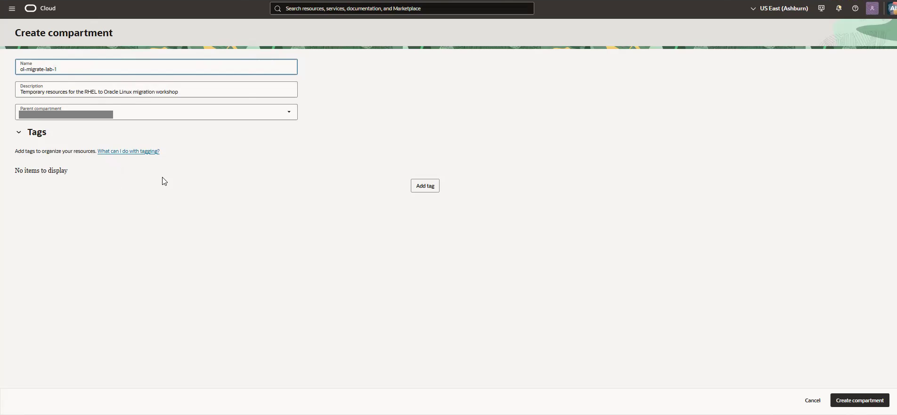

6. Select **Create compartment**. Open the new compartment when it appears and confirm that its state is **Active**.

7. Copy the compartment OCID from its details and save it in your local workshop notes. Record the region, parent compartment, and workshop compartment name beside it.

8. Confirm that you can create networking resources in this compartment. If it is missing from a resource selector or creation is denied, have your administrator resolve access before continuing.

## Task 2: Create the workshop VCN

1. Open the navigation menu, select **Networking**, and then select **Virtual cloud networks**.

2. Select your workshop compartment in the compartment selector. Confirm that the region selector still shows your workshop region.

3. Select **Start VCN Wizard**. If this option is inside **Actions**, open that menu first.

4. Select **Create VCN with Internet Connectivity**, then select **Start VCN Wizard**.

5. On **Configuration**, enter:

    - VCN name: `ol-migrate-vcn`
    - Compartment: your workshop compartment
    - VCN IPv4 CIDR: `10.0.0.0/16`
    - Public subnet IPv4 CIDR: `10.0.0.0/24`
    - Private subnet IPv4 CIDR: review and record the wizard value; it must be inside the VCN and must not overlap the public subnet

    Scroll down to review the subnet fields. The recording retains the VCN and public subnet ranges shown above. Review the private subnet range before continuing. If your organization requires different ranges, use its approved values and record them. This workshop uses IPv4.

    The recorded wizard displays a warning-styled banner saying that the resource availability check succeeded. Read the message text: that result is not a resource creation failure.

    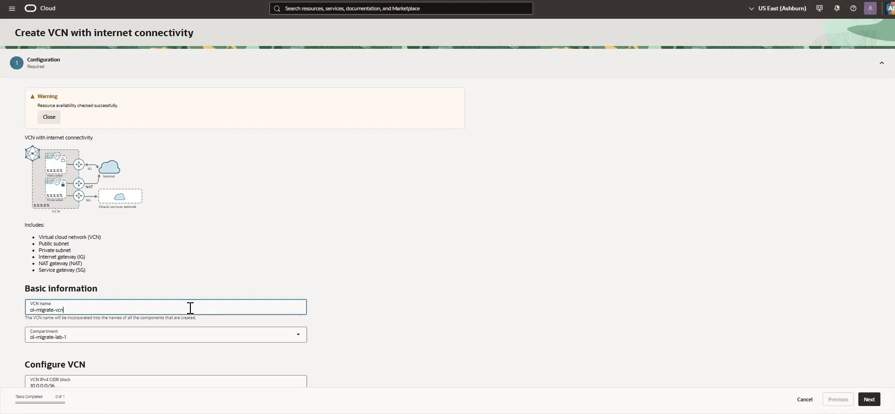

6. Select **Next** to open **Review and create**. Check the compartment and CIDRs for the VCN and both subnets. Confirm that the proposed resources include the internet gateway, NAT gateway, service gateway, route tables, and security lists.

    Your review must show the values you selected in Step 5. Scroll down to check the private subnet and remaining resources before selecting Create.

    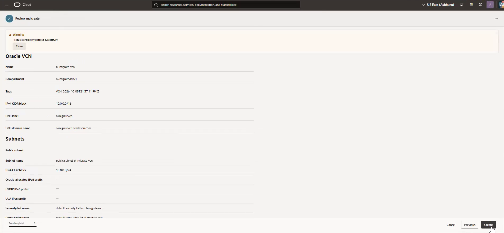

7. Select **Create** and wait for resource creation to finish. If a resource fails, resolve the reported permission or service-limit error before proceeding.

8. Select **View Virtual Cloud Network** if offered, or return to the VCN list and open `ol-migrate-vcn`. Confirm that its state is **Available** and its IPv4 CIDR matches your notes.

    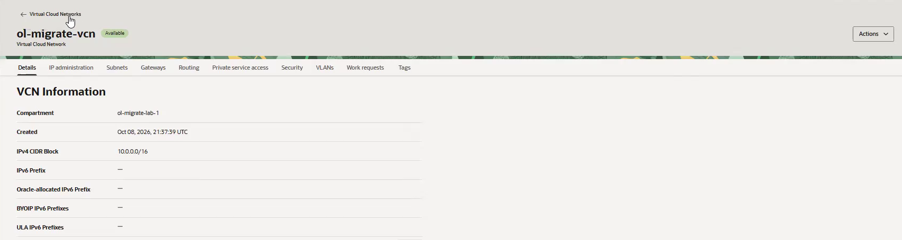

9. Open **Subnets**. Locate the public subnet, record its actual name and OCID, and confirm that it is **Available** and permits public IP addresses. The recorded name is `public subnet-ol-migrate-vcn (regional)`. Also verify that the private subnet exists and has the CIDR you selected.

10. Open the public subnet's associated route table. Confirm that destination `0.0.0.0/0` targets an enabled internet gateway. Record the route table and gateway names. This is the route the source VM will use for internet access.

## Task 3: Configure SSH and HTTP access

1. In the public subnet's details, identify its associated security list. For the wizard-created public subnet, return to the VCN, open **Security**, and select `default security list for ol-migrate-vcn`. Open **Security rules**. If your subnet uses another list, open that associated list.

2. Inspect **Ingress Rules** for a stateful TCP rule allowing destination port `22` from the address or approved network you will use for SSH.

    The recording retains the wizard's existing SSH rule with source `0.0.0.0/0`. Use a suitable existing rule if permitted by your organization. If you restrict it to your client address, use your client connection's public IPv4 address followed by `/32`.

3. If no suitable SSH rule exists, select **Add Ingress Rules** and enter:

    - Stateless: off, so the rule is stateful
    - Source type: **CIDR**
    - Source CIDR: your approved client public IPv4 address followed by `/32`, or your organization's approved network CIDR
    - IP protocol: **TCP**
    - Source port range: leave blank to allow all source ports
    - Destination port range: `22`
    - Description: `Workshop SSH access`

    Select **Add Ingress Rules** to save it. Keep an existing suitable rule instead of adding a duplicate.

4. Inspect the ingress rules for a stateful TCP rule allowing destination port `80`. This will allow your browser to reach the Apache test page created in Lab 2, Task 3.

5. If the HTTP rule is missing, select **Add Ingress Rules** and enter:

    - Stateless: off
    - Source type: **CIDR**
    - Source CIDR: `0.0.0.0/0`
    - IP protocol: **TCP**
    - Source port range: leave blank to allow all source ports
    - Destination port range: `80`
    - Description: `Temporary workshop HTTP access`

    > **Important:** This HTTP rule permits browser access from any internet address. Use it for the temporary workshop workload and remove it during Lab 8 cleanup. If your organization requires restricted access, use its approved client CIDR.

6. Select **Add Ingress Rules** to save the rule. Verify that the saved list shows TCP destination ports `22` and `80`, the intended source CIDRs, source port range **All**, and **Stateless: No**. If the HTTP rule already existed, verify its values.

    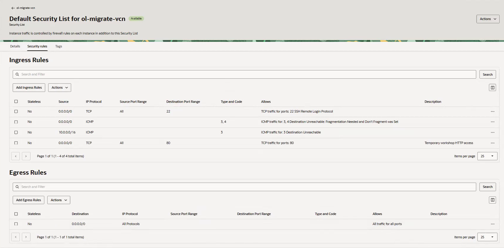

7. Inspect **Egress Rules**. Confirm that outbound traffic needed for DNS resolution and HTTPS repository access is permitted. The wizard's default stateful allow-all egress rule supports this workshop. If your organization restricts egress, have the administrator confirm the required access.

8. Record the security list name and OCID. Network rules alone do not start the web server or open the guest firewall. You will configure both inside the VM in Lab 2, Task 3.

## Task 4: Verify the workshop network

1. Check your workshop notes against the Console before launching Compute:

    | Resource | Expected value for a new workshop setup |
    | --- | --- |
    | Region | The same selected region for all labs |
    | Compartment | `ol-migrate-lab`, or your recorded substitute |
    | VCN | `ol-migrate-vcn`, CIDR `10.0.0.0/16`, or your approved range |
    | Public subnet | Available, CIDR `10.0.0.0/24` or your selected range, permits public IPs |
    | Private subnet | Available, recorded CIDR inside the VCN that does not overlap the public subnet |
    | Public subnet route | `0.0.0.0/0` through an enabled internet gateway |
    | SSH ingress | Stateful TCP destination port `22` from your approved source |
    | HTTP ingress | Stateful TCP destination port `80` from your selected source |
    | Egress | DNS and HTTPS repository access permitted |

2. Continue to Task 5 after these checks pass. Use the existing VCN and public subnet recorded here in the Compute launch form.

## Task 5: Launch the RHEL source VM

1. Open the navigation menu, select **Compute**, then **Instances**. Select your workshop compartment and select **Create instance**.

2. On **Basic information**, enter `ol-migrate-rhel-source` for the name and select your workshop compartment under **Create in compartment**.

3. Under **Placement**, select an availability domain with capacity for your shape. The recording uses **AD 1** in Ashburn. Keep the default on-demand capacity for this workshop.

4. Under **Image and shape**, select **Change image**. Choose an available x86_64 RHEL 9.8 image from **Red Hat Enterprise Linux**, or use the image OCID method demonstrated in the next step.

5. To use an image OCID, select **My Images**, then **Image OCID**. Enter the RHEL 9.8 image OCID provided for your region by Oracle or your workshop instructor. Confirm that it resolves to the intended RHEL image.

    The recording uses `Red-Hat-Enterprise-Linux-9.8-2026.09.15-8` and shows a 64 GB boot-volume size. An empty **Custom images** list does not prevent use of an accessible platform image OCID. No image import is required. Do not use an OCID from another region or select RHEL 10.2.

    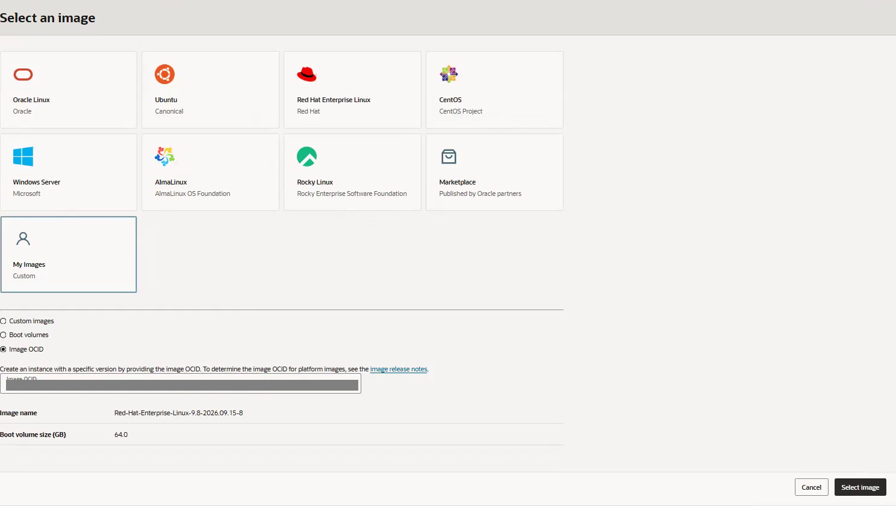

6. Select **Select image**. Record the exact image name and OCID. Review the usage-based RHEL charges and save the pricing information with your notes. Confirm with Oracle how in-place conversion affects OCI billing before production use.

7. Review **Shape**. If needed, select **Change shape**, choose a virtual machine with the compatible AMD shape `VM.Standard.E5.Flex`, and configure **1 OCPU** and **12 GB RAM**. Select the shape to return to the launch form. If the form already has these values, retain them. Use a tested compatible x86_64 fallback if required by capacity.

    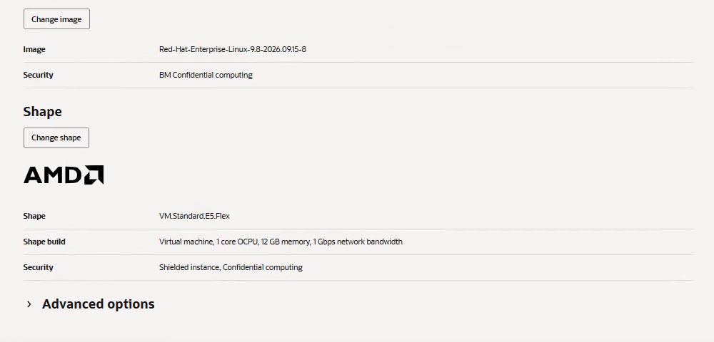

8. Select **Next** to open **Security**. For this workshop configuration, leave **Shielded instance** and **Confidential computing** off, unless your administrator requires a tested alternative.

    The recorded configuration reports that confidential computing cannot be enabled with its current settings. This message does not prevent continuing with that option off.

    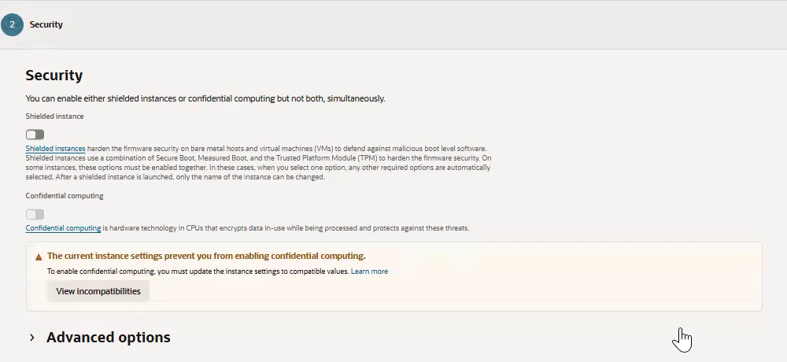

9. Select **Next** to open **Networking**. Under **Primary VNIC**, select the existing network:

    - **Select existing virtual cloud network**: `ol-migrate-vcn`
    - VCN compartment: your workshop compartment
    - **Select existing subnet**: the public subnet recorded in Task 2
    - Subnet compartment: the compartment containing that subnet

    Keep automatic private IPv4 address assignment. If a resource is missing, check the region and both compartment selectors.

    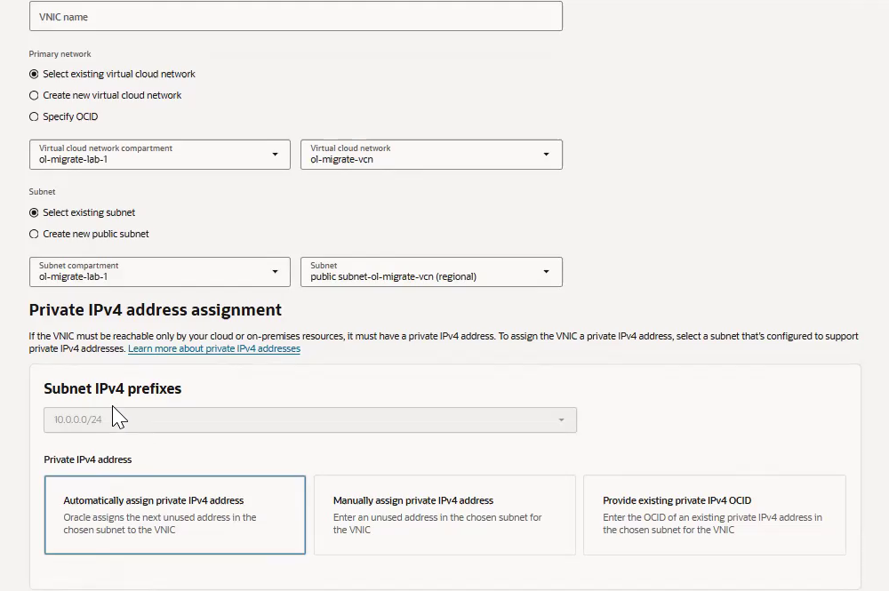

10. Scroll to **Public IPv4 address assignment** and turn on **Automatically assign public IPv4 address**. Leave **Assign IPv6 address from subnet prefix** off. The recorded IPv6 warning reflects the IPv4-only VCN and does not require enabling IPv6 for this workshop.

11. Under **Add SSH keys**, choose one of these methods:

    - **Generate a key pair for me**, as demonstrated: select **Download private key** and **Download public key**. Save both files and record the private key's local path for Lab 2. Download the private key before leaving this form because it will not be shown again.
    - For an existing key pair, select **Upload public key file (.pub)** or **Paste public key**. Retain the matching private key on your computer.

    Do not select **No SSH keys**. Keep the private key secure and out of screenshots and shared workshop notes.

    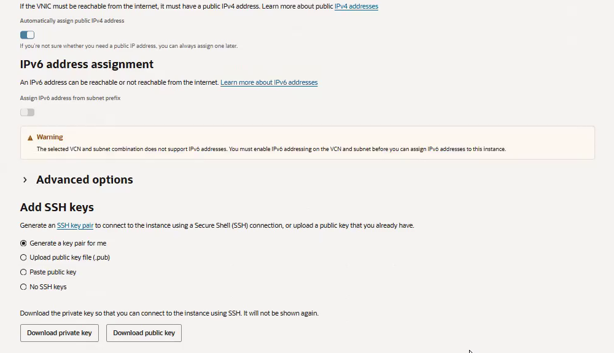

12. Select **Next** to open **Storage**. Review the boot-volume settings:

    - Keep at least **64 GB**, or the larger minimum required by your image.
    - The demonstrated image defaults to **64.0 GB**. Leave **Specify a custom boot volume size and performance setting** off to retain that default.
    - To increase the size, enable the custom setting and enter a value at least as large as the image minimum.
    - Keep the default Oracle-managed encryption key. This workshop does not require a customer-managed Vault key or an additional block volume.

    Boot-volume capacity provides space for the operating system, packages, logs, and migration work. You will check actual free space with `df -h /` in Lab 2.

    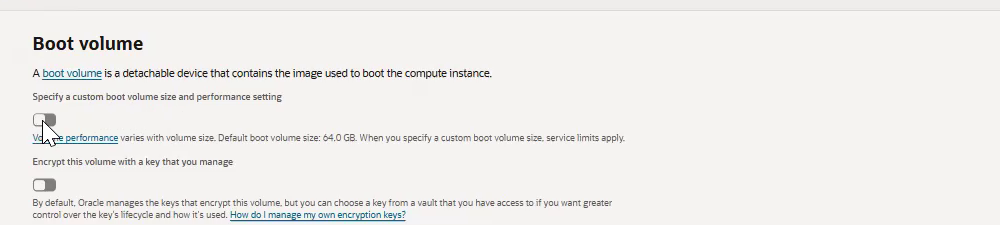

13. Select **Next** to open **Review**. Check the instance name, compartment, RHEL image, shape, OCPUs, memory, VCN, public subnet, public IPv4 assignment, SSH key, and boot volume. Expand or return to a section if you need to correct a value. Select **Create**.

    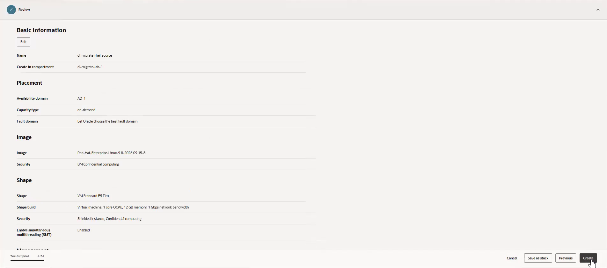

14. Wait while the instance is **Provisioning**. You can open **Work requests** to inspect creation progress. Return to **Instances** or open the instance details and wait until its state is **Running**.

    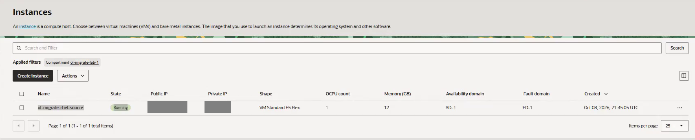

15. Open the instance details and copy the public IPv4 and private IPv4 addresses into your local workshop notes. Use your own addresses in Lab 2. The screenshot's IP values are masked.

16. Before leaving Lab 1, confirm that your notes contain:

    - Instance name and OCID
    - Region and availability domain
    - Workshop compartment name and OCID
    - Image name and OCID
    - VCN, public subnet, route table, and security list names and OCIDs
    - Actual network CIDRs, public IPv4 address, and private IPv4 address
    - Shape, OCPUs, memory, and boot-volume size
    - Private SSH key's local path and the usage-based pricing information

Continue to **Lab 2: Prepare and Baseline the RHEL Workload** after the VM is Running and its launch details are recorded. Lab 2 covers SSH access, RHUI repository checks, the Apache workload, and the RHEL baseline.

## Learn More

- [OCI virtual networking wizard](https://docs.oracle.com/en-us/iaas/Content/Network/Tasks/quickstartnetworking.htm)
- [OCI security lists](https://docs.oracle.com/en-us/iaas/Content/Network/Concepts/securitylists.htm)
- [Creating an OCI Compute instance](https://docs.oracle.com/en-us/iaas/Content/Compute/Tasks/launchinginstance.htm)

## Acknowledgements

- **Author** - Perside Foster, Principal Solution Engineer, Oracle
- **Last Updated By/Date** - Oracle LiveLabs Workshop Team, October 2026
