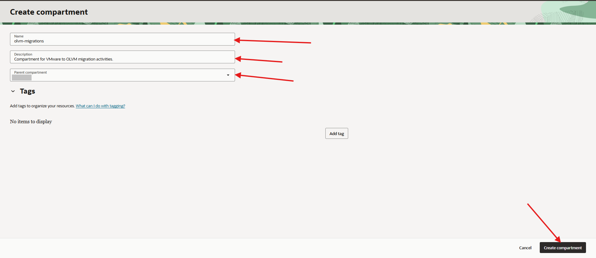

# Create the Migration Compartment

## Introduction

In this lab, you create a dedicated OCI compartment for VMware to OLVM migration resources. A separate compartment keeps migration resources isolated from production workloads and makes cleanup easier after the migration is complete.

Estimated Time: 10 minutes

### Objectives

In this lab, you will:

* Create a dedicated migration compartment.
* Confirm the compartment is visible in the OCI Console.
* Record the compartment details for later labs.

## Task 1: Create a Dedicated Compartment

1. Sign in to the OCI Console.

2. Open the navigation menu.

3. Go to **Identity & Security**, then open **Compartments**.

4. Click **Create Compartment**.

5. For **Name**, enter:
    ```text
    <copy>olvm-migrations</copy>
    ```

6. For **Description**, enter:
    ```text
    <copy>Compartment for VMware to OLVM migration activities.</copy>
    ```

7. Select **Parent Compartment** from drop-down list

8. Click **Create Compartment**.
   

9. Refresh your browser after the compartment is created.

10. Confirm that the new compartment appears in the list before continuing. 
    - Go to **Identity & Security**, then open **Compartments**.
    - Search for the Parent Compartment and look for `olvm-migrations`

11. Record the compartment details.

    ```text
    Migration compartment:
    Migration compartment OCID:
    Region:
    ```

## Acknowledgements

* **Author** - Mark Atkinson, Evgeny Golenkov, Perside Foster
* **Last Updated By/Date** - Perside Foster, June 2026
