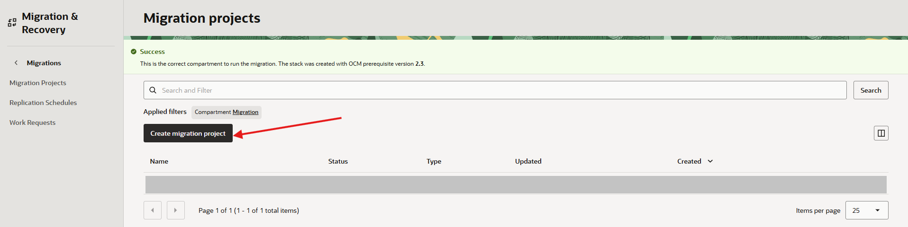
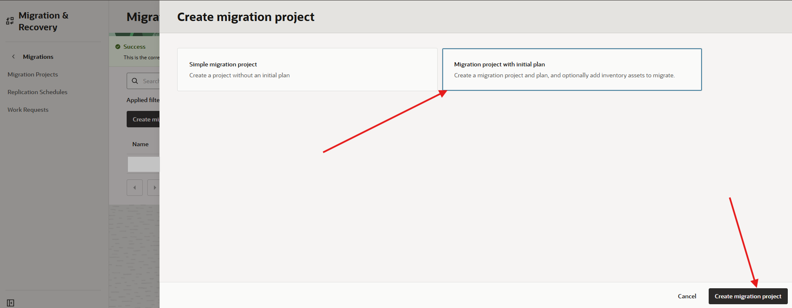
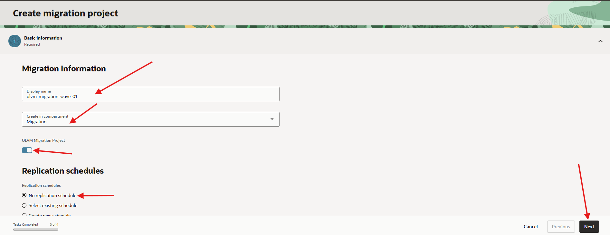
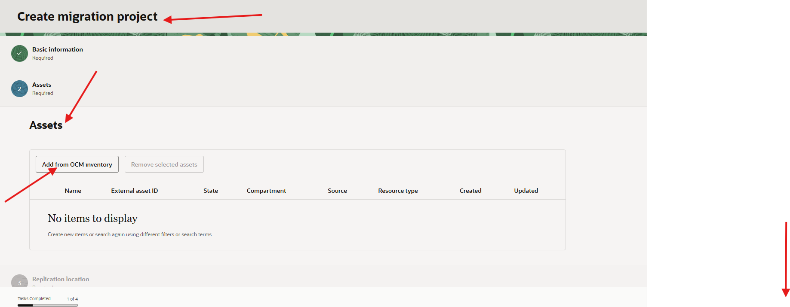
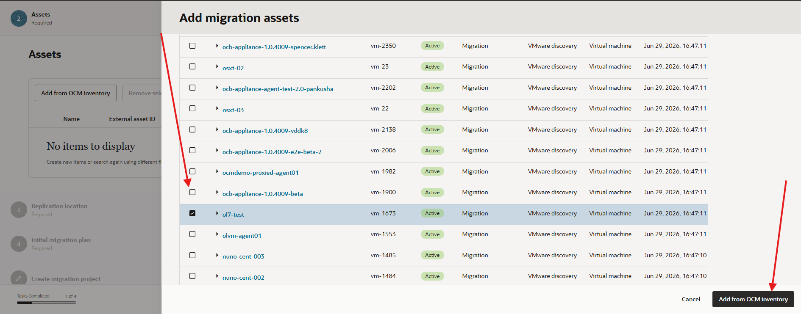
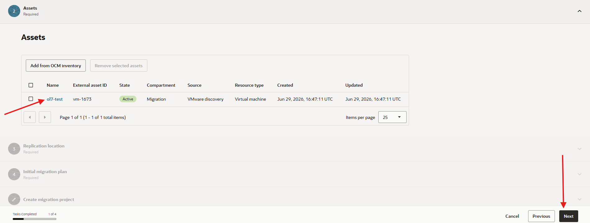
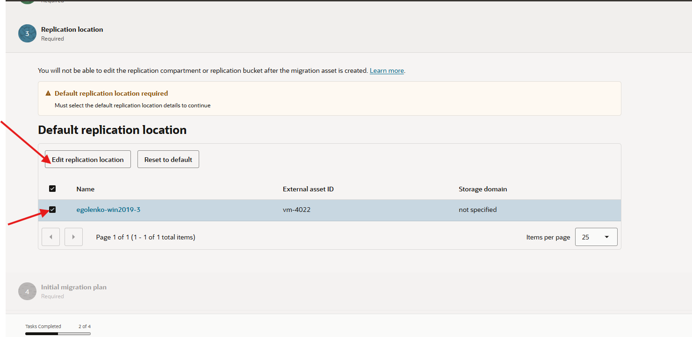
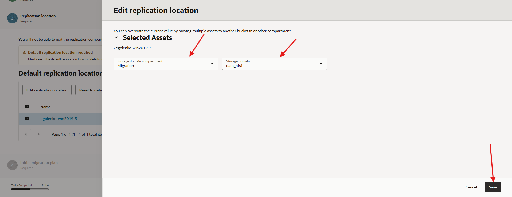
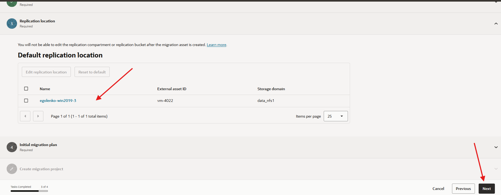
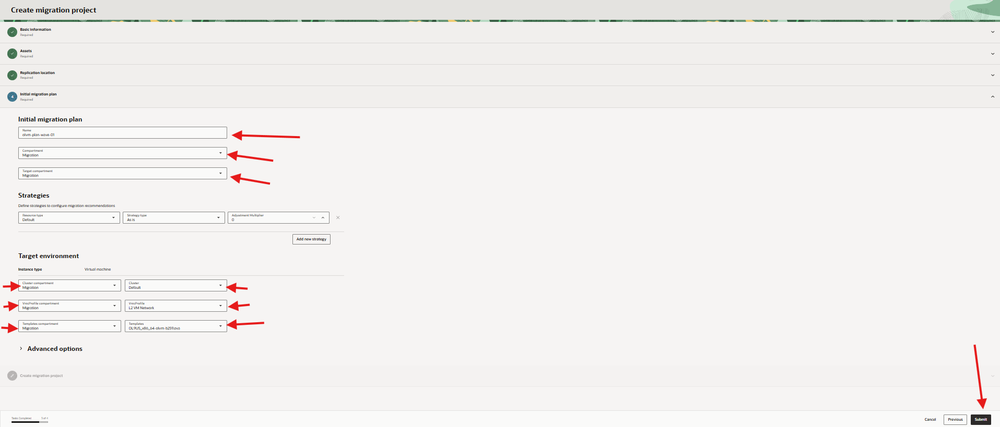

# Create the OLVM Migration Project

## Introduction

In this lab, you create an OCM migration project with an initial OLVM migration plan, add the discovered VMware VM, configure the replication location, and select OLVM target values.

Estimated Time: 30 minutes

### Objectives

In this lab, you will:

* Create a migration project with an initial migration plan.
* Enable OLVM migration project mode.
* Add discovered VMware assets.
* Set the replication location.
* Configure OLVM cluster, VnicProfile, and template values.

## Task 1: Start the Migration Project Wizard

1. In the OCI Console Menu, open **Migration & Recovery**,**Cloud Migrations**, **Migrations**.
    

2. From **Migration projects** page click **Create migration project** button.
    

3. Select **Create a migration project with initial migration plan**. Then click **Create Migration Project**.
    

## Task 2: Enter Basic Information

1. For **Display Name**, enter `olvm-migration-wave-01` or your migration wave name.

2. Select the **Migration** compartment.

3. Enable the **OLVM Migration Project** option.

    This option is required. Without it, the project targets OCI Compute instead of OLVM and the OLVM-specific target fields will not appear.

4. Select **No replication schedule** for a first test.

    
5. Click **Next**.

## Task 3: Add Assets

1. From **Create migration project, Assets**,  Click **Add from OCM Inventory** button
    

2. Select (checkbox) the VMware VMs from inventory that you want to include in the migration wave. Then Click **Add from OCM Inventory** button
    

3. Confirm that the selected VMs appear in the assets list.
    

4. Click **Next**.

## Task 4: Set the Replication Location

1. Under **Default Replication Location**, select the target availability domain.
    

2. Select the replication compartment **Migration**.

3. Select the replication bucket created by the prerequisites stack **data-nfs-1**. Then click the **Save** button
    

4. Confirm that all assets show the selected replication location.
    

5. Click **Next**.

## Task 5: Configure Initial Migration Plan and Taget Environment 

1. Enter a display name for the migration plan, such as `olvm-plan-wave-01`.

2. Select compartment **Migration**. Then select the target compartment **Migration**.

3. Select the OLVM cluster where migrated VMs will be provisioned.

4. Select the VnicProfile to assign to migrated VM network adapters.

5. Select the template to use as the base for provisioned VMs in OLVM.
    

6. Click **Submit**.

7. Confirm that the migration project and initial migration plan appear with an active status.

8. Record the project and plan names.

    ```text
    Migration project:
    Migration plan:
    Replication bucket:
    Target cluster:
    Target VnicProfile:
    Target template:
    ```

## Learn More

* [Create a migration project for OLVM](https://docs.oracle.com/en-us/iaas/Content/cloud-migration/cloud-migration-create-migration-project-olvm.htm)

## Acknowledgements

* **Author** - Mark Atkinson, Evgeny Golenkov, Andrey Sokolov, Perside Foster
* **Contributor** - Keya Balutkar
* **Last Updated By/Date** - Perside Foster, July 2026
