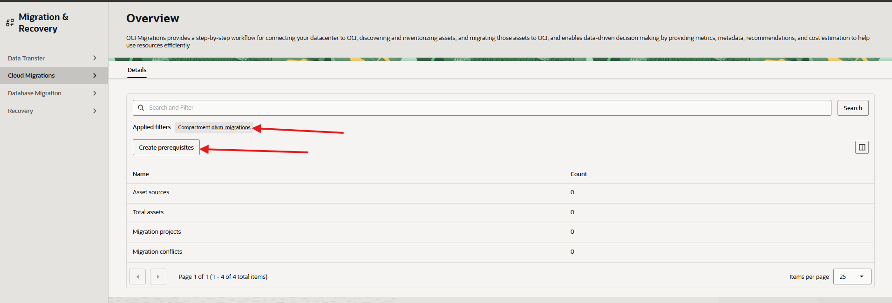
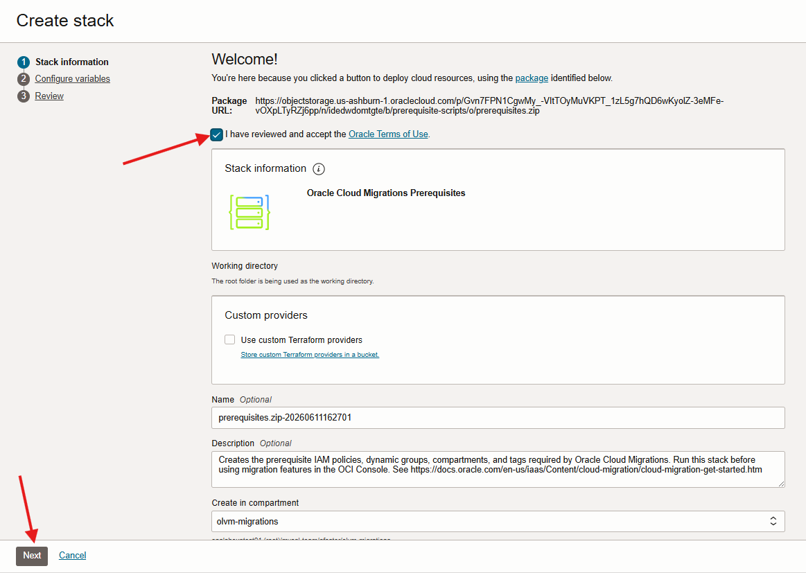
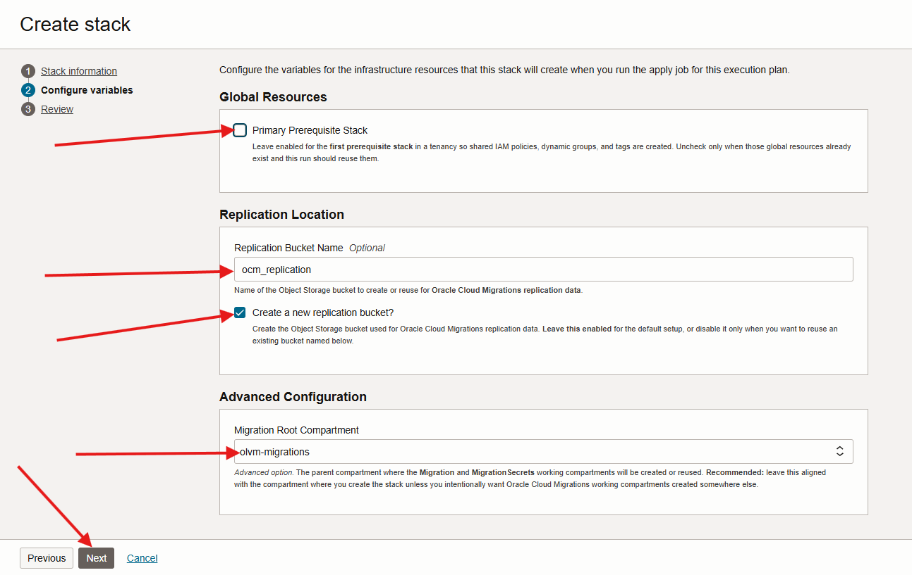
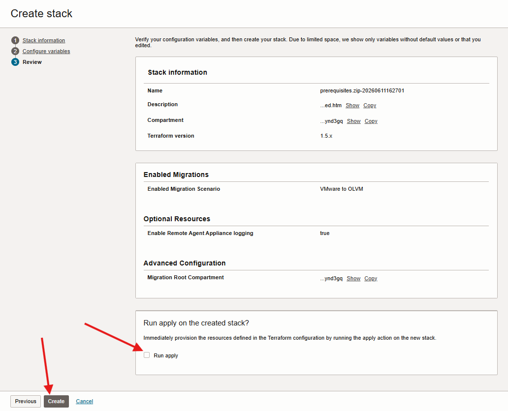
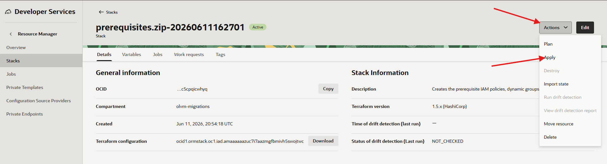
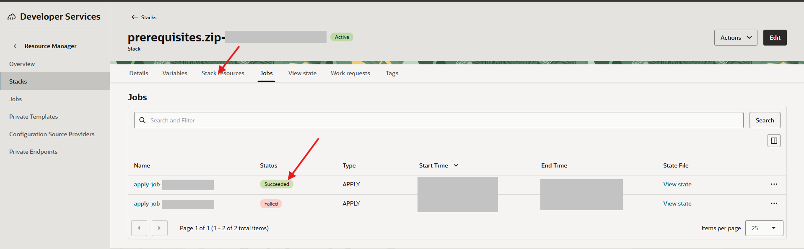

# Deploy the OCM Prerequisites Stack

## Introduction

Oracle Cloud Migrations uses a Resource Manager stack to create or configure the tenancy resources required for VMware to OLVM migrations. In this lab, you create the prerequisites stack, review the plan, apply the stack, and verify the resources.

Estimated Time: 30 minutes

### Objectives

In this lab, you will:

* Open the OCM prerequisites wizard.
* Configure and Review prerequisite stack options for VMware to OLVM migrations.
* Apply the stack and handle the expected tag retry condition if it appears.
* Verify created stack completed successfully.

## Task 1: Open the Prerequisites Wizard

1. Open the OCI Console navigation menu.

2. Go to **Migration & Recovery**, then open **Cloud Migrations** + **Overview**.

3. Use the compartment picker to select the `olvm-migrations` compartment.

4. Click **Create Prerequisites**.
    

## Task 2: Configure the Stack

1. Accept the Oracle terms of use.

2. Click **Next**.
    

3. On the configuration page, use the following baseline selections.

    | Option | Action |
    | --- | --- |
    | Primary Prerequisite Stack | Enable |
    | Enabled Migrations | Select VMware to OLVM |
    | Replication bucket name| ocm_replication |
    | Create a new replication bucket? | Enable |
    | Enable Remote Agent Appliance logging| Enable |
    | Migration root compartment | olvm-migrations |

    

4. Click **Next**.

5. Scroll to the bottom of the review page.

6. Clear **Apply** so the stack is created without immediately changing resources.
    

7. Click **Create**.

## Task 3: Apply the Stack

1. From the Resource Manager stack created by the prerequisites wizard.
    * Click the **Actions** Menu
    * Click **Apply**.
    

2. From the apply page, click **Apply**.

3. Wait for the apply job to complete.

4. If the apply job fails with an invalid tags error, wait a few minutes, then click **Apply** again on the same stack.

    This retry handles a known tag propagation timing condition. If the failure is not related to invalid tags, troubleshoot the Resource Manager job before retrying.

5. If the apply job fails while creating `oci_kms_key.ocm_key` with a DNS lookup error for a new Vault management endpoint, wait 5 to 10 minutes, then click **Apply** again on the same stack.

    This retry handles a Vault endpoint propagation timing condition after the Vault is created. Do not delete the stack or recreate the prerequisite resources unless instructed by Oracle Support.

6. Confirm that the apply job shows **Succeeded**.
    

## Learn More

* [Oracle Cloud Migrations documentation](https://docs.oracle.com/en-us/iaas/Content/cloud-migration/home.htm)
* [OCI Resource Manager documentation](https://docs.oracle.com/en-us/iaas/Content/ResourceManager/home.htm)

## Acknowledgements

* **Author** - Mark Atkinson, Evgeny Golenkov, Andrey Sokolov, Perside Foster
* **Contributor** - Keya Balutkar
* **Last Updated By/Date** - Perside Foster, June 2026
