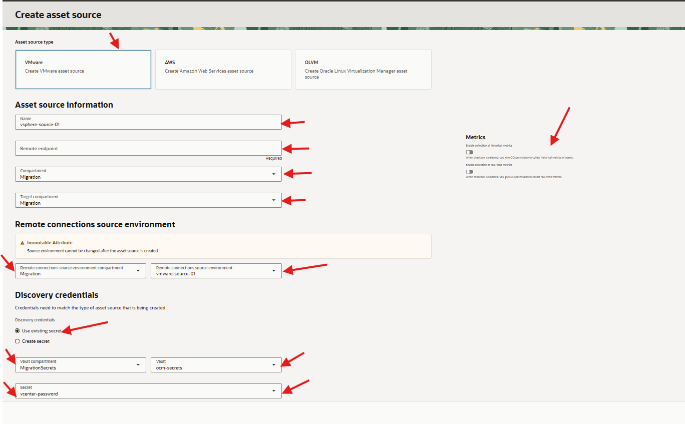
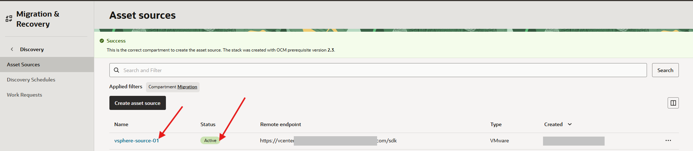
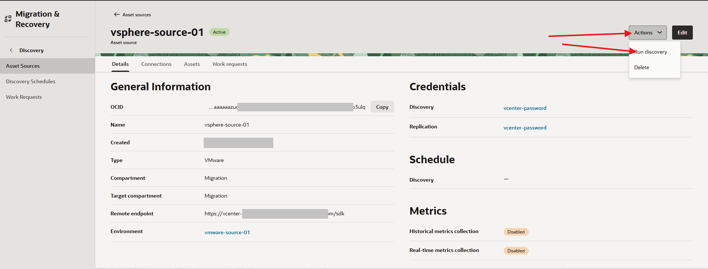
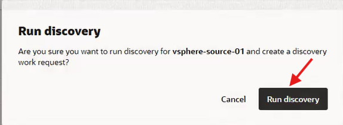
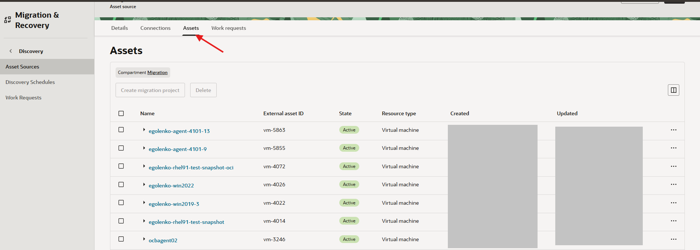

# Run VMware Asset Discovery

## Introduction

In this lab, you create the VMware asset source and run discovery so OCM can inventory the source VMs that you plan to migrate.

Estimated Time: 25 minutes

### Objectives

In this lab, you will:

* Create a VMware asset source.
* Associate the source environment and VDDK dependency.
* Discover VMware source VMs.
* Confirm source VM inventory metadata.

## Task 1: Create a VMware Asset Source

1. In the OCI Console Menu, open **Migration & Recovery**, **Cloud Migrations** then open **Discovery**.

2. Open **Asset Sources**.

3. Click **Create Asset Source**.

4. Select **VMware** as the source type.

5. Enter the VMware asset source details.

    | Field | Value |
    | --- | --- |
    | Asset source type | VMware |
    | Name | vsphere-source-01 |
    | Remote endpoint | vCenter FQDN or public IP |
    | Compartment | Migration |
    | Target compartment | Migration |
    | Remote connections source environment compartment | Migration |
    | Remote connections source environment | vmware-source-01 |
    | Discovery credentials | select Use existing secret |
    | Vault compartment | MigrationSecrets |
    | Vault | ocm-secrets |
    | Secret | vcenter-password |

    * Ignore Discovery schedules
    * Metrics:Turn Off - Enable collection of historical metrics
    * Metrics:Turn Off - Enable collection of real-time metrics

    

6. Click **Create Asset Source**.

7. Confirm that the VMware asset source status is **Active**.
    

## Task 2: Discover VMware Source VMs

1. In the OCI Console Menu, open **Migration & Recovery**, **Cloud Migrations** then open **Discovery**.
2. Click on the **vsphere-source-01** Asset Source to open the VMware asset source details page. Click **Actions** **Run Discovery**.
    

    

3. Wait for the discovery job to complete.

4. Open **Asset Inventory**.
    

5. Confirm that VMware VMs appear in inventory.

6. Open the VM you plan to migrate.

7. Confirm that CPU, memory, disk, network adapter, and guest operating system metadata are visible.

8. Record the selected source VM.

    ```text
    VMware asset source:
    Source VM:
    Discovery job:
    ```

## Learn More

* [Oracle Cloud Migrations documentation](https://docs.oracle.com/en-us/iaas/Content/cloud-migration/home.htm)

## Acknowledgements

* **Author** - Mark Atkinson, Evgeny Golenkov, Andrey Sokolov, Perside Foster
* **Contributor** - Keya Balutkar
* **Last Updated By/Date** - Perside Foster, July 2026
