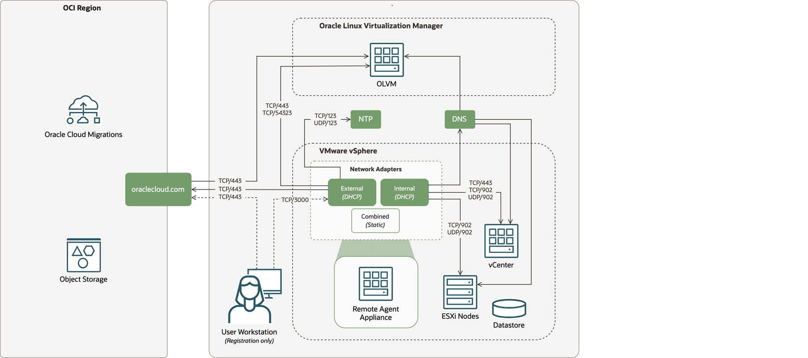

# VMware to OLVM Migration with Oracle Cloud Migrations

## Introduction

This workshop walks through a VMware to Oracle Linux Virtualization Manager (OLVM) migration by using Oracle Cloud Migrations (OCM). You will prepare the OCI tenancy, configure OCM prerequisites, upload the VMware Virtual Disk Development Kit (VDDK), deploy and register the remote agent appliance, discover VMware and OLVM assets, create an OLVM migration project, replicate a selected VM, validate the migrated VM, and clean up temporary migration resources.

Estimated Workshop Time: 3 hours, plus replication and migration execution time

### Objectives

In this workshop, you will:

* Create a dedicated OCI compartment for migration activity.
* Deploy the OCM prerequisites Resource Manager stack.
* Upload and register the VDDK package as an agent dependency.
* Configure the VMware source environment and remote agent appliance.
* Configure the OLVM target asset source.
* Discover VMware source VMs and OLVM target assets.
* Create an OLVM migration project and migration plan.
* Replicate, migrate, validate, cut over, and clean up a migrated VM.

### Prerequisites

This workshop assumes you have:

* OCI tenancy access with permission to manage compartments, IAM, Vault, Object Storage, Resource Manager, and Cloud Migrations.
* VMware vCenter access and a service account for migration.
* OLVM Manager access, including the URL, username, password, and TLS certificate.
* The VDDK package downloaded from the VMware portal.
* A workstation that can reach OCI over HTTPS and the remote agent appliance registration endpoint.
* Network connectivity from the remote agent appliance to vCenter, ESXi hosts, OCI service endpoints, Object Storage, and OLVM.

## Workshop Architecture

The workshop uses Oracle Cloud Migrations in OCI to coordinate a migration from a VMware vSphere source environment to an OLVM target environment. OCI provides the Cloud Migrations service, Object Storage for migration dependencies and replication artifacts, and the service endpoints required by the remote agent appliance.

The remote agent appliance runs in the VMware environment and needs network access to vCenter, ESXi hosts, DNS, NTP, OCI service endpoints, and OLVM. The user workstation is used only for registration and console-driven setup tasks.

## Workshop Flow

* Lab 1 creates the migration compartment.
* Lab 2 deploys the OCM prerequisites stack.
* Lab 3 uploads and registers the VDDK.
* Lab 4 sets up the VMware source environment and remote agent.
* Lab 5 sets up the OLVM target environment.
* Lab 6 discovers VMware source VMs.
* Lab 7 creates the OLVM migration project.
* Lab 8 replicates, migrates, validates, and cuts over the VM.
* Lab 9 marks the project complete and cleans up temporary resources.

## Learn More

* [Oracle Cloud Migrations documentation](https://docs.oracle.com/en-us/iaas/Content/cloud-migration/home.htm)
* [Oracle Linux Virtualization Manager documentation](https://docs.oracle.com/en/virtualization/oracle-linux-virtualization-manager/)
* [OCI Resource Manager documentation](https://docs.oracle.com/en-us/iaas/Content/ResourceManager/home.htm)

## Acknowledgements

* **Author** - Mark Atkinson, Evgeny Golenkov, Andrey Sokolov, Perside Foster
* **Contributor** - Keya Balutkar
* **Last Updated By/Date** - Perside Foster, June 2026
