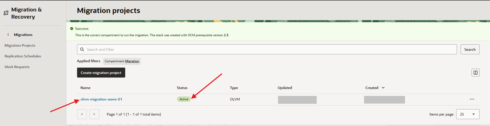
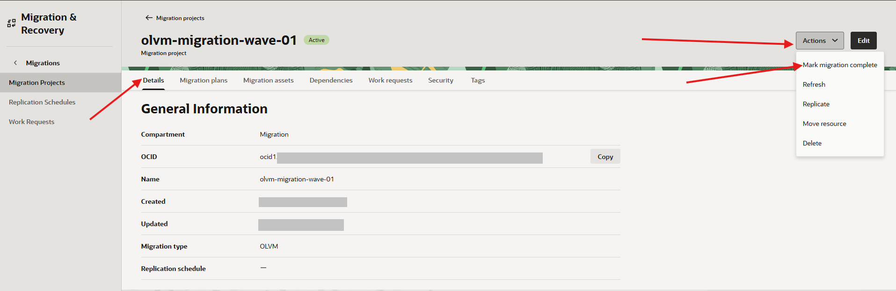
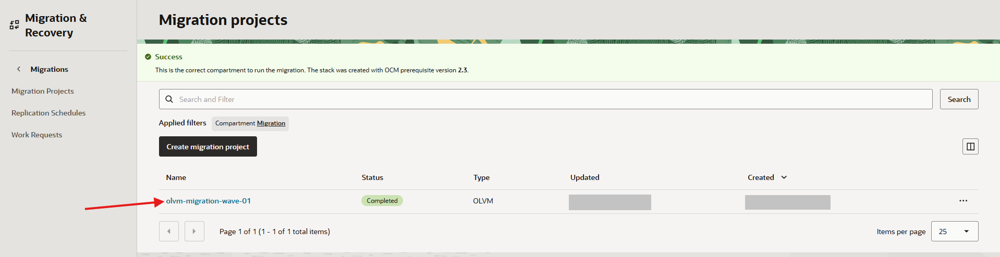

# Mark Complete and Clean Up

## Introduction

In this lab, you mark the OCM migration project complete and clean up temporary migration resources after the migration owner confirms that the migrated VM is accepted.

Estimated Time: 20 minutes

### Objectives

In this lab, you will:

* Mark the migration project complete.
* Clean up remote agent appliances when they are no longer needed.
* Rotate or revoke temporary migration credentials.
* Confirm replication bucket cleanup.
* Confirm that the migration compartment contains no production resources before deletion.

## Task 1: Mark the Migration Project Complete

1. In the OCI Console Menu, open **Migration & Recovery**,**Cloud Migrations**, **Migrations**.
    

2. Open the Migration project item ****olvm-migration-wave-01**.
    

3. Confirm that no migration assets or migration plans require changes.

4. Click the Migration project item Detail, Click on Action menu and select **Mark as Complete** .
    

5. Confirm the action.

6. Confirm that the project status changes to **Completed**.
    

7. Record the completion details.

    ```text
    <copy>Migration project:
    Completion date:
    Approver:</copy>
    ```

## Task 2: Complete Post-Migration Cleanup

1. Confirm that the migrated VM is running correctly on OLVM.

2. Confirm that rollback is no longer required.

3. Delete remote agent appliance VMs from vCenter when no additional migrations require them.

4. Rotate or revoke the vCenter credentials stored in Vault if they were created only for the migration.

5. Rotate or revoke OLVM migration credentials if they were created only for the migration.

6. Confirm that the replication bucket no longer contains residual snapshot data that must be retained.

7. Delete temporary replication objects according to your retention policy.

8. Confirm that the migration compartment contains no production resources.

9. Delete the migration compartment only after audit, retention, and rollback requirements are satisfied.

10. Record cleanup results.

    ```text
    <copy>Remote agent removed:
    Credentials rotated or revoked:
    Replication bucket checked:
    Migration compartment cleanup:
    Remaining resources:</copy>
    ```

## Learn More

* [Oracle Cloud Migrations documentation](https://docs.oracle.com/en-us/iaas/Content/cloud-migration/home.htm)
* [OCI Object Storage documentation](https://docs.oracle.com/en-us/iaas/Content/Object/home.htm)

## Acknowledgements

* **Author** - Mark Atkinson, Evgeny Golenkov, Andrey Sokolov, Perside Foster
* **Contributor** - Keya Balutkar
* **Last Updated By/Date** - Perside Foster, July 2026
