# Replicate and Validate

## Introduction

In this lab, you trigger replication, run the migration plan, validate the migrated VM in OLVM, and perform production cutover when the migration owner approves it.

Estimated Time: 45 minutes, plus replication and migration execution time

### Objectives

In this lab, you will:

* Trigger replication for a selected migration asset.
* Run the migration plan for a test migration.
* Confirm that the migrated VM appears in OLVM.
* Validate the migrated VM.
* Perform production cutover when ready.

## Task 1: Trigger Replication

1. In the OCI Console Menu, open **Migration & Recovery**,**Cloud Migrations**, **Migrations**.
    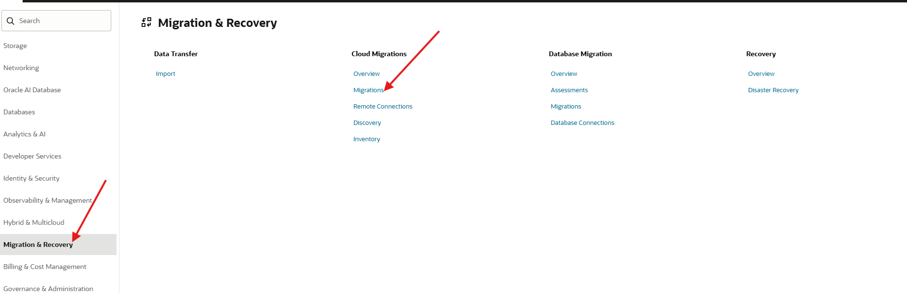

2. Open the Migration project item ****olvm-migration-wave-01**.
    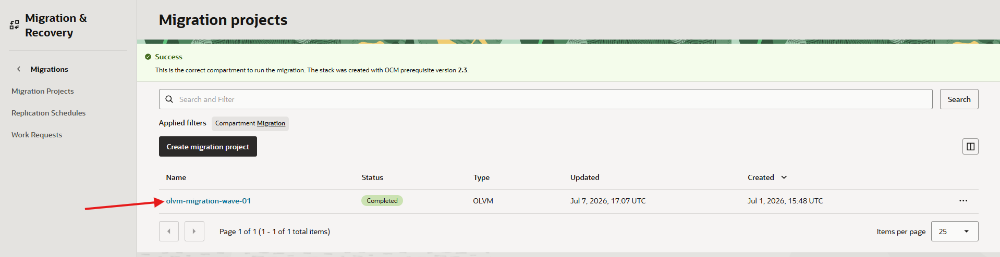

3. Click the **Migration Assets** tab.
    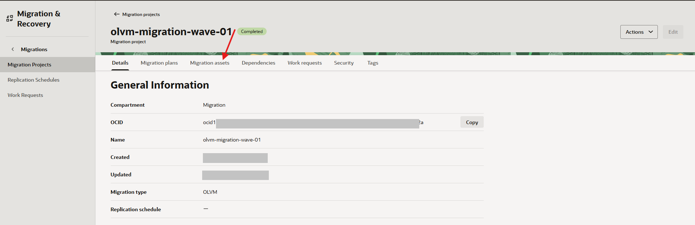
4. Select one VM to test replication first.

5. Click **Replicate**.
    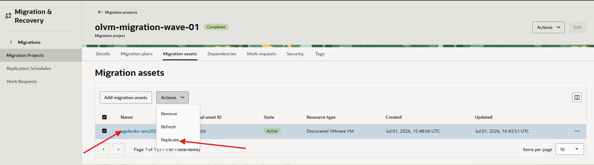

    

6. Monitor the replication job in **Work Requests**.

7. Click the Migration asset item
    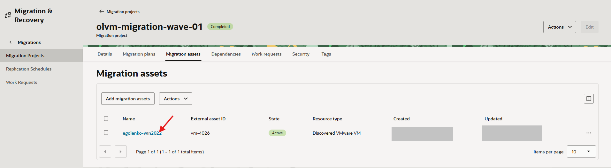

8. From the migration asset **Genera Information** page Click the **Work requests** tab
    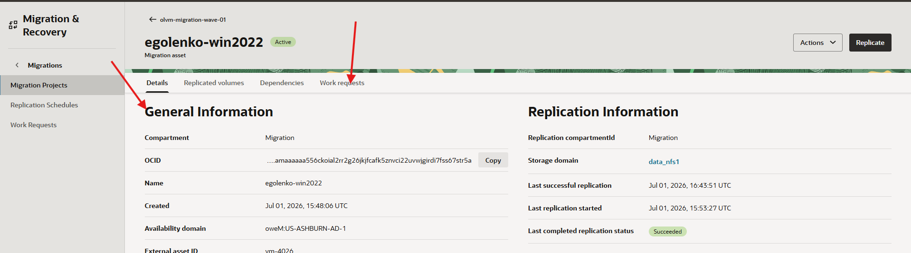

9. Confirm that the replication job completes with a state of **Succeeded** and a **Time Finished** timestamp.
    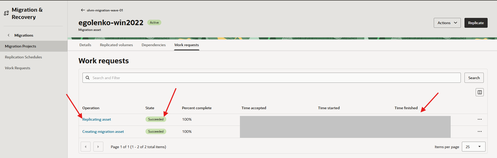

## Task 2: Run the Migration Plan for Testing

1. In the OCI Console Menu, open **Migration & Recovery**,**Cloud Migrations**, **Migrations**.
    

2. Open the Migration project item ****olvm-migration-wave-01**.
    

3. Open the **Migration Plans** tab.
    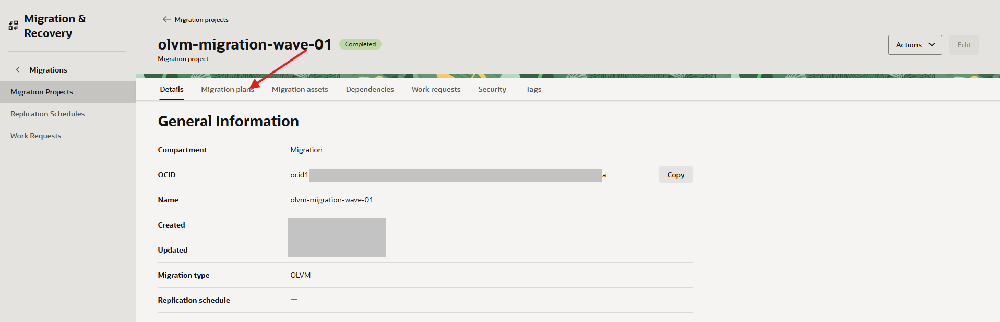

4. Select your migration plan `olvm-plan-wave-01`.

5. Click **Migration Plan**. Then select Action Button  **Generate RMSStack**
    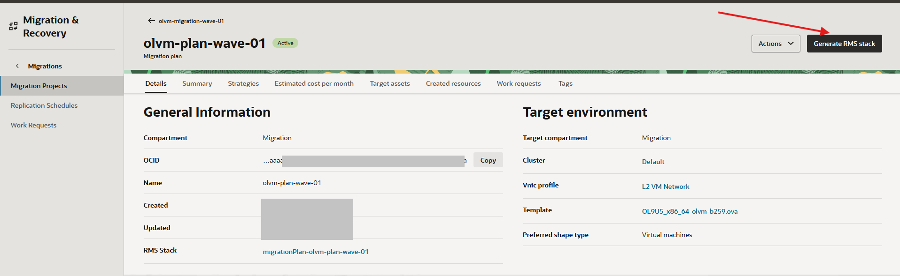

6. Select **Work Request** tab. Wait until work request completes

7. Select the **Details** tab, Navigate to the **RMS Stack** link,  and click in plan Details page
    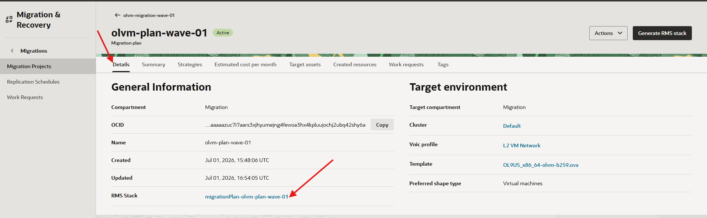

8. From the RMS Stack page Open Action Menu and click Plan. Wait for plan finish
    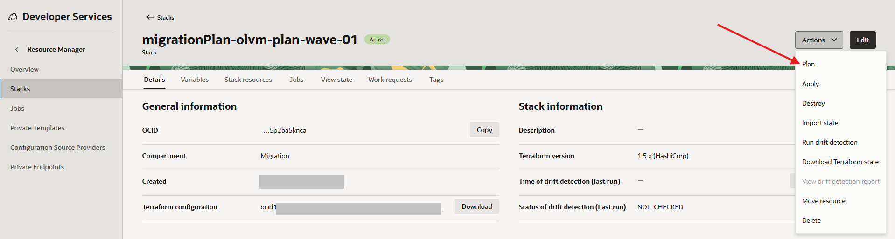

9. Return to RMS Stack page Open Action Menu and click Apply
    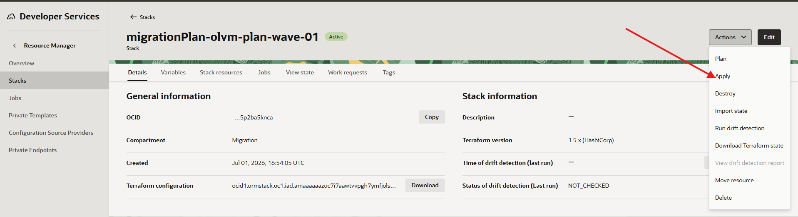

10. Monitor the job until it completes.

11. Sign in to OLVM Manager.

12. Confirm that the VM appears in the target cluster.

## Task 3: Validate the Migrated VM

> **NOTE:**  OLVM experience required  for this lab

1. In OLVM Manager, confirm that the VM powers on successfully.
    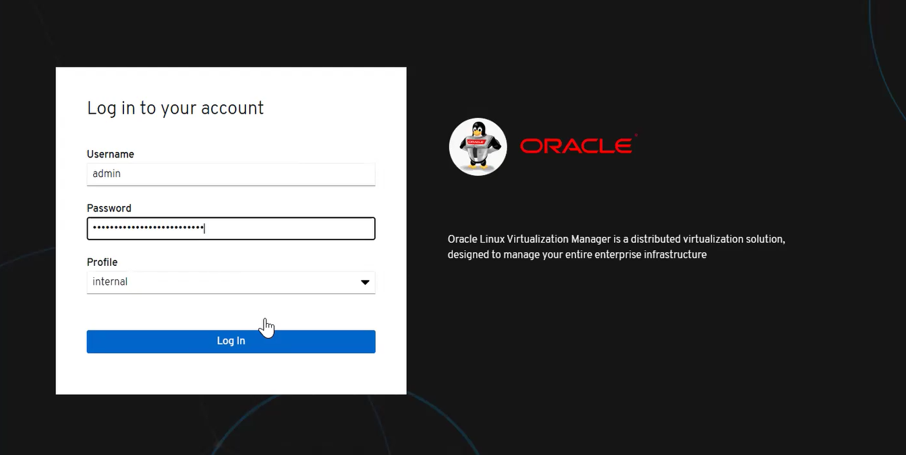

2. Confirm that the network adapter is configured .

3. Confirm that the VM is reachable by IP address.

4. Confirm that all disks are attached.

5. Confirm that data is intact.

6. Confirm that required applications start and respond correctly.

7. Confirm that operating system drivers are appropriate for KVM, including virtio network and storage drivers when required.

8. Record validation results.

    ```text
    VM powers on:
    Network reachable:
    Disks attached:
    Application check:
    Driver check:
    Issues:
    ```

## Task 4: Run Production Cutover When Ready

> **NOTE:**  VMware experience and OLVM experience  are required  for steps 1 through 3

1. Confirm that the test migration has been accepted.

2. Confirm the approved cutover window.

3. Shut down the source VM in vCenter.

4. Return to the migration asset in OCM (See Task1 and Task2 of this lab for more details).
    * Click **Replicate** one final time to capture the latest source VM state.
    * Wait for the final replication job to complete.
    * Run the migration plan again to provision the final production instance.

5. Validate the VM on OLVM again.

6. Confirm that the VM is running on OLVM with current data.

7. Confirm that the source VM in vCenter remains powered off.

## Learn More

* [Oracle Cloud Migrations documentation](https://docs.oracle.com/en-us/iaas/Content/cloud-migration/home.htm)
* [Oracle Linux Virtualization Manager documentation](https://docs.oracle.com/en/virtualization/oracle-linux-virtualization-manager/)

## Acknowledgements

* **Author** - Mark Atkinson, Evgeny Golenkov, Andrey Sokolov, Perside Foster
* **Contributor** - Keya Balutkar
* **Last Updated By/Date** - Perside Foster, July 2026
