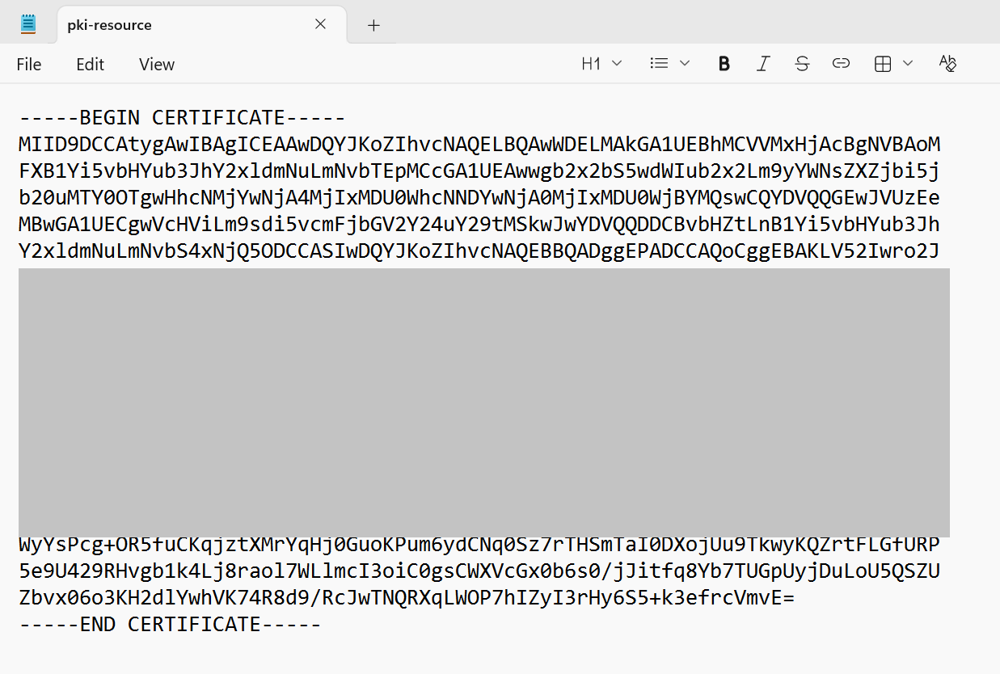
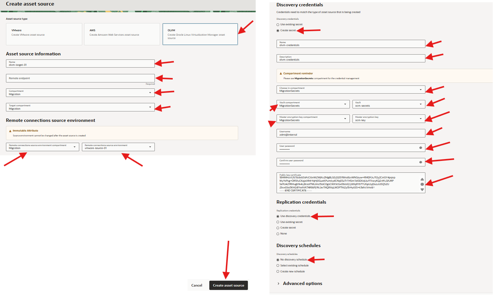
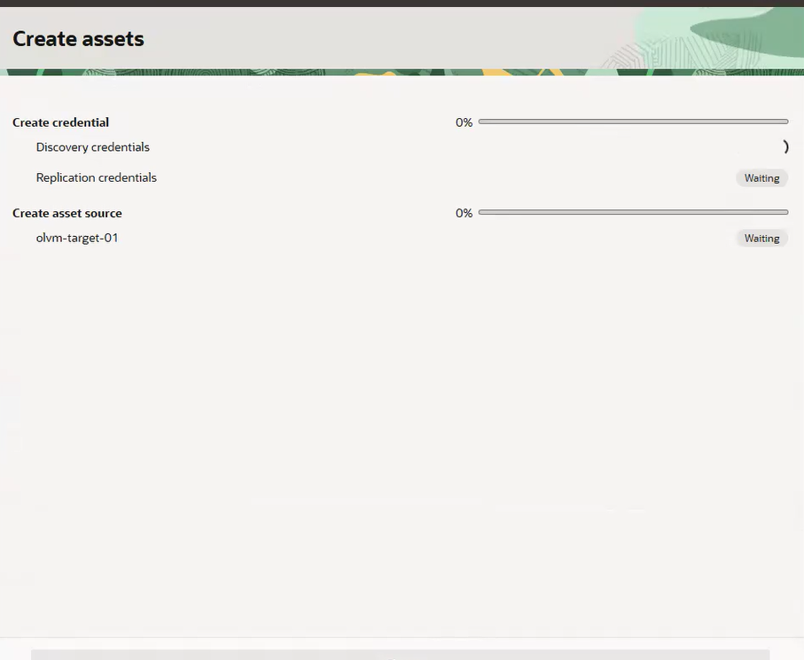
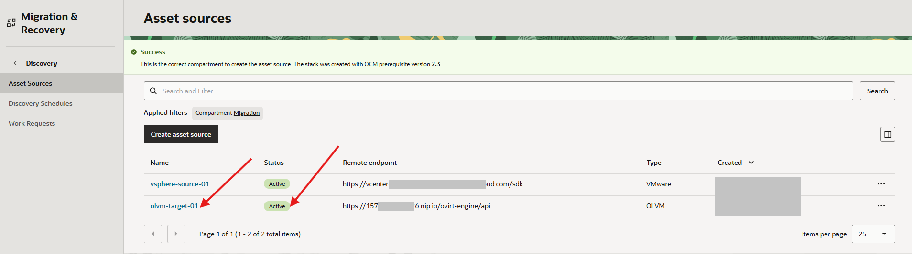
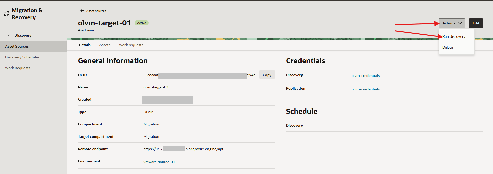
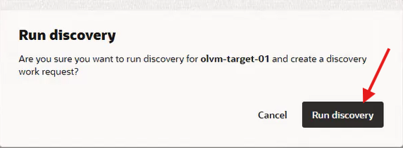
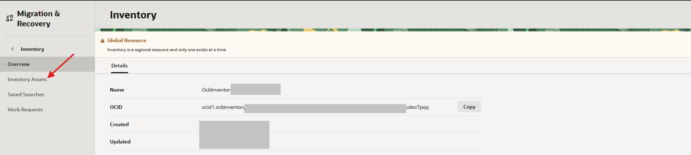
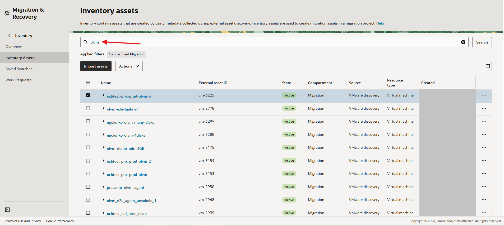

# Set Up the OLVM Target Environment

## Introduction

In this lab, you store OLVM credentials and certificate material in Vault, create the OLVM asset source in OCM, and discover OLVM target assets.

Estimated Time: 25 minutes

### Objectives

In this lab, you will:

* Store OLVM password and certificate secrets in Vault.
* Create the OLVM asset source.
* Discover OLVM target assets.
* Confirm that target clusters, storage domains, templates, and network profiles are visible in inventory.

## Task 1: Download Engine CA Certificate

1. Open your local browser. Navigate to the Administration Portal using the OLVM engine FQDN or Public IP adress:

    ```bash
    <copy>https://<olvm-fqdn>/ovirt-engine</copy>
    ```

2. On the landing page, click **Engine CA Certificate** to download it.

    

3. Open certificate with notepad  and copy its value
    

## Task 2: Create the OLVM Asset Source

1. In the OCI Console Menu, open **Migration & Recovery**, **Cloud Migrations** then open **Discovery**.

2. Open **Asset Sources**.

3. Click **Create Asset Source**.

4. Select **OLVM** as the source type.

5. Enter the OLVM asset source details.

    | Field | Value |
    | --- | --- |
    | Asset source type | OLVM |
    | Name | olvm-target-01 |
    | Remote endpoint | OLVM Manager FQDN or IP |
    | Compartment | Migration |
    | Target compartment | Migration |
    | Remote connections source environment compartment | Migration |
    | Remote connections source environment | vmware-source-01 |
    | Discovery credentials | Create secret |
    | Choose compartment | MigrationSecrets |
    | Vault compartment | MigrationSecrets |
    | Vault | ocm-secrets |
    | Username | admin |
    | User password | olvm-password |
    | Confirm user password secret | olvm-password |
    | Public key certificate | Notepad Ca Certficate copy from Task1 |

    

6. Click **Create Asset Source**.
    

7. Confirm that the asset source status is **Active**.
    

## Task 3: Discover OLVM Target Assets

1. In the OCI Console Menu, open **Migration & Recovery**, **Cloud Migrations** then open **Discovery**.
2. Click on the **olvm-target-01** Asset Source to open the OLVM asset source details page. Click **Actions** **Run Discovery**.
    

    

3. Wait for the discovery job to complete.

4. In the OCI Console Menu, open **Migration & Recovery**, **Cloud Migrations** then open **Inventory**.

5. Open **Inventory assets**.
    

6. Filter for OLVM assets.
    

7. Confirm that the inventory contains the target resources needed by the migration plan.

    ```text
    OLVM cluster:
    Storage domains:
    Templates:
    Network profiles:
    ```

8. If the OLVM Manager is not reachable from OCI, use standalone discovery through the OCM API with the **CreateDiscoverySchedule** operation.

## Learn More

* [Oracle Linux Virtualization Manager documentation](https://docs.oracle.com/en/virtualization/oracle-linux-virtualization-manager/)
* [Oracle Cloud Migrations documentation](https://docs.oracle.com/en-us/iaas/Content/cloud-migration/home.htm)

## Acknowledgements

* **Author** - Mark Atkinson, Evgeny Golenkov, Andrey Sokolov, Perside Foster
* **Contributor** - Keya Balutkar
* **Last Updated By/Date** - Perside Foster, July 2026
