# Set Up the VMware Source Environment

## Introduction

In this lab, you store vCenter credentials, create the OCM source environment, download and deploy the remote agent appliance, verify the appliance registration endpoint, and register the agent.

Estimated Time: 45 minutes

### Objectives

In this lab, you will:

* Store the vCenter password in OCI Vault.
* Create the VMware source environment in OCM.
* Download the remote agent appliance OVA.
* Deploy and power on the appliance in vCenter.
* Verify the appliance registration endpoint on port 3000.
* Register the remote agent and confirm health.

### Note: Prepare Source Windows VMs

Before you migrate Windows VMs to OLVM, install the required VirtIO network and storage drivers on each source Windows VM. Windows VMs that do not have the required VirtIO drivers may fail to boot after they are replicated and launched in the OLVM environment.

If this workshop migration uses only Linux source VMs, no Windows VirtIO driver preparation is required.

## Task 1: Store vCenter Credentials in Vault

1. In the OCI Console menu, open **Identity & Security**, **Key Management**, **Vault**.
    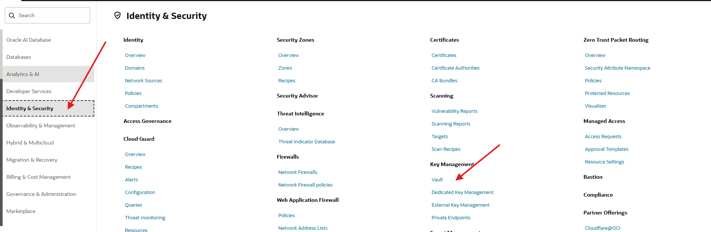

2. Select the compartment **olvm-migrations -> Migration -> MigrationSecrets**. Then Open the Vault created by the prerequisites stack **ocm-secrets**.
    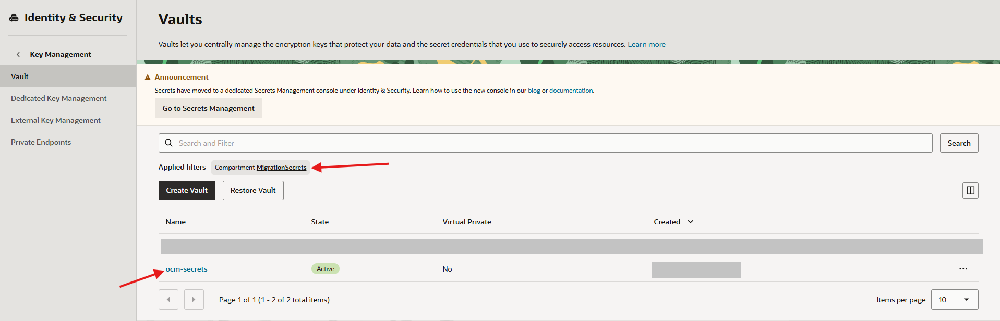

3. Click **Key Management** and selet the **Vault Information** tab
    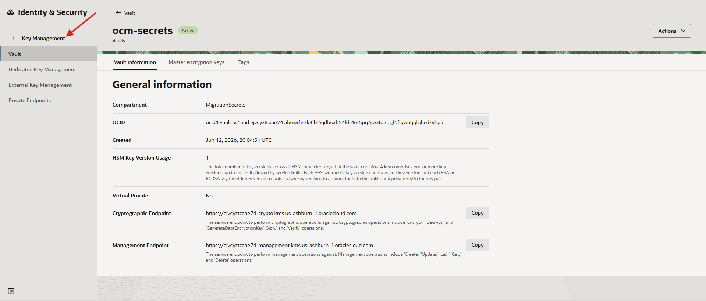

4. Click **Secret Management**, then click **Create Secret**.
    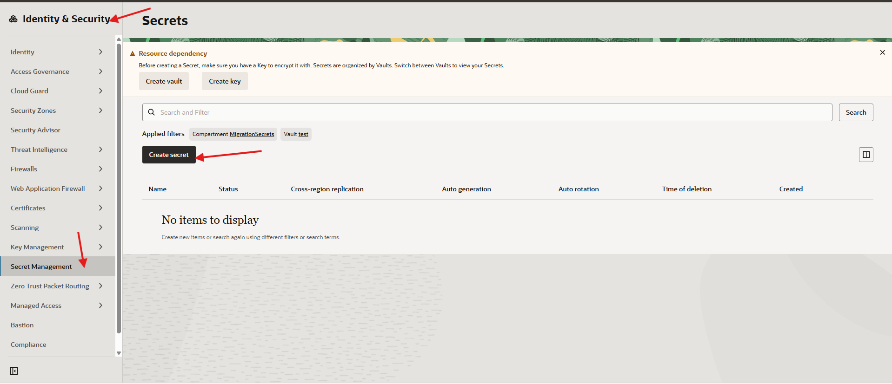

5. On the **Create Secret** page, use the following values.
    > Note: Be sure to follow the example format for the secret contents.

    | Field | Value |
    | --- | --- |
    | Name | vcenter-password |
    | Description | vCenter service account password |
    | Vault Compartment | MigrationSecrets |
    | Vault | ocm-secrets |
    | Encryption key compartment | MigrationSecrets |
    | Encryption key | ocm-key |
    | Secret Generation | Manual secret generation |
    | Secret type template | Plain-Text |
    | Secret contents | `{"username":"USER_","password":"PASSWORD"}` |

    **Example:** `{"username":"sidneyglick@vsphere.local","password":"GXf0gxijfkfuJDIe84484"}`

    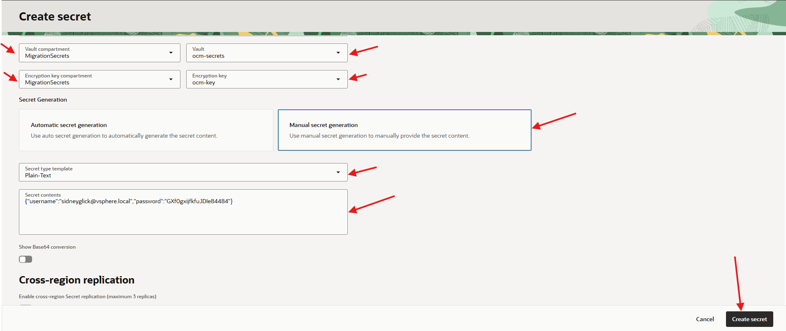

6. Click **Create secret** and wait for the secret status to become **Active**.

7. To Locate the active secret , start at  OCI Console menu, open **Identity & Security**, **Secret Management**
    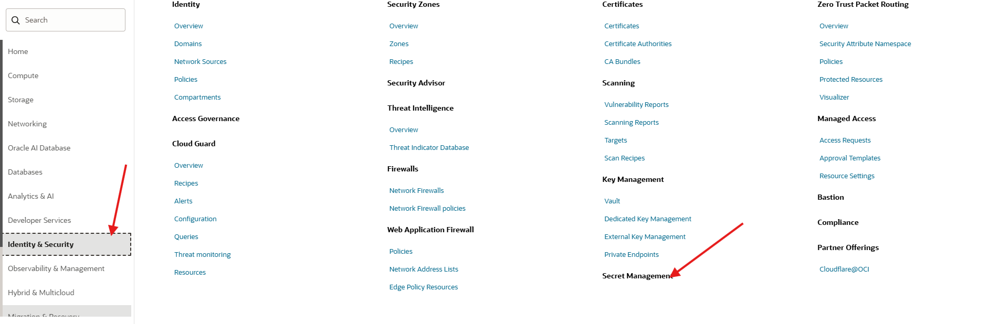

8. Select Compartment **MigrationSecrets**, Vault **ocm-secrets**, and click the **Apply filter** button. 
    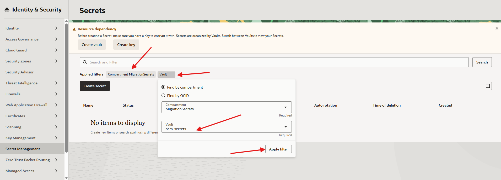

    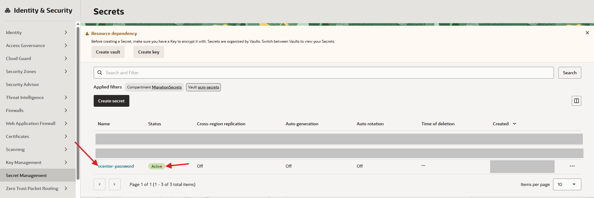

## Task 2: Create the Source Environment

1. In the OCI Console menu, open **Migration & Recovery**, **Cloud Migrations**, **Remote Connections**.

2. Open **Source Environments**.
    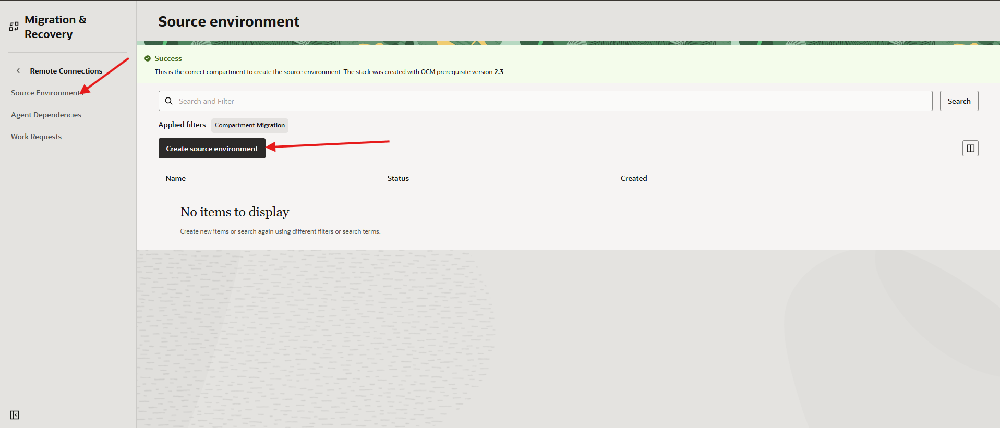

3. Click **Create Source Environment**, and use the following values:
    * **Name:** enter **vmware-source-01**
    * **Migration Compartment:** select **Migration**
    * Click **Create**.

    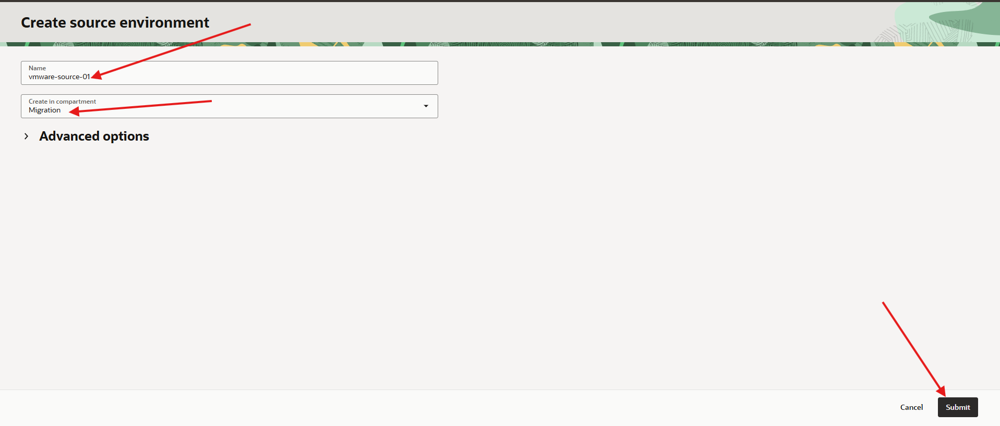

4. Confirm that the source environment appears with an **active** status.
    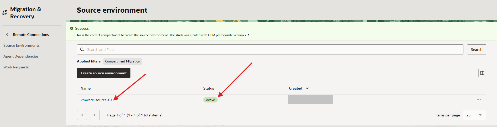

5. Create the agent dependency. In the OCI Console menu, open **Migration & Recovery**, **Cloud Migrations**, **Resource Environments**.

6. Select **Source Environments**, then click **Add agent dependencies**.
    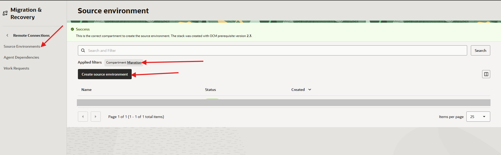

7. Configure the "Create Agent Dependency" page as follows:
    * Select **Select from existing agent dependencies**.
    * Source environment compartment: **Migration**
    * Select the **vddk-package**
    * Click **Add agent dependencies**.

    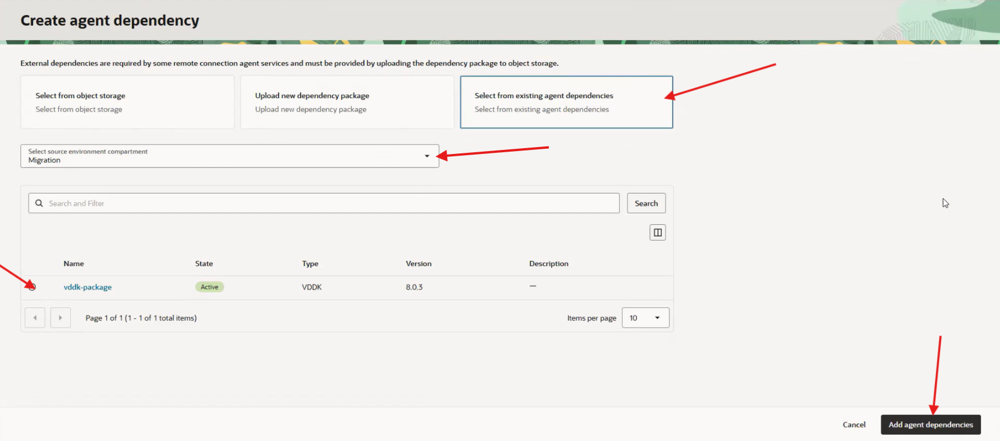

8. Wait for the **vmware-source-01** agent dependency to become **Active**.

## Task 3: Download the Remote Agent Appliance OVA

1. Open the source environment details page.

2. Click **Actions**.

3. Click **Download Agent VM**.
    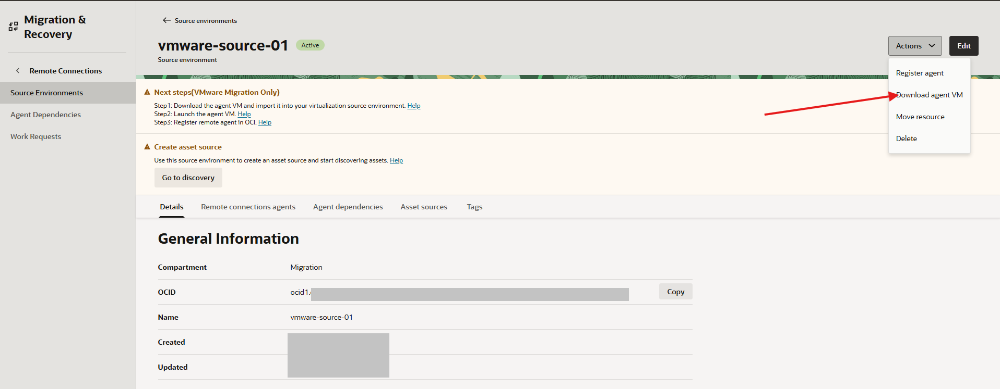

4. Select the most recent agent version.

5. Download the OVA file.
    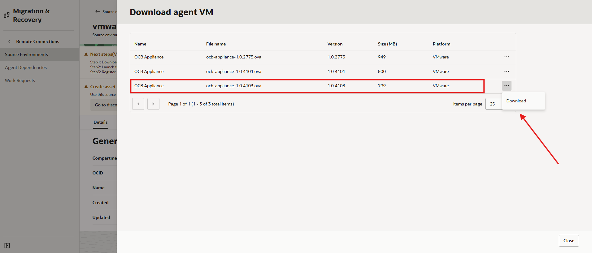

6. Confirm that the OVA download completes successfully then close the page.

## Task 4: Add the OVA to the vCenter Content Library

>**NOTE:** VMware experience required for this lab

1. Sign in to vCenter.
    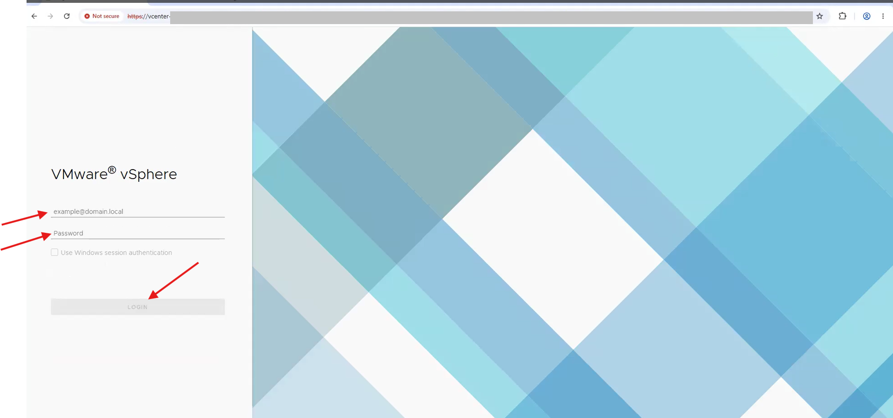

2. Open your vCenter content library.

3. Import or upload the downloaded OVA as a new content library item.

4. Wait for the upload to complete.

5. Confirm that the OVA item status is ready.

## Task 5: Deploy the Agent Appliance

>**NOTE:** VMware experience required for this lab

1. In vCenter, select the target cluster.

2. Start **Deploy OVF Template** from the content library item.

3. For **Name**, enter **OCM-Agent-01**.

4. Select the target cluster and datastore.

5. On the network mapping page, select the correct network layout.

    Use **Advanced** for a dual-interface deployment. Map the external adapter to the network with OCI egress over TCP 443 and map the internal adapter to the vCenter management network.

6. If your network is not isolated, use the standard single-interface deployment and map the appliance to the network that can reach both OCI and vCenter.

7. Enter static IP settings if your environment requires them.

8. Finish the deployment.

9. Power on the appliance VM.

10. Open the VM console.

11. Press **Enter** to refresh diagnostics.

12. Confirm that the appliance reports healthy and not registered.

## Task 6: Verify Agent Console Accessibility

1. Record the external IP address shown in the appliance console or in vCenter network details.

    ```text
    <copy>Agent external IP:</copy>
    ```

2. From your workstation, open a browser to the registration endpoint.

    ```text
    <copy>https://<agent-external-ip>:3000</copy>
    ```

3. Accept the certificate warning if your browser displays one.
    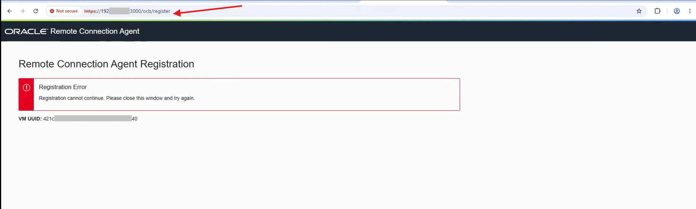

4. If the browser reports that the client sent an HTTP request to an HTTPS server, change **http://** to **https://** in the address bar.

## Task 7: Register the Agent

1. Return to the source environment in the OCI Console. In the OCI Console menu, open **Migration & Recovery**, **Cloud Migrations**, **Remote Connections**.

2. From the **Source environment** page, click the source environment name **vmware-source-01**.

3. From the **vmware-source-01** page, click **Actions**, then select **Register agent**.
    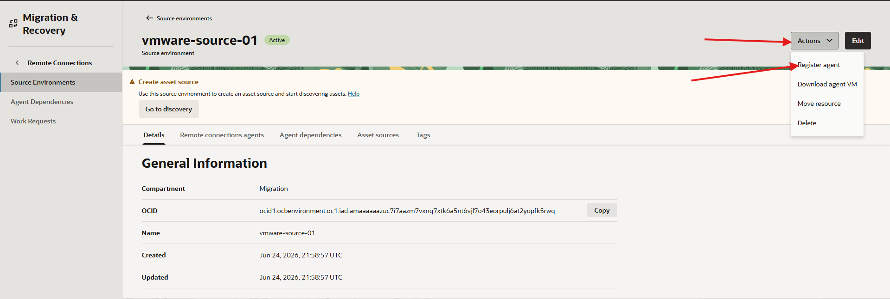

4. From the **Register agent** page, enter the following values:
    * **Name:** keep the default value
    * **Agent host name or IP:** external IP address of the VMware agent appliance
    * **Generate HTTPS Redirect URL (for ocb-appliance version > 1.0.4081):** select this option to generate the HTTPS redirect URL
    * Click **Register**.
    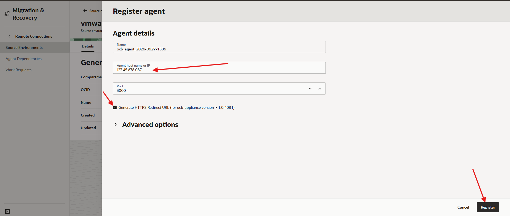

5. From vCenter, verify that the remote agent web console is available. Open a new Chrome tab and enter `https://<agent-external-ip>:3000/ocb/register`.

6. Keep the new browser tab open while the key exchange completes.

7. Enter the agent name, such as **OCM-Agent-01**.

8. Click **Register**.

9. Click **Confirm** when prompted.

10. Click **Close**.

11. Open the appliance VM console in vCenter.

12. Press **Enter** to refresh diagnostics.

13. Confirm that the status changes to healthy and registered.

14. In the OCI Console, confirm that the agent shows a recent heartbeat.
    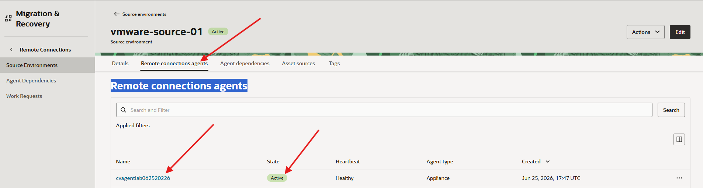

    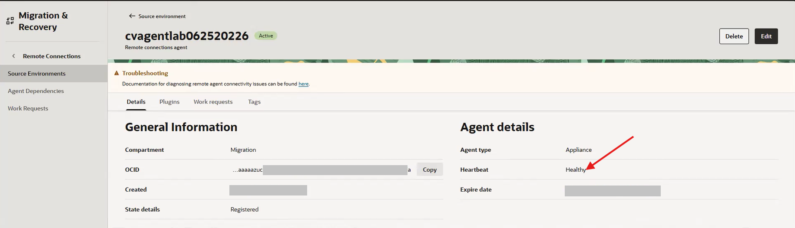

15. Confirm plugin status.

    ```text
    <copy>Agent Monitoring:
    Discovery:
    Replication:</copy>
    ```

    Replication may show a needs-attention state until asset sources are configured.

## Learn More

* [Oracle Cloud Migrations documentation](https://docs.oracle.com/en-us/iaas/Content/cloud-migration/home.htm)

## Acknowledgements

* **Author** - Mark Atkinson, Evgeny Golenkov, Andrey Sokolov, Perside Foster
* **Contributor** - Keya Balutkar
* **Last Updated By/Date** - Perside Foster, July 2026
