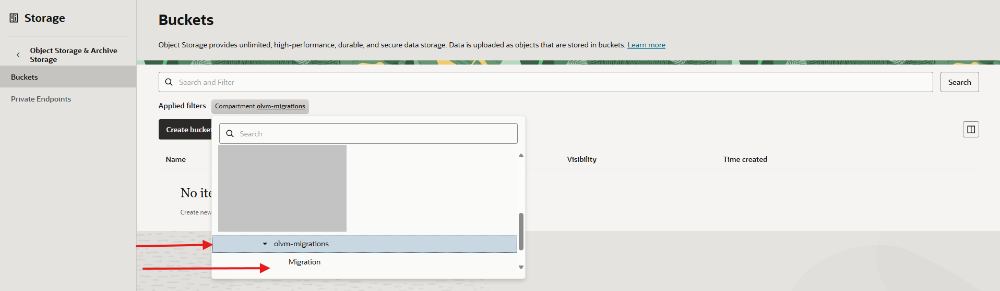
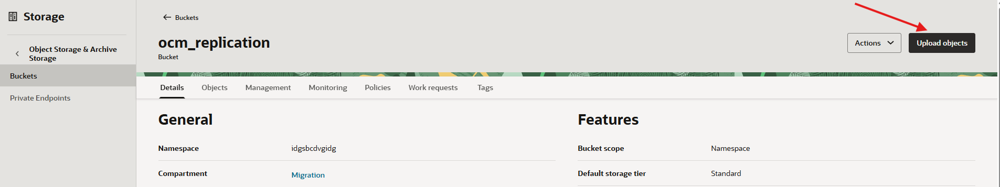
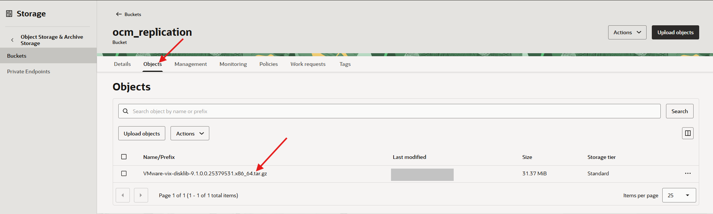
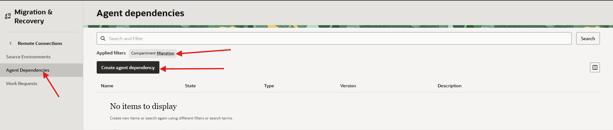

# Upload and Register the VDDK

## Introduction

The VMware Virtual Disk Development Kit (VDDK) is required by the OCM remote agent to read VMware snapshot data during replication. In this lab, you upload the VDDK package to Object Storage and register it as an agent dependency.

Estimated Time: 20 minutes

### Objectives

In this lab, you will:

* Upload the VDDK package to Object Storage.
* Create an OCM agent dependency for the VDDK package.
* Confirm that the dependency is available before remote agent setup.

### Prerequisites

Before you begin this lab, make sure you have access to the VDDK Linux tarball package. You can download it from the Broadcom VMware Developer Portal. Broadcom may require account login for older VDDK versions. If you cannot access the supported download, ask your instructor or VMware administrator to provide the approved VDDK Linux tarball for this workshop.

Use one of the VDDK Linux tarball versions supported by Oracle Cloud Migrations:

| Source VMware version | Broadcom VDDK version | File name | MD5 |
| --- | --- | --- | --- |
| vSphere 8.0 | 8.0U3 | `VMware-vix-disklib-8.0.3-23950268.x86_64.tar.gz` | `007ab979e52f52401f02278b75ab5c74` |

Do not use the latest VDDK version unless it matches one of the supported versions in this table.

## Task 1: Upload the VDDK to Object Storage

1. In the OCI Console Menu, open **Storage**, **Object Storage & Archive Storage** , **Buckets**.

2. Select the **Migration** subcompartment under **olvm-migrations**.
    

3. Open the **ocm_replication** bucket created by the prerequisites stack.

4. Click **Upload**.
    

5. Download the VDDK package from the Broadcom VMware Developer Portal.
    * Open [VMware Virtual Disk Development Kit (VDDK)](https://developer.broadcom.com/sdks/vmware-virtual-disk-development-kit-vddk/latest).
    * Select `v8.0` and download the VDDK `8.0U3` Linux tarball package for most source environments. This is not the same as the earlier `8.0` or `8.0.1` rows.

6. Select the VDDK Linux tarball package file that you downloaded.

7. Leave **Additional checksum** set to **None**.

    This Object Storage upload option is separate from the OCM agent dependency validation. Selecting SHA256, SHA384, or CRC32C does not resolve an OCM `Invalid Checksum` dependency error.

8. Click **Upload**.

9. Wait for the upload to complete.

10. Confirm that the VDDK file appears in the bucket object list.
    

11. Record the Object Storage values.

    ```text
    Object Storage namespace:
    VDDK bucket: ocm_replication
    VDDK object:VMwarexxxxxxx.gz
    ```

## Task 2: Register the VDDK as an Agent Dependency

1. Open **Migration & Disaster Recovery**, then open **Cloud Migrations**.

2. Open **Remote Connections**.

3. Open **Agent Dependencies**.

4. Click **Create Agent Dependency**.
    
5. For **Name**, enter **vddk-package** or your approved dependency name.

6. Select the **Migration** subcompartment under **olvm-migrations**.

7. Select the **ocm_replication** Object Storage bucket that contains the VDDK package.

8. Select the VDDK object.

9. Click **Create**.
    

10. Confirm that the agent dependency appears with a status of **Available**.

    If the dependency fails with **Invalid Checksum**, the uploaded object does not match an approved VDDK dependency package. Delete the failed dependency, confirm that you downloaded one of the supported VDDK Linux tarball packages listed in the prerequisites, upload the correct tarball object, and create the agent dependency again.

11. Record the dependency details.

    ```text
    Agent dependency: vddk-package
    Dependency status: Active
    ```

## Learn More

* [Oracle Cloud Migrations documentation](https://docs.oracle.com/en-us/iaas/Content/cloud-migration/home.htm)
* [Oracle Cloud Migrations agent dependencies](https://docs.oracle.com/en-us/iaas/Content/cloud-migration/cloud-migration-manage-agent-dependencies.htm)
* [OCI Object Storage documentation](https://docs.oracle.com/en-us/iaas/Content/Object/home.htm)

## Acknowledgements

* **Author** - Mark Atkinson, Evgeny Golenkov, Andrey Sokolov, Perside Foster
* **Contributor** - Keya Balutkar
* **Last Updated By/Date** - Perside Foster, June 2026
